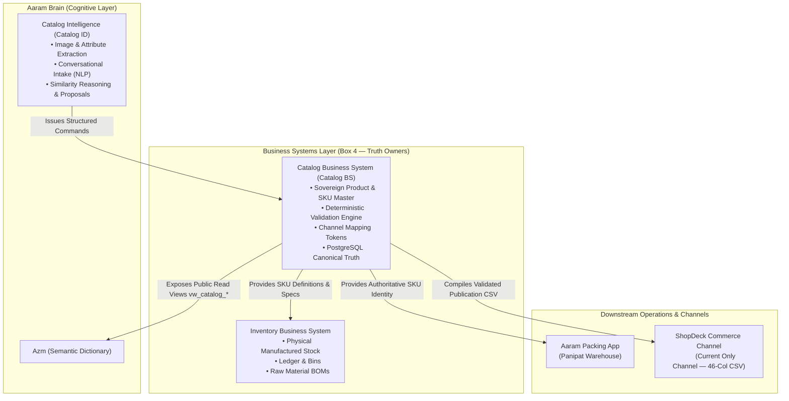

# Catalog Business System (Catalog BS) — Foundation Architecture Specification

**Document Reference:** `business_systems/catalog/docs/01-catalog-bs.md`
**System Name:** Sovereign Catalog Business System (`Catalog BS`)
**Domain Layer:** Business Systems Layer (Box 4 in Aaram Ecosystem)
**Status:** Canonical Foundation Architecture
**Authoritative Version:** 1.1 (Revised)
**Last Updated:** September 1, 2026

---

## 1. Purpose & Business Problem

### 1.1 The Operational Problem
In a high-velocity direct-to-consumer (D2C) brand, the catalog is the authoritative commercial definition of what the business sells.

Prior to this system, Aaram lacked an independent, sovereign Catalog Master. Catalog management was entirely manual, reactive, and fragmented across external tools (the ShopDeck merchant dashboard and ad-hoc CSV files). This created severe operational friction for the business owner:

1. **Catalog-Caused SKU Collisions:** Because external storefront platforms allow duplicate seller codes, different physical products were accidentally assigned identical human codes (e.g., assigning `102BS` to both *Blush Pink Gulbahar* and *Aqua Gulbahar*). This caused SKU ambiguity on packing slips, warehouse confusion in Panipat, and avoidable wrong-item dispatches resulting in Return-to-Origin (RTO) costs.
2. **Storefront Page Fragmentation:** Lack of structured parent-variant governance resulted in separate product pages for individual colors rather than unified product pages with interactive color swatches, creating cluttered navigation and missed conversion opportunities.
3. **Analytics Blindness & Token Decoupling:** Third-party commerce platforms (ShopDeck) strip seller SKU strings on analytics replicas (leaving `sku_id` and `product_id` 100% NULL) and replace them with opaque short hashes (e.g., `customer_sku_short_id = 'JVAZr4Qf'`). Without a sovereign catalog registry, the business could not deterministically join live order lines back to product metadata, commercial costs, or packaging specifications.
4. **Owner Administrative Burden:** Formatting, validating, debugging, and uploading multi-column spreadsheets manually was tedious, error-prone, and unscalable.

### 1.2 Primary Business Objective
The primary objective of Catalog BS is **to make catalog creation, maintenance, validation, and commerce-channel publication dramatically easier for the business owner**, while eliminating catalog-caused SKU ambiguity across operations.

The intended target workflow is:

$$\begin{aligned}
\text{Human Intent / Images / Natural Language} &\longrightarrow \mathbf{Catalog\ Intelligence\ (Catalog\ ID)} \\
&\longrightarrow \mathbf{Structured\ Catalog\ Command} \\
&\longrightarrow \mathbf{Catalog\ BS\ Validation\ \&\ Persistence} \\
&\longrightarrow \mathbf{ShopDeck\text{-}Ready\ Publication\ Artifact}
\end{aligned}$$

---

## 2. Why Catalog Must Be a Sovereign Business System

Catalog BS is the sovereign owner of Aaram's **CATALOG TRUTH**. It is an independent Business System because:

- **Commercial Truth Sovereignty:** Aaram must own the authoritative definition of its commercial offerings—what products exist, how they are grouped, what each sellable SKU consists of, their canonical descriptions, media, pricing, and packaging specifications—independently of any external commerce channel.
- **Strict Separation of Product Truth from Inventory Truth:** Inventory tracks *physical stock levels, warehouse bins, batch allocations, and material movements*; Orders track *customer transactions and fulfillment*; Catalog owns *the commercial product definition and sellable SKU specifications*. A SKU is a sellable commercial unit; it is not synonymous with physical inventory.
- **Deterministic Validation Gatekeeper:** It enforces rigid business rules and validation invariants, guaranteeing that invalid, colliding, or malformed SKUs are rejected before they can impact operations or be published to sales channels.

---

## 3. Catalog BS Responsibilities & Boundaries

### 3.1 Explicit Responsibilities (What Catalog BS Owns)

| Domain Area | Authoritative Scope Owned by Catalog BS |
|---|---|
| **Product Master** | Canonical records for all commercial Product families (groupings) and sellable SKUs. |
| **SKU Identity & Governance** | Enforcing SKU formatting ($5 \le \text{length} \le 10$, alphanumeric, uppercase), global uniqueness across the catalog, and editable business keys. |
| **Commercial Specifications** | Canonical MRP, Base Selling Price, Cost Price, HSN codes, GST rates, packaging dimensions (L $\times$ B $\times$ H in cm), and dead weights (kg). |
| **Catalog Attributes & Media** | Canonical product descriptions, styling attributes, fabric types, care instructions, and product media asset references. |
| **Channel Mapping Registry** | The deterministic translation table linking sovereign `sku_id`s to external channel tokens (e.g., ShopDeck's `customer_sku_short_id`). |
| **Catalog Lifecycle** | Pre-publication lifecycle states: `DRAFT`, `READY`, and `PUBLISHED`. |
| **Authoritative Mutation** | Executing, validating, and persisting catalog commands received from Catalog Intelligence (Catalog ID) or human operators. |
| **Publication Compilation** | Generating channel-specific publication artifacts (specifically, the ShopDeck 46-column bulk upload CSV). |

### 3.2 Explicit Non-Responsibilities (What Catalog BS Does NOT Own)

| Domain | What Catalog BS Does NOT Own | Sovereign System Owner |
|---|---|---|
| **Physical Inventory Truth** | Does NOT track manufactured quantities, physical warehouse stock, batch numbers, bin allocations, or stock movements. | **Inventory Business System** |
| **Order & Shipment Truth** | Does NOT track customer transactions, fulfillment lifecycle, AWB numbers, or logistics execution. | **ShopDeck / Logistics Business Systems** |
| **Warehouse Packing Execution** | Does NOT run packing mobile apps, camera scanning, or pack verification. It only provides authoritative SKU identity and metadata to the packing layer. | **Aaram Packing App / Warehouse** |
| **Cognitive Reasoning & Vision** | Does NOT perform image analysis, natural language parsing, SEO copy drafting, or similarity reasoning. | **Catalog Intelligence (Catalog ID)** |
| **Channel Runtime State** | Does NOT control live storefront hosting, checkout UI, customer cart sessions, or whether an item is active/hidden on the channel. | **Commerce Channel (ShopDeck)** |

---

## 4. Relationships with Ecosystem Components



### 4.1 Relationship with Catalog Intelligence (Catalog ID)
- **Catalog ID THINKS / ANALYZES / PROPOSES:** Interprets human intent, analyzes photos, extracts candidate attributes, detects potential duplicates, and proposes a complete Product/SKU creation or modification command.
- **Catalog BS VALIDATES / ENFORCES / PERSISTS:** Evaluates the proposed command against immutable business invariants, verifies uniqueness, writes canonical records to PostgreSQL, and returns an authoritative confirmation.
- **Core Principle:** Catalog ID *never* writes directly to the Catalog database. It communicates strictly via the Catalog BS Command Contract.

### 4.2 Relationship with Brain Core & Azm
- Catalog BS projects its canonical models as public read views (`vw_catalog_products`, `vw_catalog_skus`) into **Azm**.
- Azm indexes these schemas so the Brain's generic cognitive engines (RABTA, Qwen Coder) can answer business queries (e.g., *"What are the dimensions and cost of SKU 126BS?"*) without hardcoded table couplings.

### 4.3 Relationship with Inventory BS
- Inventory BS references `sku_id` as the catalog anchor to attach physical manufactured quantities, bin locations, and Bill of Materials (BOM) raw materials.
- Physical manufactured stock belongs strictly to Inventory BS; Catalog BS owns the commercial product specifications.

### 4.4 Relationship with Warehouse Packing
- Catalog BS provides the authoritative `sku_id` string and product metadata to the Aaram Packing App.
- This eliminates catalog-caused SKU ambiguity and materially reduces avoidable dispatch errors in Panipat.

### 4.5 Relationship with Commerce Channels (ShopDeck)
- **ShopDeck is currently the ONLY active commerce channel.**
- Catalog BS is designed to maintain channel-specific publication mappings while remaining completely independent of ShopDeck implementation details in its canonical domain model.
- Publication is currently executed by generating a strict, pre-validated 46-column ShopDeck CSV for manual upload.

---

## 5. Canonical Commercial Model: Product ➔ SKU

The Catalog Business System operates on a **strict 2-tier commercial hierarchy**. There is **no separate intermediate Variant entity**.

```text
┌────────────────────────────────────────────────────────────────────────┐
│  PRODUCT (Commercial Product Family)                                   │
│  • Represents a commercially grouped product family whose SKUs are      │
│    intended to be offered together as one product on a sales channel.  │
│  • Identified by: internal_id (UUID) & Product Code (< 25 chars)       │
└───────────────────────────────────┬────────────────────────────────────┘
                                    │
                                    │ 1-to-N Relationship
                                    ▼
┌────────────────────────────────────────────────────────────────────────┐
│  SKU (Sellable Commercial Unit)                                        │
│  • Represents the exact sellable catalog item.                         │
│  • Differentiated by attributes such as Color, Size, or Pack.          │
│  • Identified by: internal_id (UUID) & sku_id (5-10 chars, uppercase) │
│  • Owns: Pricing, Cost, Weight, Dimensions, Media references           │
└────────────────────────────────────────────────────────────────────────┘
```

> [!NOTE]
> The commercial grouping framework is formalized in `03-catalog-business-rules.md`, where Catalog ID proposes product families and Catalog BS validates explicit attachment, routing ambiguous cases to human approval.

---

## 6. Identity Principles & Standards

| Identifier | Level | Mutability | Format / Constraints | Operational Role |
|---|---|---|---|---|
| **`internal_id`** | System (Both) | **Immutable** | Standard RFC 4122 `UUID` (Generated by PostgreSQL) | Technical Primary Key for database integrity and relational joins. |
| **`sku_id`** | SKU Level | **Editable (Controlled)** | $5 \le \text{length} \le 10$, Uppercase alphanumeric + hyphens (regex: `^[A-Z0-9]+(-[A-Z0-9]+)*$`), Globally Unique (e.g., `126BS-BLU`, `101CC-SUN`, `103OTTO`) | **Sovereign Operational Key:** Used on packing slips, inventory ledger references, and AI queries. |
| **`Product Code`** | Product Level | **Editable (Propagating)** | Alphanumeric slug with hyphens, strictly $< 25$ characters (e.g., `AH-MP-WATERPROOF-DBF`) | Product-family grouping identifier; shared by all sibling SKUs in the family. |
| **`shopdeck_sku_id`** | SKU Level | Channel Mapping | Alphanumeric token (e.g., `JVAZr4Qf`) | Mapping token matching ShopDeck `order_line_items.customer_sku_short_id`. |
| **`shopdeck_product_id`** | Product Level | Channel Mapping | Alphanumeric token (e.g., `dsJVn46kfqbs`) | Mapping token matching ShopDeck `customer_product_short_id`. |

### 6.1 Core Identity Rules
1. **`internal_id` is the Database Primary Key:** Protects relational integrity so that editing a human `sku_id` does not require cascading database key migrations.
2. **`sku_id` is the Sovereign Human Key:** It is unique across the entire catalog, human-memorable, and category-coded.
3. **Historical Data Notice:** Old, random, or historical SKU codes from legacy CSVs represent historical evidence only and do not constrain the new validation architecture.
4. **Renaming Propagation:** Changing a `Product Code` renames the commercial family and propagates consistently to all mapped child SKUs and channel export outputs.

---

## 7. Quantity Ownership & Separation

A complete firewall is maintained between physical inventory and commerce figures:

```text
┌────────────────────────────────────────────────────────────────────────┐
│  1. MANUFACTURED / INVENTORY QUANTITY (Sovereign Owner: Inventory BS)   │
│     • Physical on-hand stock in Panipat warehouse                      │
│     • Batch tracking, cutting loss, allocated stock, damaged stock     │
│     • Authoritative physical inventory truth                           │
└────────────────────────────────────────────────────────────────────────┘
                                    ≠ (Completely Independent)
┌────────────────────────────────────────────────────────────────────────┐
│  2. COMMERCE AVAILABLE QUANTITY (Owner: Downstream Channel / ShopDeck) │
│     • An operational figure maintained on ShopDeck to govern web sales │
│     • Uploaded via CSV and subsequently modified manually on ShopDeck  │
│     • Catalog BS does NOT treat this as inventory truth                │
└────────────────────────────────────────────────────────────────────────┘
```

---

## 8. Catalog Lifecycle & Channel State Ownership

The lifecycle is divided strictly by system ownership boundaries:

```mermaid
stateDiagram-v2
    direction LR

    subgraph "Catalog BS Ownership (Catalog Lifecycle)"
        DRAFT --> READY : Validated & Complete
        READY --> PUBLISHED : Publication Artifact Generated
        READY --> DRAFT : Returned for Modification
    end

    subgraph "Commerce Channel Ownership (Observed Channel State)"
        PUBLISHED -.-> ACTIVE : Channel Confirms Listing Live
        ACTIVE --> DE_LIVE : Disabled / Delisted on Channel
        DE_LIVE --> ACTIVE : Relisted on Channel
    end
```

| Lifecycle State | State Owner | Architectural Semantics |
|---|---|---|
| **`DRAFT`** | **Catalog BS** | SKU/Product is under creation or enrichment. Incomplete fields. Not eligible for publication. |
| **`READY`** | **Catalog BS** | Passed all deterministic business validations. Approved for channel export. |
| **`PUBLISHED`** | **Catalog BS** | Catalog BS has compiled and issued the publication artifact (e.g., the 46-column ShopDeck CSV). |
| **`ACTIVE`** | **Commerce Channel** | Observed channel state: confirmed live and purchasable on the commerce storefront. |
| **`DE-LIVE`** | **Commerce Channel** | Observed channel state: taken down, hidden, or disabled on the storefront. |

> [!IMPORTANT]
> `PUBLISHED != ACTIVE`. `PUBLISHED` is owned by Catalog BS and records that the publication payload was produced. `ACTIVE` is owned by the commerce channel (ShopDeck). If Catalog BS tracks `ACTIVE` or `DE-LIVE` in the future, it is stored strictly as *observed/confirmed channel state*, not Catalog-owned truth.

---

## 9. Architectural Decision Records (ADRs)

| ADR Reference | Decision Topic | Status | Architectural Determination |
|---|---|---|---|
| **ADR-CAT-001** | Bounded Context | `DECIDED` | Catalog is an independent Business System (`business_systems/catalog/docs/`), owning catalog truth. |
| **ADR-CAT-002** | Commercial Hierarchy | `DECIDED` | Strict 2-tier commercial model: `Product ➔ SKU`. No separate intermediate Variant entity. |
| **ADR-CAT-003** | Primary Key Standard | `DECIDED` | Database uses `internal_id UUID` as PK. Human `sku_id` is an indexed, unique business key. |
| **ADR-CAT-004** | Division of Labor | `DECIDED` | Catalog ID thinks and proposes. Catalog BS validates, enforces, and stores truth. |
| **ADR-CAT-005** | Quantity Boundary | `DECIDED` | Physical stock belongs to Inventory BS; Commerce Available Quantity is a channel figure. |
| **ADR-CAT-006** | Channel Strategy | `DECIDED` | ShopDeck is currently the ONLY active commerce channel. Publication is via 46-column CSV generation. |
| **ADR-CAT-007** | Product Family Rule | `DECIDED` | Commercial grouping framework formalized in `03`; ambiguous cases route to human approval. |
| **ADR-CAT-008** | Attribute Partition | `DECIDED` | Product-level vs. SKU-level attribute ownership finalized in `02` and `06`. |
| **ADR-CAT-009** | Media Asset Storage | `OPEN` | Canonical media asset hosting architecture (Self-hosted VPS vs Object Storage) prior to channel publication. |
| **ADR-CAT-010** | SKU Retirement Policy | `DECIDED` | Retired `sku_id` strings are permanently tombstoned; recycling business codes is strictly prohibited. |

---

## 10. Measurable Business Value

Implementing Catalog BS transforms the business owner's day-to-day operations:

1. **Material Reduction in Dispatch Errors:** Enforcing global SKU uniqueness eliminates catalog-caused SKU ambiguity on packing slips in Panipat.
2. **Effortless Storefront Grouping:** Structuring parent Product Codes ensures ShopDeck cleanly groups color/size swatches on single high-converting product pages.
3. **Deterministic Unit Economics:** Enables joining live ShopDeck order lines back to canonical cost prices and packaging weights with 0ms latency.
4. **Owner Administrative Freedom:** Replaces hours of manual spreadsheet formatting, validation checking, and error debugging with a seamless validated export pipeline.
