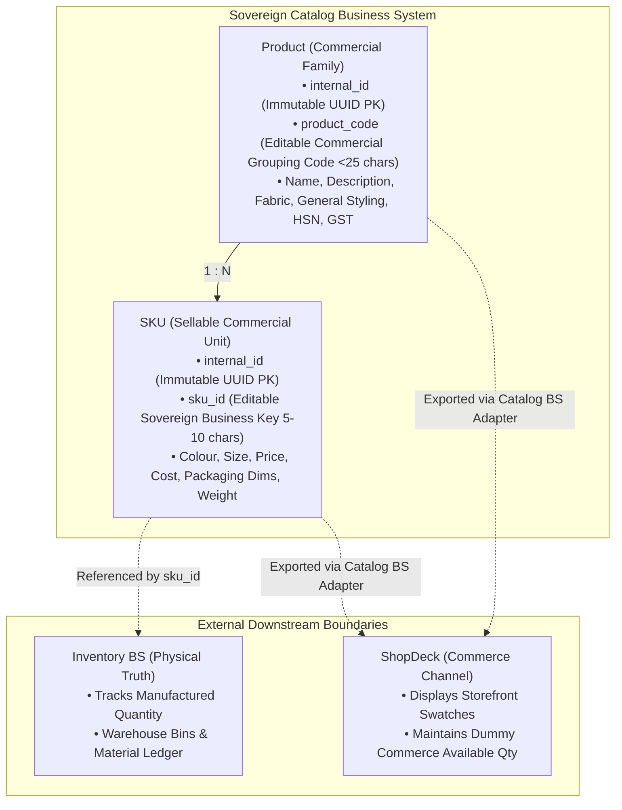
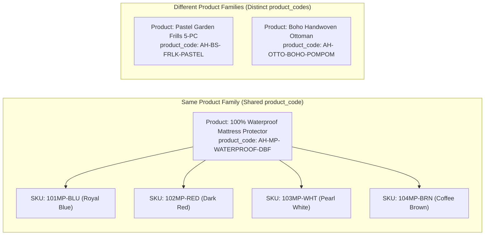
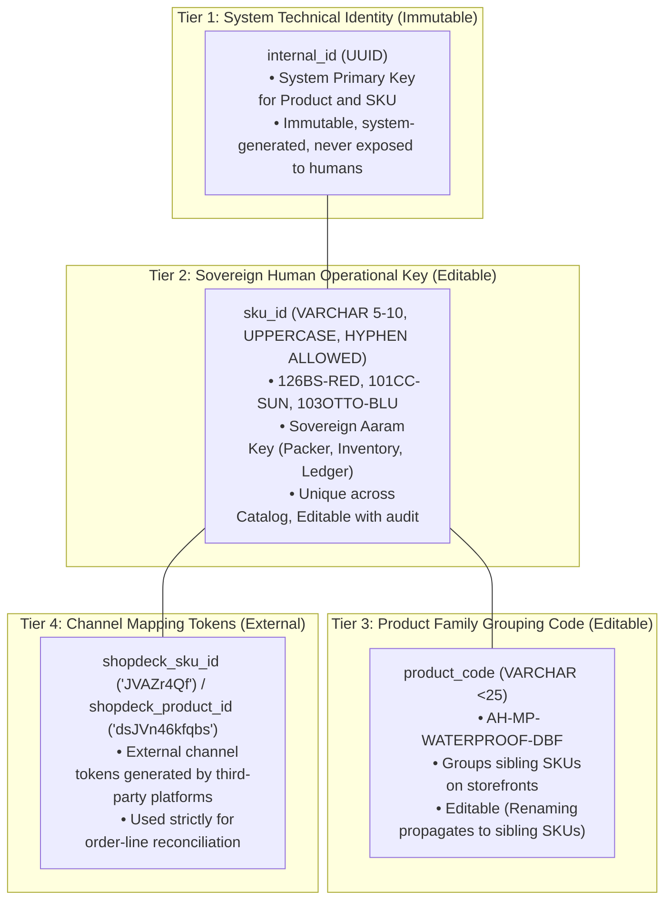
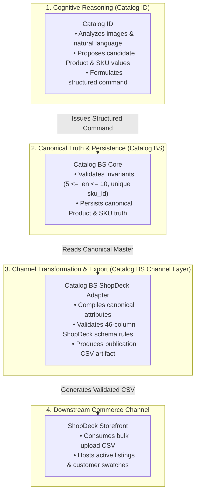

# Catalog Domain Model Specification

**Document Reference:** `business_systems/catalog/docs/02-catalog-domain-model.md`
**System Name:** Sovereign Catalog Business System (`Catalog BS`)
**Domain Layer:** Domain Model Layer (Box 4 in Aaram Ecosystem)
**Status:** Canonical Domain Specification
**Authoritative Version:** 1.4 (Final Targeted Alignment)
**Last Updated:** September 1, 2026

---

## 1. Executive Summary & Purpose

This document establishes the canonical **Domain Model** for the Aaram Catalog Business System (`Catalog BS`). It defines the fundamental commercial entities, their relationships, attribute ownership boundaries, identity models, and the strict structural separation between canonical catalog truth, physical warehouse inventory, and external sales channels.



---

## 2. Core Entities: Product & SKU

The commercial model is strictly **2-tier**: `Product` $\longrightarrow$ `SKU`. There is **no separate intermediate Variant entity**.

```text
┌────────────────────────────────────────────────────────────────────────┐
│  PRODUCT (Commercial Product Family / Parent)                          │
│  "What is the commercial design offering?"                             │
│  • Identity: internal_id (UUID)                                        │
│  • Commercial Code: product_code (Editable grouping slug < 25 chars)   │
│  • Represents the customer-facing family container                     │
│  • Owns shared conceptual attributes (Title, Fabric, Styling, HSN)     │
└───────────────────────────────────┬────────────────────────────────────┘
                                    │
                                    │ 1 : N (One-to-Many)
                                    ▼
┌────────────────────────────────────────────────────────────────────────┐
│  SKU (Sellable Commercial Unit / Child)                                │
│  "What is the exact physical item being sold, priced, and packed?"     │
│  • Identity: internal_id (UUID)                                        │
│  • Sovereign Business Key: sku_id (5-10 chars, uppercase, hyphenated)  │
│  • Represents the discrete, sellable, physical unit                    │
│  • Owns commercial & physical attributes (Price, Cost, Weight, Dims)   │
└────────────────────────────────────────────────────────────────────────┘
```

### 2.1 Entity Definition: Product (Parent)
- **Definition:** A commercial grouping or design family under which one or more sellable SKUs are presented to customers as a single product offering.
- **Role:** Defines the shared commercial offering, customer-facing title narrative, general styling, care instructions, and storefront grouping container.
- **Identity & Coding:**
  - **Technical Identity:** `internal_id` (`UUID`) — strictly immutable system identifier.
  - **Commercial Grouping Code:** `product_code` (`VARCHAR < 25`) — editable commercial code shared by all child SKUs (e.g., `AH-MP-WATERPROOF-DBF`, `AH-BS-PASTELGARDEN-5PC`). Renaming a `product_code` does *not* create a new Product; it updates the existing family and propagates consistently to child publication payloads.

### 2.2 Entity Definition: SKU (Child)
- **Definition:** The discrete, sellable commercial unit that can be purchased, packed, priced, and shipped.
- **Role:** The atomic operational unit of commerce. Each SKU corresponds to a specific physical variation (e.g., Royal Blue King, Coffee Brown Queen, Sunflower Pack of 2).
- **Identity & Coding:**
  - **Technical Identity:** `internal_id` (`UUID`) — strictly immutable system identifier.
  - **Sovereign Operational Key:** `sku_id` (`VARCHAR 5-10`) — editable, globally unique, uppercase alphanumeric with hyphens permitted (e.g., `126BS-RED`, `126BS-BLU`, `101CC-SUN`, `103OTTO-BLU`).

---

## 3. Product Family Concept & Commercial Grouping

A **Product Family** is fundamentally a **commercial grouping decision**. It represents a set of SKUs that are intended to be offered and marketed together on a commerce channel under a single parent listing, allowing customers to select variants via swatches or option selectors.



### 3.1 Practical Domain Differentiation

| Context | Criteria for "Same Product Family" | Criteria for "Different Product Families" |
|---|---|---|
| **Commercial Offering** | Shared commercial offering intended to be presented together under one listing. | Materially different commercial concept or standalone product line. |
| **Storefront Presentation** | Customer selects variations (e.g. Color, Size, Pack) via **swatches/dropdowns on one page**. | Customer browses them as **separate independent catalog cards**. |
| **Operational Linkage** | SKUs share the same `product_code` grouping slug on channels. | SKUs carry distinct `product_code` grouping slugs. |
| **Illustrative Examples** | • *Mattress Protector* in Blue, Red, White, Brown.<br>• *Bohemian Tufted Cushions* in Sunflower, Zig-Zag, Rainbow.<br>• *Pastel Garden Bedsheet* in King (108x108") and Super King (110x110"). | • *Pastel Garden Bedsheet* vs *Blue Garden Bedsheet* (Distinct flagship designs).<br>• *Quilted Dohar* vs *Bedsheet Set*.<br>• *Ottoman Stool* vs *Cushion Cover*. |

### 3.2 SKU Generation & Distinguishing Role
- Candidate SKU IDs are proposed by **Catalog Intelligence (Catalog ID)** and validated by **Catalog BS** according to the business rules specified in `03-catalog-business-rules.md`.
- Sibling SKUs within a Product Family may incorporate short attribute keywords (such as color or size shortcodes with hyphens, e.g. `126BS-RED`, `126BS-BLU`) to ensure they remain instantly distinguishable on physical packing slips, PDF labels, and inventory ledgers.

> [!NOTE]
> The commercial grouping framework and uniqueness invariants are formally decided in `03-catalog-business-rules.md`, with candidate code generation proposed by Catalog ID and validated by Catalog BS. Genuinely ambiguous grouping cases route to human-in-the-loop approval.

---

## 4. Multi-Tier Identity Model

To decouple database reliability from human business operations and external channel quirks, Catalog BS implements a clear separation between technical identity and commercial keys:



### 4.1 Detailed Identifier Specifications

| Identifier | Level | Format & Constraints | Mutability & Editability Rules | Operational Role |
|---|---|---|---|---|
| **`internal_id`** | System (Both) | RFC 4122 `UUID` (e.g., `550e8400-e29b-...`) | **Strictly Immutable.** Generated once at record creation. | **Technical Identity:** Database Primary Key. Guarantees relational integrity across foreign keys. |
| **`sku_id`** | SKU Level | $5 \le \text{length} \le 10$, Alphanumeric with hyphens permitted, Uppercase (e.g., `126BS-RED`, `101CC-SUN`) | **Editable (Controlled).** Changing `sku_id` updates the business key but preserves `internal_id`. Must remain globally unique across catalog. | **Sovereign Operational Key:** Barcode scans, physical pick-lists, PDF label parsing, inventory ledger references, AI chat. |
| **`product_code`** | Product Level | Alphanumeric slug, strictly $< 25$ characters (e.g., `AH-MP-WATERPROOF-DBF`) | **Editable (Propagating).** Renaming updates the commercial code for the existing family container and child export payloads. | **Commercial Grouping Code:** Groups sibling SKUs under one storefront listing. |
| **`shopdeck_sku_id`** | SKU Level | Alphanumeric hash (e.g., `JVAZr4Qf`) | **Mutable (Channel Assigned).** Ingested from ShopDeck order sync. | Maps live ShopDeck `order_line_items.customer_sku_short_id` back to `sku_id`. |
| **`shopdeck_product_id`** | Product Level | Alphanumeric hash (e.g., `dsJVn46kfqbs`) | **Mutable (Channel Assigned).** Extracted from image URL / order data. | Maps ShopDeck `customer_product_short_id`. |

### 4.2 Consequences of Identifier Modifications
- **Editing `sku_id`:** Updates the human reference. Because foreign keys join on `internal_id`, no relational tables break. Downstream physical systems (Packer, Inventory) begin using the new string immediately. Historical order logs retain an audit link to `internal_id`.
- **Renaming `product_code`:** Renames the commercial grouping code of the existing Product entity. The change propagates to all child SKUs and will be reflected in the next generated ShopDeck publication CSV.
- **Editing `Product Name`:** Updates the customer-facing title across all child SKUs without affecting `sku_id` or `product_code`.

---

## 5. Comprehensive Attribute Ownership Matrix

Every piece of product and commercial metadata is allocated strictly to its authoritative domain owner:

| Attribute Name | Canonical Domain Level | Data Type | Description & Domain Rationale | Decision Status |
|---|---|---|---|---|
| **`internal_id`** | **System (Both)** | `UUID` | Immutable surrogate database primary key. | `DECIDED` |
| **`sku_id`** | **SKU** | `VARCHAR(10)` | Sovereign human operational identifier ($5 \le \text{len} \le 10$, uppercase, hyphens allowed). | `DECIDED` |
| **`product_code`** | **Product** | `VARCHAR(24)` | Commercial grouping slug ($< 25$ characters). | `DECIDED` |
| **`name`** | **Product** | `TEXT` | Commercial title (e.g. *"100% Waterproof Mattress Protector"*). | `DECIDED` |
| **`description`** | **Product** | `TEXT` | Marketing narrative, storytelling, and specifications. | `DECIDED` |
| **`product_type`** | **Product** | `VARCHAR(64)` | Category taxonomy (e.g. `home__home_furnishing__bed_linen`). | `DECIDED` |
| **`brand`** | **Product** | `VARCHAR(64)` | Brand identity (e.g., *"Aaram Homes"*). Shared by family. | `DECIDED` |
| **`hsn_code`** | **Product** | `VARCHAR(10)` | Harmonized System Nomenclature (e.g., `6304`). | `DECIDED` |
| **`gst_percentage`** | **Product** | `NUMERIC` | Tax rate percentage (e.g., `5.0`, `12.0`, `18.0`). | `DECIDED` |
| **`fabric_type`** | **Product** | `TEXT` | Base fabric composition (e.g., *"220 GSM Imported Cotton Blend"*). | `DECIDED` |
| **`care_instructions`** | **Product** | `TEXT` | Washing and maintenance guidelines. | `DECIDED` |
| **`set_composition`** | **Product** | `TEXT` | Fundamental product contents shared across family (e.g. *"Bedsheet with Pillow Covers"*). | `PROVISIONAL` |
| **`pack_configuration`**| **SKU** | `TEXT` | SKU-specific pack details (e.g. *"Pack of 2"*, *"5-Piece Set with 2 Cushions"*). | `PROVISIONAL` |
| **`colour`** | **SKU** | `VARCHAR(64)` | Colorway / visual variant (e.g., *"Royal Blue"*, *"Blush Pink"*). | `DECIDED` |
| **`size`** | **SKU** | `VARCHAR(64)` | Size specification (e.g., *"108 x 108 inches"*, *"16x16 Inches"*). | `DECIDED` |
| **`size_type`** | **SKU** | `VARCHAR(32)` | Dimension classification (`'size'` vs `'variant'`). | `DECIDED` |
| **`mrp`** | **SKU** | `NUMERIC` | Maximum Retail Price printed on packaging. | `DECIDED` |
| **`selling_price`** | **SKU** | `NUMERIC` | Canonical base selling price. Must be $\le$ MRP. | `DECIDED` |
| **`cost_price`** | **SKU** | `NUMERIC` | Manufactured cost price for unit economics calculation. | `DECIDED` |
| **`gross_margin`** | **Derived** | `NUMERIC` | Computed field: `selling_price - cost_price`. | `DECIDED` |
| **`packaging_length_cm`** | **SKU** | `NUMERIC` | Physical packaging length in cm ($1 \le L \le 50$). | `DECIDED` |
| **`packaging_breadth_cm`** | **SKU** | `NUMERIC` | Physical packaging breadth in cm ($1 \le B \le 50$). | `DECIDED` |
| **`packaging_height_cm`** | **SKU** | `NUMERIC` | Physical packaging height in cm ($1 \le H \le 50$). | `DECIDED` |
| **`packaging_weight_kg`** | **SKU** | `NUMERIC` | Dead weight of package in kg ($0.05 \le W \le 10.0$). | `DECIDED` |
| **`product_media_urls`** | **Product** | `ARRAY[TEXT]` | Canonical shared family media references (lifestyle, common presentations). | `DECIDED` |
| **`sku_media_urls`** | **SKU** | `ARRAY[TEXT]` | Canonical variant-specific media references (exact colour/swatch packaging). | `DECIDED` |
| **`pickup_address_code`** | **Channel / Config** | `VARCHAR(64)` | Warehouse pickup location code (channel-logistics configuration). | `PROVISIONAL` |
| **`shopdeck_sku_id`** | **Channel** | `VARCHAR(64)` | ShopDeck `customer_sku_short_id` mapping token. | `DECIDED` |
| **`shopdeck_product_id`** | **Channel** | `VARCHAR(64)` | ShopDeck `customer_product_short_id` mapping token. | `DECIDED` |
| **`manufactured_quantity`** | **Inventory BS** | `INTEGER` | Physical warehouse on-hand stock. **NOT in Catalog.** | `OUT OF SCOPE` |
| **`commerce_available_qty`**| **Channel (ShopDeck)** | `INTEGER` | Operational dummy figure displayed on storefront. | `OUT OF SCOPE` |

> [!NOTE]
> **Visibility Governance:** A generic `visibility` boolean has been intentionally excluded from canonical catalog data. Storefront exposure is governed authoritatively through the lifecycle state machine (`DRAFT ➔ READY ➔ PUBLISHED` owned by Catalog BS; `ACTIVE ➔ DE-LIVE` confirmed by the sales channel).

---

## 6. Media Model & Asset Ownership

Media ownership is governed by a fundamental domain principle: **Media belongs to the entity whose visual identity it describes.**

```text
┌────────────────────────────────────────────────────────────────────────┐
│  PRODUCT-LEVEL MEDIA (Owned by Product)                                │
│  • Brand lifestyle imagery, mood shots, aesthetic room mockups         │
│  • Represents the shared commercial presentation across all variants   │
└───────────────────────────────────┬────────────────────────────────────┘
                                    │
                                    ▼
┌────────────────────────────────────────────────────────────────────────┐
│  SKU-LEVEL MEDIA (Owned by SKU)                                        │
│  • Primary Image (Image 1): The exact colour/variant packaging item    │
│  • Detail Swatch (Image 2-6): Close-up fabric texture, print, seams    │
│  • Represents the specific physical unit picked in the warehouse       │
└───────────────────────────────────┬────────────────────────────────────┘
                                    │
                                    ▼
┌────────────────────────────────────────────────────────────────────────┐
│  CHANNEL-TRANSFORMED MEDIA (ShopDeck Publication Representation)       │
│  • Resized, compressed, CDN-cached S3 URLs compiled during CSV export  │
│  • Not stored as canonical Catalog media truth                         │
└────────────────────────────────────────────────────────────────────────┘
```

- **Canonical Asset Separation:** Product-level media is stored once on the Product entity. Sibling SKUs do *not* duplicate shared product imagery; SKUs only store media references that are specific to their physical variant identity.
- **Storage Agnostic:** The canonical media model stores URI pointers. Whether master files reside on a self-hosted VPS, Cloudflare R2, or Amazon S3 is an infrastructure implementation detail that does not change the domain entity structure.

---

## 7. Pricing & Unit Economics Model

Catalog BS owns the commercial pricing foundation of the enterprise:

$$\mathbf{Gross\ Margin} = \mathbf{Selling\ Price} - \mathbf{Cost\ Price}$$

```text
┌────────────────────────────────────────────────────────────────────────┐
│                         PRICING HIERARCHY                              │
│                                                                        │
│  [ MRP ]              ──► Maximum Retail Price (Customer Reference)    │
│                           e.g., ₹2,999.00                              │
│                                                                        │
│  [ Selling Price ]    ──► Canonical Base Selling Price (Storefront)   │
│                           e.g., ₹1,499.00   (Rule: Selling Price ≤ MRP)│
│                                                                        │
│  [ Cost Price ]       ──► Landed Manufacturing Cost (Panipat Unit)     │
│                           e.g., ₹760.00                                │
│                                                                        │
│  [ Gross Margin ]     ──► Derived Commercial Margin: ₹739.00 (49.3%)   │
└────────────────────────────────────────────────────────────────────────┘
```

> [!NOTE]
> `Gross Margin` is modeled as a **Derived Concept**. In PostgreSQL, it can be expressed as a generated column or dynamic view calculation. Catalog BS owns base pricing because pricing is a fundamental commercial property of a sellable catalog item.

---

## 8. Canonical Catalog vs. Channel-Specific Separation

To prevent external marketplace schemas from contaminating Aaram's core domain truth, the operational compilation and export machinery is owned strictly by **Catalog BS Channel Adapters**:



- **Transformation Ownership:** Catalog BS (not Catalog ID) owns the deterministic transformation and compilation engine that formats canonical catalog records into channel-specific schemas (e.g. ShopDeck's 46-column CSV).
- **Rule:** Columns that exist strictly because of ShopDeck (e.g., `Associated Pixel`, `Customisation Id`, `attr1_Attribute Name`) are compiled during export and are **not core domain entities**.

---

## 9. Architectural Decision Records (ADRs)

| ADR Reference | Decision Topic | Status | Architectural Determination |
|---|---|---|---|
| **ADR-DOM-001** | Commercial Hierarchy | `DECIDED` | 2-Tier `Product ➔ SKU`. No separate Variant entity. |
| **ADR-DOM-002** | Surrogate Primary Key | `DECIDED` | `internal_id UUID` is technical PK; `sku_id` is sovereign business key; `product_code` is commercial grouping code. |
| **ADR-DOM-003** | SKU Length & Character Set | `DECIDED` | $5 \le \text{length} \le 10$, alphanumeric with hyphens permitted, uppercase, globally unique across catalog. |
| **ADR-DOM-004** | Product Code Constraints | `DECIDED` | Alphanumeric slug, strictly $< 25$ characters, shared across family SKUs. Renaming propagates without changing entity identity. |
| **ADR-DOM-005** | Quantity Segregation | `DECIDED` | Physical stock belongs strictly to Inventory BS; Commerce Available Quantity is a channel figure. |
| **ADR-DOM-006** | Pricing Ownership | `DECIDED` | MRP, Selling Price, and Cost Price are owned by Catalog BS; Gross Margin is derived. |
| **ADR-DOM-007** | Product Family Rule | `DECIDED` | Commercial grouping framework formalized in `03`; ambiguous cases route to human approval. |
| **ADR-DOM-008** | SKU Retirement & Tombstoning | `DECIDED` | Retired `sku_id` strings are permanently tombstoned; recycling business codes is strictly prohibited. |
| **ADR-DOM-009** | Media Storage Backend | `OPEN` | Physical storage infrastructure for canonical media (VPS vs Object Storage). |
| **ADR-DOM-010** | Set & Pack Configuration | `DECIDED` | Product-level `set_composition` vs SKU-level `pack_configuration` separation finalized in `03` & `06`. |
| **ADR-DOM-011** | Pickup Address Ownership | `DECIDED` | `pickup_address_code` classified as channel-logistics configuration injected by adapter in `05`. |

---

## 10. Illustrative Operational Alignment (Non-Prescriptive)

The domain model is designed so that future cognitive agents (Catalog ID) and human operators interact with clean, well-bounded entities:

```text
┌────────────────────────────────────────────────────────────────────────┐
│                   ILLUSTRATIVE INTERACTION WORKFLOW                    │
│                                                                        │
│  1. Operator Intent: "Add this blue floral king-size bedsheet..."      │
│  2. Catalog ID Reasoning: (Defined in Catalog Intelligence Docs)       │
│     • Proposes product_code: AH-BS-FRLK-BLUE                           │
│     • Proposes candidate sku_id: 124BS-BLU                             │
│     • Populates Product & SKU domain attributes                        │
│  3. Catalog BS Persistence: (Defined in Catalog BS Docs)               │
│     • Validates invariants (5 <= len <= 10, unique sku_id)             │
│     • Persists Product & SKU rows anchored by immutable internal_id   │
│  4. Channel Export: (Defined in ShopDeck Channel Docs)                 │
│     • Catalog BS Adapter compiles attributes into 46-col ShopDeck CSV  │
└────────────────────────────────────────────────────────────────────────┘
```

> [!NOTE]
> Detailed cognitive reasoning workflows, image-to-attribute extraction, prompt engineering, and similarity detection belong strictly to **Catalog Intelligence documentation** (`docs/03-intelligence-domains/catalog-intelligence/`). Catalog BS only defines the structured domain entities that receive and store the resulting truth.
