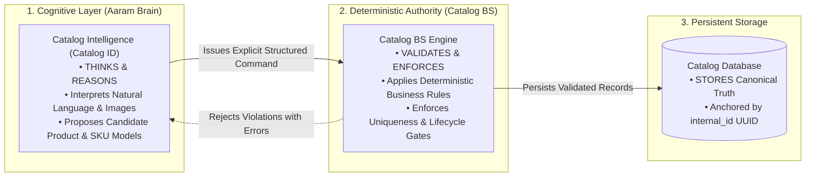
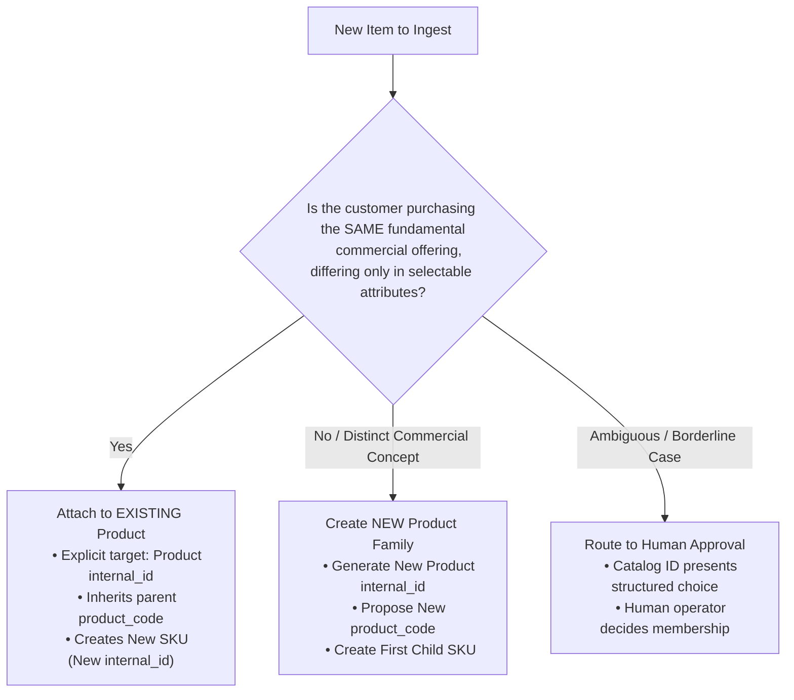
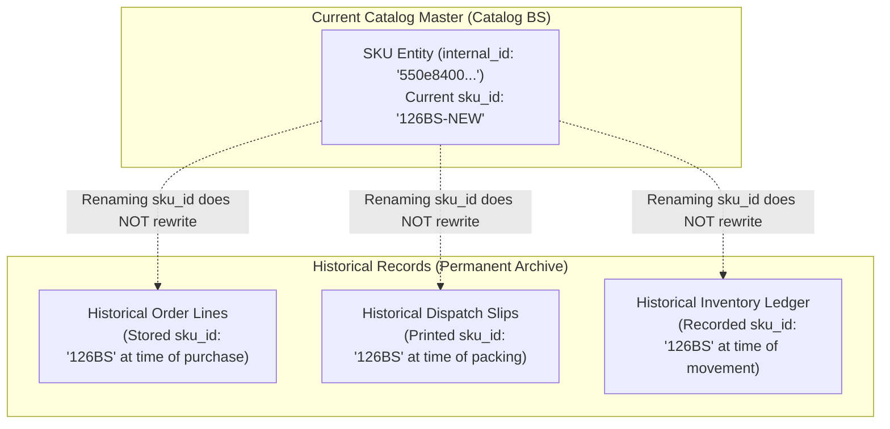
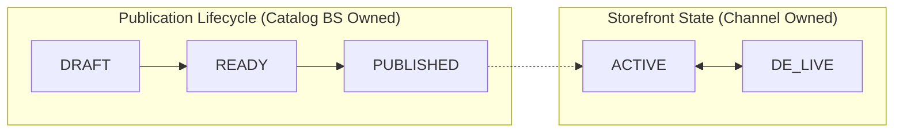

# Catalog Business Rules Specification

**Document Reference:** `business_systems/catalog/docs/03-catalog-business-rules.md`
**System Name:** Sovereign Catalog Business System (`Catalog BS`)
**Domain Layer:** Business Rules Layer (Box 4 in Aaram Ecosystem)
**Status:** Canonical Business Rules Specification
**Authoritative Version:** 1.3 (Architectural Refinement Pass)
**Last Updated:** September 1, 2026

---

## 1. Business Rule Principles & Governance

The Catalog Business System (`Catalog BS`) enforces **deterministic business truth**. To maintain architectural integrity across the AaramBooks ecosystem, a strict division of responsibility is enforced:



### 1.1 Core Principles
1. **Determinism:** Business rules evaluate deterministically (True/False). An AI model proposes data; the business engine validates invariants without probabilistic guessing.
2. **Identity Decoupling:** Technical database identity (`internal_id`) is strictly decoupled from human business keys (`sku_id`) and commercial grouping codes (`product_code`).
3. **Explicit Entity Membership:** Sibling SKUs are attached to a Product family strictly through explicit entity references (`Product internal_id`), never by automatic string-matching heuristics.
4. **Domain Sovereignty:** Catalog rules govern *what Aaram sells*. They do not govern physical inventory movements (Inventory BS) or channel runtime states (ShopDeck).

---

## 2. SKU Business Rules

The SKU is the atomic, sellable commercial unit within AaramBooks.

```text
┌────────────────────────────────────────────────────────────────────────┐
│                          SKU BUSINESS INVARIANTS                       │
│                                                                        │
│  • Format: 5 to 10 characters, strictly UPPERCASE                     │
│  • Character Set: Alphanumeric [A-Z, 0-9] and Hyphen [-]               │
│  • Uniqueness: Globally UNIQUE across all Catalog SKUs                 │
│  • Mutability: EDITABLE (Updates current business key, preserves ID)   │
│  • Identity: internal_id UUID is the database PK, NOT sku_id           │
│  • Label Compatibility: Short & clean for Packer PDF label extraction  │
└────────────────────────────────────────────────────────────────────────┘
```

### 2.1 Approved SKU Invariants
- **Rule SKU-01 (Length & Character Set):** Every `sku_id` must satisfy $5 \le \text{length} \le 10$ and contain only characters matching the regex `^[A-Z0-9]+(-[A-Z0-9]+)*$`. Leading, trailing, or consecutive hyphens are prohibited.
- **Rule SKU-02 (Global Uniqueness):** No two SKU records in Catalog BS may share the same `sku_id`.
- **Rule SKU-03 (Technical Identity Preservation):** `sku_id` is an editable attribute. Changing a `sku_id` mutates the current business reference on the existing entity; it does *not* create a new entity or alter `internal_id`.
- **Rule SKU-04 (Generation Boundary):** Catalog ID is solely responsible for proposing candidate `sku_id` strings. Catalog BS does *not* contain heuristic sequence-incrementing or naming algorithms; it strictly validates syntax, length, uniqueness, and lifecycle constraints. Historical SKU patterns from legacy CSVs never constrain future SKU generation.

---

## 3. Product Code Business Rules

`product_code` is the commercial grouping identifier that unifies one or more sibling SKUs under a single commercial product offering.

### 3.1 Product Code Invariants
- **Rule PRD-01 (Not Entity Identity):** `product_code` is a human-readable commercial grouping code, **NOT** the entity Primary Key. Product identity is permanently anchored by `internal_id` (`UUID`).
- **Rule PRD-02 (Length & Character Constraints):** $5 \le \text{length} < 25$. Must be uppercase alphanumeric with hyphens (regex: `^[A-Z0-9]+(-[A-Z0-9]+)*$`).
- **Rule PRD-03 (Family Sharing):** All child SKUs belonging to the same Product entity share the exact same `product_code`.
- **Rule PRD-04 (Renaming Propagation):** Renaming a `product_code` renames the commercial grouping code of the existing Product entity. The update propagates consistently to all child SKUs and triggers a re-export of downstream channel artifacts without altering entity IDs.
- **Rule PRD-05 (Uniqueness, Historical Non-Reuse & Membership Firewall):** `product_code` must be globally unique across all Product entities. Historical non-reuse is physically guaranteed at the database level by the permanent reservation registry `catalog_product_code_reservations` and trigger `trg_catalog_products_reserve_product_code`: every `product_code` ever assigned to a Product entity is permanently locked to its `internal_id`. Even if a Product is renamed, its prior `product_code` strings remain permanently reserved and cannot be recycled for a different Product entity. Furthermore, **a matching `product_code` must NEVER automatically cause a new SKU to be attached to an existing Product**. Attaching a SKU to an existing Product requires an explicit command specifying the parent Product's `internal_id`.

---

## 4. Product Family Determination Framework

A **Product** represents a single commercial product offering. Multiple SKUs belong to the same Product when the customer is purchasing the **same fundamental commercial product**, differing only in selectable attributes of that offering (such as colourway, visual design/theme, size, or pack configuration).

A **new Product** is required when the difference changes the fundamental commercial concept, construction, intended use, set composition, or customer value proposition.



### 4.1 Commercial Decision Framework

| Decision Dimension | Same Product Family (Sibling SKUs) | Distinct Product Family (New Product Entity) |
|---|---|---|
| **Commercial Offering** | Selectable variation of the same commercial offering (e.g. choice of color, design theme, or dimension). | Materially different commercial concept, standalone flagship line, or distinct category. |
| **Visual Design / Theme** | Different prints/colors that are marketed together as selectable design choices under one product line. | Distinct flagship design that warrants its own dedicated storytelling, marketing campaign, and independent listing. |
| **Set Composition** | Same component structure (e.g. 1 Bedsheet + 2 Pillow Covers across all sizes). | Different component structure (e.g. 3-Piece Set vs 5-Piece Frill Set with Cushions vs Comforter Bedding Set). |
| **Real Examples** | • *Mattress Protector* in Blue, Red, White, Brown.<br>• *Bohemian Tufted Cushions* in Sunflower, Zig-Zag, Rainbow.<br>• *Everyday Cotton Bedsheets* in King (108x108") and Super King (110x110"). | • *Pastel Garden Frill Bedsheet Set* vs *Cloud Cotton Comforter Bedding Set*.<br>• *Quilted Dohar* vs *Bedsheet Set*.<br>• *Ottoman Stool* vs *Kitchen Apron*. |

### 4.2 Ambiguity Resolution & Human Approval Boundary
- When Catalog ID cannot deterministically determine family membership with high confidence ($\ge 90\%$), it must **not guess**.
- It must generate a structured clarification proposal to the human operator:
  > *"Should 'Aqua Gulbahar' be grouped as a selectable design under the existing 'Gulbahar Bedsheets' family, or created as an independent product?"*
- Catalog BS enforces the resulting explicit command targeting `Product internal_id`.

---

## 5. Lifecycle-Based Attribute Validation Matrix

Catalog BS validates attribute completeness progressively across the **Catalog Lifecycle**:
1. **`DRAFT` Creation:** Requires minimal identity and structural keys, allowing Catalog ID to ingest and enrich records incrementally.
2. **`READY` State:** Requires complete commercial, physical, and media specifications before approval for publication.
3. **`PUBLISHED` / Channel Export:** Enforces downstream channel-specific constraints during export compilation.

| Attribute | Level | Required for DRAFT? | Required for READY? | Required for PUBLISHED? | Proposer | Validator |
|---|---|---|---|---|---|---|
| **`internal_id`** | Both | **Yes (Auto)** | **Yes** | **Yes** | System | Database |
| **`product_code`** | Product | **Yes** | **Yes** | **Yes** | Catalog ID | Catalog BS |
| **`name`** | Product | **Yes** | **Yes** | **Yes** | Catalog ID | Catalog BS |
| **`sku_id`** | SKU | **Yes** | **Yes** | **Yes** | Catalog ID | Catalog BS |
| **`mrp`** | SKU | Optional | **Yes** | **Yes** | Human / ID | Catalog BS |
| **`selling_price`** | SKU | Optional | **Yes** | **Yes** | Human / ID | Catalog BS |
| **`cost_price`** | SKU | Optional | **Yes** | **Yes** | Human / ID | Catalog BS |
| **`packaging_dims`** | SKU | Optional | **Yes** | **Yes** | Catalog ID | Catalog BS |
| **`packaging_weight`**| SKU | Optional | **Yes** | **Yes** | Catalog ID | Catalog BS |
| **`sku_media_urls`** | SKU | Optional | **Yes ($\ge 1$)** | **Yes** | Catalog ID | Catalog BS |
| **`description`** | Product | Optional | **Yes** | **Yes** | Catalog ID | Catalog BS |
| **`product_type`** | Product | Optional | **Yes** | **Yes** | Catalog ID | Catalog BS |
| **`hsn_code`** | Product | Optional | Optional | **Yes (Channel)** | Catalog ID | Channel Adapter |
| **`gst_percentage`** | Product | Optional | **Yes** | **Yes** | Catalog ID | Catalog BS |
| **`size`** | SKU | Optional | Optional | **Yes (Channel)** | Catalog ID | Catalog BS / Adapter |
| **`colour`** | SKU | Optional | Optional | Optional | Catalog ID | Catalog BS |
| **`set_composition`** | Product | Optional | Optional | Optional | Catalog ID | Catalog BS |
| **`pack_configuration`**| SKU | Optional | Optional | Optional | Catalog ID | Catalog BS |
| **`pickup_address_code`**| Config| Optional | Optional | **Yes (Channel)** | System | Channel Adapter |

> [!NOTE]
> **Canonical Size vs. Channel Requirement:** In canonical Catalog BS, `size` is optional because products without size variations (e.g. single-size Kitchen Apron, Table Decor, Ottoman Stool) are fully valid. Downstream channels (ShopDeck) that require a `Size` value will be populated with default or classification strings by the Channel Adapter during export compilation.

---

## 6. Pricing & Unit Economics Rules

```text
┌────────────────────────────────────────────────────────────────────────┐
│                        DETERMINISTIC PRICING RULES                     │
│                                                                        │
│  1. Non-Zero Positivity: MRP, Selling Price, and Cost Price must be > 0│
│  2. Canonical Ceiling: Selling Price MUST be <= MRP                    │
│  3. Gross Margin: Computed dynamically as (Selling Price - Cost Price) │
│  4. Audit Trail: All pricing changes must record timestamp & operator  │
└────────────────────────────────────────────────────────────────────────┘
```

- **Rule PRC-01 (Canonical Price Ceiling):** $\text{Selling Price} \le \text{MRP}$ is enforced. Equality ($\text{Selling Price} = \text{MRP}$) is valid canonical catalog data.
- **Rule PRC-02 (Channel Price Incompatibility):** Downstream channels (ShopDeck) require $\text{Selling Price} < \text{MRP}$. If canonical data has $\text{Selling Price} = \text{MRP}$, the publication compiler flags the incompatibility for operator correction prior to export. Canonical Catalog truth is **never silently modified** to satisfy an external channel.
- **Rule PRC-03 (Cost Price Boundary):** In canonical Catalog BS, Cost Price must be positive ($> 0$). (The range $20 \le \text{Cost} \le 20,000$ is recognized as an external ShopDeck CSV validation rule, not an intrinsic catalog ceiling).
- **Rule PRC-04 (Margin Warning — `PROVISIONAL`):** Cost Price should ordinarily be less than Selling Price. If Cost Price exceeds Selling Price, Catalog BS flags a commercial pricing alert during validation (ADR-RUL-003).
- **Rule PRC-05 (Price Change History):** Price adjustments update current commercial state without altering entity identity. Historical price modifications are recorded in an audit log.

---

## 7. Quantity Separation Rules (Non-Negotiable Boundary)

```text
┌────────────────────────────────────────────────────────────────────────┐
│                       STRICT QUANTITY FIREWALL                         │
│                                                                        │
│  MANUFACTURED / PHYSICAL INVENTORY QUANTITY                            │
│  • Sovereign Owner: Inventory Business System (Inventory BS)           │
│  • Physical reality in Panipat (cutting, stock, damage, bin allocation) │
│  • Catalog BS has ZERO ownership of this figure                       │
│                                                                        │
│                           ≠ (COMPLETELY INDEPENDENT)                   │
│                                                                        │
│  COMMERCE AVAILABLE QUANTITY                                           │
│  • Sovereign Owner: Sales Channel (ShopDeck)                           │
│  • Marketing / operational figure maintained on the storefront         │
│  • Catalog BS generates an initial CSV seeding figure (e.g. 10)        │
│  • Catalog BS NEVER synchronizes this back as inventory truth          │
└────────────────────────────────────────────────────────────────────────┘
```

- **Rule QTY-01 (Inventory Boundary):** Catalog BS will never store, track, or model physical warehouse stock levels.
- **Rule QTY-02 (Channel Seeding):** When compiling the ShopDeck 46-column CSV, Catalog BS injects a configured default commercial quantity (e.g., `10`) required by ShopDeck's CSV validator. This figure is strictly channel metadata and must never be reconciled back into Inventory BS.

---

## 8. Media Governance Rules

- **Rule MED-01 (Ownership by Visual Identity):** Media belongs to the entity whose visual presentation it defines. Product-level media covers shared lifestyle/family shots; SKU-level media covers exact color/variant packaging.
- **Rule MED-02 (Primary Image Requirement for READY):** Every SKU must have at least one primary image reference (`sku_media_urls[0]`) before transitioning from `DRAFT` to `READY`.
- **Rule MED-03 (URI Integrity):** Catalog BS stores valid URI pointers (e.g. `https://.../image.png`). Physical asset hosting (VPS, Cloudflare R2, AWS S3) is an infrastructure detail decoupled from domain logic.
- **Rule MED-04 (Media Updates):** Updating an image URI updates canonical truth and marks the publication payload for re-export.

---

## 9. Identity Change, Mutation & Historical Preservation

When an existing catalog entity is modified, the system enforces a strict boundary between **Current Catalog State** and **Historical Observed Records**:



| Modified Field | Entity Consequence | Historical Impact | Republication Required? |
|---|---|---|---|
| **`sku_id`** | **Same SKU Entity** (`internal_id` preserved) | **Historical records are NOT rewritten.** Future packing slips use new `sku_id`. | Yes (Channel Update) |
| **`product_code`** | **Same Product Entity** (`internal_id` preserved) | Historical order records unchanged. Propagates to current child SKUs. | Yes (Channel Update) |
| **`name` / `description`** | **Same Product Entity** | Content update only. | Yes |
| **`mrp` / `selling_price`** | **Same SKU Entity** | Logged to price audit history. Past order prices unchanged. | Yes |
| **`colour` / `size` (Minor Fix)**| **Same SKU Entity** | Corrects a typo (e.g., `'Ryl Blue'` ➔ `'Royal Blue'`). | Yes |
| **`colour` / `size` (New Variant)**| **New SKU Entity** | Creates new SKU row with fresh `internal_id`. | Yes (New SKU Addition) |

---

## 10. Uniqueness & Collision Rejection Policy

To guarantee zero SKU collisions across Panipat warehouse operations:

- **Rule COL-01 (Deterministic Rejection):** If an inbound command attempts to create a SKU with an existing `sku_id`, Catalog BS **rejects the transaction** with a `SKU_COLLISION` error. It does *not* silently overwrite data or auto-append random suffixes without human review.
- **Rule COL-02 (Proactive Disambiguation):** Catalog ID is responsible for proposing distinct distinguishing SKUs (e.g., `102BS-PNK` vs `102BS-AQA`) before command submission.

---

## 11. Retirement, De-listing & Physical Deletion Rules



- **Rule RET-01 (Tombstoning vs Physical Deletion):** Normal business operations use **historical preservation / tombstoning**, never physical database deletion (`DROP` / `DELETE`). Historical orders referencing `internal_id` and `sku_id` remain 100% valid for reporting and returns.
- **Rule RET-02 (Permanent SKU Immutability / No Recycling — `DECIDED`):** A `sku_id` string that has been used in production **MUST NEVER be recycled or reused for a different physical product**. This protects historical order lookups, return processing, and Brain analytics from operational corruption. This is physically enforced at the database level by the permanent reservation registry `catalog_sku_id_reservations` and trigger `trg_catalog_skus_reserve_sku_id`: every `sku_id` ever assigned to a SKU entity is permanently locked to its `internal_id`. Even if an existing SKU is subsequently renamed, its prior `sku_id` strings remain permanently reserved and cannot be claimed by any new or existing SKU entity.
- **Rule RET-03 (Publication State vs Discontinuation):** `DE-LIVE` is an observed channel state where a product is temporarily taken down from storefronts. Discontinued products remain permanently in the Catalog database with their foreign keys protected by referential integrity (`ON DELETE RESTRICT`), preventing accidental operational corruption.

---

## 12. Validation Rules: Canonical Catalog vs. ShopDeck Channel

| Validation Dimension | Canonical Catalog BS Invariant | Downstream ShopDeck Publication Rule | Enforcement Point |
|---|---|---|---|
| **SKU Format** | $5 \le \text{length} \le 10$, uppercase, hyphens allowed | MinCharacterLength: 5 | Inbound Command Validation |
| **Product Code Format**| $5 \le \text{length} < 25$, uppercase, hyphens allowed | MinCharacterLength: 5 | Inbound Command Validation |
| **Product Name** | Non-empty string | MinCharacterLength: 5 | Inbound Command Validation |
| **Uniqueness** | `sku_id` globally unique across catalog | `UNIQUE(Product Code, Sku Id, Size)` | Inbound & Export Compilation |
| **Price Relationship** | $\text{Selling Price} \le \text{MRP}$ (Equality permitted) | $\text{Selling Price} < \text{MRP}$ (Strict inequality required) | Inbound vs Export Compilation |
| **Cost Price** | Must be positive ($> 0$) | Range: $20 \le \text{Cost} \le 20,000$ (ShopDeck Upload Rule) | Inbound vs Export Compilation |
| **Packaging Dims** | Length, Breadth, Height: $1 \le D \le 50\text{ cm}$ | Range: $1 \le D \le 50\text{ cm}$ | Inbound Command Validation |
| **Packaging Weight** | Dead Weight: $0.05 \le W \le 10.0\text{ kg}$ | Range: $0.05 \le W \le 10.0\text{ kg}$ | Inbound Command Validation |
| **Size & Size Type** | Optional in Canonical Catalog | Required: `'size'` or `'variant'` | Inbound vs Export Compilation |
| **Quantity** | N/A (Owned by Inventory) | Required: $\text{Quantity} \ge 0$ (Default injected: 10) | Channel Export Compilation |

---

## 13. System Ownership Matrix

| Area / Rule | Human Owner | Catalog ID (Cognitive) | Catalog BS (Authority) | Database Engine | Inventory BS | ShopDeck (Channel) |
|---|---|---|---|---|---|---|
| **Product Concept & Family** | **Decides / Approves** | Proposes | Validates Explicit Links | Stores Truth | — | — |
| **SKU Code Creation** | Approves | Proposes | **Enforces Format/Unique** | Stores Truth | Reads | Consumes |
| **Pricing & Costs** | **Decides** | Proposes | Validates $\le$ MRP | Stores Truth | — | Displays Price |
| **Manufactured Stock** | — | — | — | — | **Owns Truth** | — |
| **Commerce Available Qty**| Overrides | — | Injects CSV Default | — | — | **Owns Channel State**|
| **CSV Export Generation** | Triggers | Optimizes Copy | **Compiles & Validates** | Source Data | — | Ingests |
| **Storefront Live/De-live** | — | — | Observes | Stores Observed | — | **Controls Runtime** |

---

## 14. Architectural Decision Records (ADRs)

| ADR Reference | Decision Topic | Status | Architectural Determination |
|---|---|---|---|
| **ADR-RUL-001** | SKU Generation Heuristics | `OPEN` | Generation logic belongs to Catalog ID; Catalog BS enforces syntax, length, and uniqueness invariants. |
| **ADR-RUL-002** | SKU Code Recycling Policy | `DECIDED` | Retired `sku_id` strings are permanently tombstoned; recycling business codes is strictly prohibited. |
| **ADR-RUL-003** | Loss-Leader Pricing Policy | `PROVISIONAL` | Cost Price > Selling Price triggers a validation warning; final policy pending business margin rules. |
| **ADR-RUL-004** | Collision Rejection Standard | `DECIDED` | Duplicate SKU submissions are deterministically rejected with `SKU_COLLISION`. |
| **ADR-RUL-005** | Channel Quantity Seeding | `DECIDED` | Catalog BS injects default CSV dummy figure (10) without claiming inventory truth. |
| **ADR-RUL-006** | Product Family Decision Boundary | `DECIDED` | Commercial grouping framework approved; high ambiguity cases route to Human-in-the-loop approval. |
| **ADR-RUL-007** | Membership Attachment Rule | `DECIDED` | Sibling SKU attachment requires explicit target `internal_id`, never string-matched `product_code`. |
| **ADR-RUL-008** | Product Code Historical Non-Reuse | `DECIDED` | Retired `product_code` strings cannot be silently reused for different Product entities. |

---

## 15. Review Status

- **Architectural Status:** **`SOUND`** — Safe to use as authoritative business-rule baseline for `04-catalog-contracts.md`.
- **Remaining Open / Provisional Decisions:**
  - `ADR-RUL-001`: Sequential series algorithms and suffix derivation heuristics (owned by Catalog ID).
  - `ADR-RUL-003`: Loss-leader warning vs blocking error policy (provisional alert).
- **Decisions Intentionally Deferred to Catalog ID:**
  - Image-to-attribute extraction heuristics, SEO prompt engineering, similarity clustering algorithms.
- **Decisions Intentionally Deferred to ShopDeck/Channel Documentation (`05-shopdeck-channel.md`):**
  - Detailed 46-column field mapping, pickup address code configuration, handling $\text{Selling Price} = \text{MRP}$ during CSV publication export.
