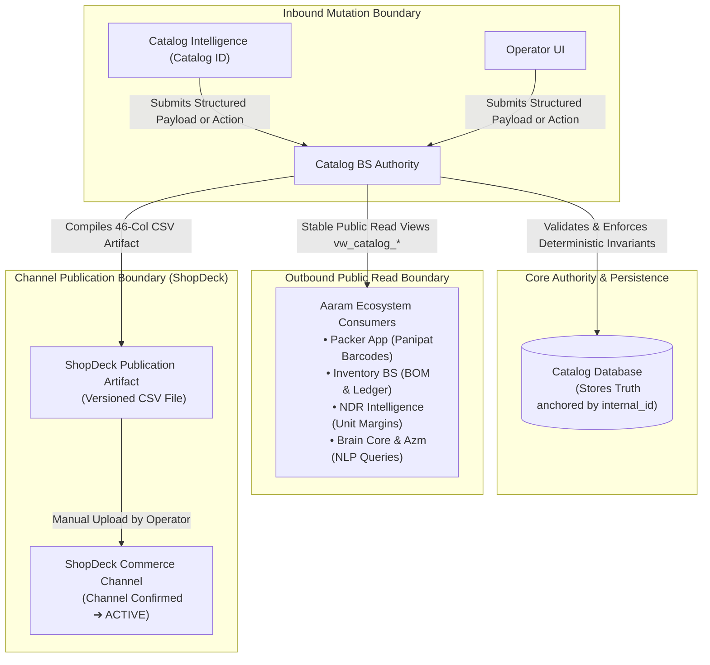
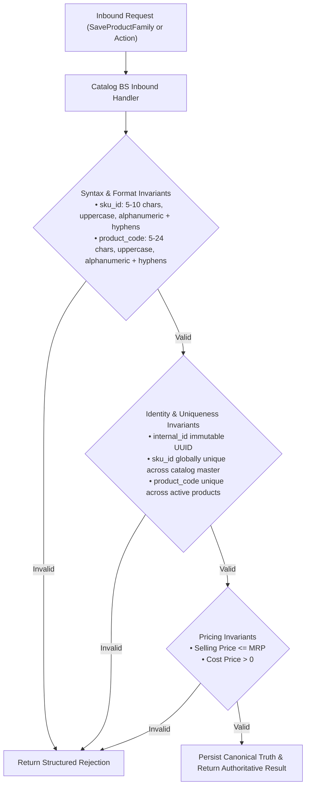
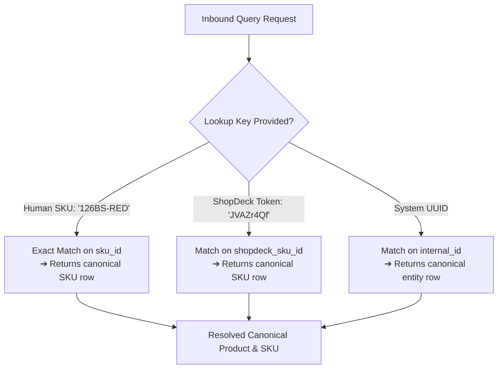

# Catalog Contracts Specification

**Document Reference:** `business_systems/catalog/docs/04-catalog-contracts.md`
**System Name:** Sovereign Catalog Business System (`Catalog BS`)
**Domain Layer:** Interface & Contracts Layer (Box 4 in Aaram Ecosystem)
**Status:** Canonical Contracts Specification
**Authoritative Version:** 1.3 (Final Architectural Consolidation)
**Last Updated:** September 1, 2026

---

## 1. Executive Summary & Contract Governance

The Catalog Contracts define the authoritative interface boundaries of `Catalog BS`. This document specifies:
1. **Inbound Mutation Contract:** How Catalog Intelligence (Catalog ID) or human operators submit structured data mutations and trigger explicit business actions to alter catalog truth.
2. **Outbound Public Read Models:** How downstream systems (Packer, Inventory BS, NDR Intelligence, Brain Core, Azm) read stable catalog facts.
3. **Publication Contracts:** How canonical catalog truth is compiled into the external channel artifact (specifically, the ShopDeck 46-column CSV).



### 1.1 Fundamental Contract Invariant
$$\mathbf{Catalog\ ID\ THINKS\ \&\ PROPOSES} \longrightarrow \mathbf{Catalog\ BS\ VALIDATES\ \&\ PERSISTS} \longrightarrow \mathbf{Database\ STORES\ TRUTH}$$

Catalog ID **never directly writes to the Catalog database**. All mutations flow through the structured mutation interface defined herein.

---

## 2. Inbound Mutation Contract (Catalog ID ➔ Catalog BS)

To ensure the contract remains simple and practical for AI-driven catalog creation and operator workflows, Catalog BS cleanly separates **Data Mutation** from **Business Actions**:

```text
┌────────────────────────────────────────────────────────────────────────┐
│                      INBOUND MUTATION TAXONOMY                         │
│                                                                        │
│  1. DATA MUTATION (Structured Upsert):                                 │
│     • SaveProductFamily: Creates or updates a Product family and all   │
│       its child SKUs in a single, atomic structured payload.           │
│                                                                        │
│  2. BUSINESS ACTIONS (Explicit Governance Operations):                 │
│     • RenameProductCode: Explicit commercial grouping code rename.     │
│     • TransitionLifecycleState: Governs DRAFT ↔ READY transitions.     │
│     • GenerateChannelPublicationArtifact: Compiles versioned CSV export│
└────────────────────────────────────────────────────────────────────────┘
```



### 2.1 The Mutation Contract Operations

| Operation Type | Operation Name | Intent & Operational Scope | Key Identifier Rules | State Consequence |
|---|---|---|---|---|
| **Data Mutation** | **`SaveProductFamily`** | Atomically creates a new Product family, updates an existing Product, adds sibling SKUs, or updates child SKUs. | Target `product_internal_id` (if updating) or omitted (if new). Child SKUs supply `sku_internal_id` (if updating) or new `sku_id`. | Persists Product and child SKUs in `DRAFT` or `READY`. |
| **Business Action** | **`RenameProductCode`** | Renames the commercial grouping code for an existing Product family. | Target `product_internal_id` (UUID), new `product_code`. | Updates `product_code` across all child SKUs. Preserves entity `internal_id`. |
| **Business Action** | **`TransitionLifecycleState`**| Transitions the Product family between **Catalog-owned** states (`DRAFT` $\leftrightarrow$ `READY`). | Target `product_internal_id`, target `lifecycle_state`. | Validates completeness invariants across family and child SKUs. |
| **Business Action** | **`GenerateChannelPublicationArtifact`** | Compiles canonical catalog records into a versioned ShopDeck 46-column CSV payload. | Target `channel` (`'SHOPDECK'`), selection criteria. | Validates channel constraints; generates CSV file; marks Catalog state as `PUBLISHED`. |

---

## 3. Command Identity Model & Resolution Rules

Catalog BS deterministically enforces identity references within all mutation payloads:

```text
┌────────────────────────────────────────────────────────────────────────┐
│                        COMMAND IDENTITY RULES                          │
│                                                                        │
│  1. Technical Anchor: internal_id (UUID PK) is immutable identity      │
│  2. Sovereign Business Key: sku_id is 5-10 chars, uppercase, unique    │
│  3. Grouping Code: product_code is 5-24 chars, uppercase, unique       │
│  4. Membership: Sibling SKUs belong to parent Product internal_id      │
│  5. Channel Tokens: shopdeck_sku_id is an external mapping alias       │
└────────────────────────────────────────────────────────────────────────┘
```

### 3.1 Identifier Resolution Behaviors
- **`internal_id` provided:** Catalog BS resolves the target entity directly via Primary Key for updates. If not found, returns `ENTITY_NOT_FOUND`.
- **`sku_id` provided for New SKU:** Verified against the entire catalog master. If `sku_id` already exists under any active or retired entity with a different `internal_id`, returns `SKU_COLLISION`.
- **`product_code` provided for New Product:** Verified against existing Product entities. If `product_code` already exists with a different `internal_id`, Catalog BS **rejects the creation** with `PRODUCT_CODE_COLLISION` (preventing accidental duplicate family containers).
- **Identifier Conflict:** If a payload supplies an `internal_id` and a `sku_id` belonging to a *different* `internal_id`, returns `IDENTITY_MISMATCH_CONFLICT`.

---

## 4. Idempotency & Safe Mutation Contract

To prevent accidental duplicate entities caused by AI retries or network replays:
- **`idempotency_key` Header:** Inbound mutation requests supply an optional client-generated `idempotency_key` (`UUID` or string).
- **Physical Persistence (`catalog_idempotency_records`):** Catalog BS persists mutation outcomes in `catalog_idempotency_records` with a 24-hour expiration (`expires_at`). If an identical payload is re-submitted with the same `idempotency_key` within 24 hours, Catalog BS returns the cached response with status `UNCHANGED_IDEMPOTENT` without executing duplicate database writes.

---

## 5. Validation & Rejection Contract

When a mutation fails deterministic business rules, Catalog BS returns a **structured rejection payload**:

```json
{
  "status": "REJECTED",
  "error_code": "PRICING_INVARIANT_VIOLATION",
  "target_entity": "SKU",
  "target_field": "selling_price",
  "rejected_value": 3499.00,
  "message": "Selling Price (3499.00) cannot exceed MRP (2999.00).",
  "is_retryable": false,
  "requires_human_review": true
}
```

### 5.1 Standard Rejection Error Codes
- `SKU_COLLISION`: Proposed `sku_id` is already assigned to an existing active or retired entity.
- `PRODUCT_CODE_COLLISION`: Proposed `product_code` is already assigned to a different Product entity.
- `SYNTAX_VALIDATION_ERROR`: Field format violation (e.g. `sku_id` $<5$ or $>10$ chars, invalid characters).
- `PRICING_INVARIANT_VIOLATION`: Commercial rule violation (e.g. $\text{Selling Price} > \text{MRP}$ or $\text{Cost Price} \le 0$).
- `LIFECYCLE_COMPLETENESS_ERROR`: Missing mandatory attributes required for transition to `READY`.

---

## 6. Public Read Contract (Catalog BS ➔ Aaram Ecosystem)

To ensure that downstream consumers depend on **stable business contracts** rather than volatile internal physical tables:

- **Decoupling from Storage:** Internal PostgreSQL tables may evolve without breaking public consumers.
- **Contract Boundary:** Consumers query stable public read views (`vw_catalog_*`).
- **Identity Scope:** `internal_id` is exposed solely for deterministic technical joins; `sku_id` remains the sovereign human business key. Channel tokens (`shopdeck_sku_id`) are strictly external aliases.

```mermaid
graph LR
    subgraph "Catalog BS Public Projections (Stable Views)"
        V_SKU["vw_catalog_skus (Atomic Sellable Units)"]
        V_PRD["vw_catalog_products (Commercial Product Families)"]
        V_MST["vw_catalog_master (Unified Product + SKU Master)"]
    end

    subgraph "Ecosystem Consumers"
        Packer["Aaram Packing App (Scans sku_id barcode)"]
        Inventory["Inventory BS (Attaches Stock & Bins)"]
        NDR["NDR Intelligence (Reads Cost & Packaging Weight)"]
        Brain["Brain Core / Azm (Natural Language Queries)"]
    end

    V_SKU ──► Packer
    V_SKU ──► Inventory
    V_MST ──► NDR
    V_MST ──► Brain
```

### 6.1 Commercial Product Family Read View Contract (`vw_catalog_products`)

| Field Name | Type | Description | Primary Consumer |
|---|---|---|---|
| **`product_internal_id`**| `UUID` | Immutable technical identifier for the Product family. | Database joins |
| **`product_code`** | `VARCHAR(24)` | Commercial grouping code (e.g. `AH-BS-FRLK-PASTEL`). | Storefront, AI |
| **`product_name`** | `TEXT` | Canonical commercial title. | Storefront, AI |
| **`description`** | `TEXT` | Marketing copy & bullet points (HTML supported). | Storefront |
| **`product_type`** | `VARCHAR(128)`| Taxonomical category slug. | Storefront, Catalog |
| **`brand`** | `VARCHAR(64)` | Brand name (`'Aaram Homes'`). | Storefront |
| **`hsn_code`** | `VARCHAR(10)` | HSN tax code (e.g. `'6304'`). | Invoicing, Tax |
| **`gst_percentage`** | `NUMERIC(4,2)` | Applicable GST rate (`5.00`). | Invoicing, Tax |
| **`fabric_type`** | `TEXT` | Material composition (e.g. `'100% Cotton'`). | Storefront |
| **`care_instructions`**| `TEXT` | Wash & maintenance guidance. | Storefront |
| **`set_composition`** | `TEXT` | Set composition breakdown. | Storefront |
| **`product_media_urls`**| `JSONB` | Array of shared lifestyle/room URLs. | Storefront |
| **`size_chart_url`** | `TEXT` | Shared size chart image URL. | Storefront |
| **`video_urls`** | `JSONB` | Array of product video showcase URLs. | Storefront |
| **`collection_tags`**| `TEXT[]` | Storefront collection slugs. | Storefront |
| **`lifecycle_state`** | `VARCHAR(32)`| `DRAFT`, `READY`, or `PUBLISHED`. | Governance |
| **`created_at`** | `TIMESTAMPTZ` | Record creation timestamp. | Audit |
| **`updated_at`** | `TIMESTAMPTZ` | Record mutation timestamp. | Audit |

### 6.2 Atomic SKU Read View Contract (`vw_catalog_skus`)

| Field Name | Type | Description | Primary Consumer |
|---|---|---|---|
| **`sku_internal_id`** | `UUID` | Immutable technical identifier for the SKU. | Database joins |
| **`product_internal_id`**| `UUID` | Parent Product family technical identifier. | Database joins |
| **`product_code`** | `VARCHAR(24)` | Parent commercial grouping code. | Storefront, AI |
| **`product_name`** | `TEXT` | Parent canonical commercial title. | Storefront, AI |
| **`sku_id`** | `VARCHAR(10)` | Sovereign human operational business key (e.g. `126BS-RED`). | **Packer, Inventory** |
| **`colour`** | `VARCHAR(64)` | Variant colorway / design name. | Storefront, Packer |
| **`size`** | `VARCHAR(64)` | Variant size specification (nullable for size-less items). | Storefront, Packer |
| **`size_type`** | `VARCHAR(32)` | Dimension classification (`'size'`, `'variant'`). | Channel Export |
| **`pack_configuration`**| `VARCHAR(64)`| Packaging bundle specification (e.g. `'Pack of 1'`). | Storefront |
| **`mrp`** | `NUMERIC(10,2)`| Maximum Retail Price. | Customer billing |
| **`selling_price`** | `NUMERIC(10,2)`| Canonical base selling price. | Storefront, Billing |
| **`cost_price`** | `NUMERIC(10,2)`| Landed manufacturing cost price. | **NDR, Profitability** |
| **`gross_margin`** | `NUMERIC(10,2)`| Derived margin (`selling_price - cost_price`). | **Unit Economics** |
| **`packaging_length_cm`**| `NUMERIC(6,2)`| Physical packaging length in cm. | Logistics |
| **`packaging_breadth_cm`**| `NUMERIC(6,2)`| Physical packaging breadth in cm. | Logistics |
| **`packaging_height_cm`**| `NUMERIC(6,2)`| Physical packaging height in cm. | Logistics |
| **`packaging_weight_kg`**| `NUMERIC(6,3)`| Dead weight in kg. | **Logistics / Courier SLAs** |
| **`sku_media_urls`** | `JSONB` | Array of SKU variant swatch URLs. | Packer UI, Storefront |
| **`created_at`** | `TIMESTAMPTZ` | Record creation timestamp. | Audit |
| **`updated_at`** | `TIMESTAMPTZ` | Record mutation timestamp. | Audit |

### 6.3 Unified Master Read View Contract (`vw_catalog_master`)

| Field Name | Type | Description | Primary Consumer |
|---|---|---|---|
| **`sku_internal_id`** | `UUID` | Immutable technical identifier for the SKU. | Database joins |
| **`product_internal_id`**| `UUID` | Immutable technical identifier for the Product family. | Database joins |
| **`sku_id`** | `VARCHAR(10)` | Sovereign human operational business key (e.g. `126BS-RED`). | **Packer, Inventory** |
| **`product_code`** | `VARCHAR(24)` | Commercial grouping code (e.g. `AH-BS-FRLK-PASTEL`). | Storefront, AI |
| **`product_name`** | `TEXT` | Canonical commercial title. | Storefront, AI |
| **`description`** | `TEXT` | Marketing copy & bullet points (HTML supported). | Storefront |
| **`product_type`** | `VARCHAR(128)`| Taxonomical category slug. | Storefront, Catalog |
| **`brand`** | `VARCHAR(64)` | Brand name (`'Aaram Homes'`). | Storefront |
| **`hsn_code`** | `VARCHAR(10)` | HSN tax code (e.g. `'6304'`). | Invoicing, Tax |
| **`gst_percentage`** | `NUMERIC(4,2)` | Applicable GST rate (`5.00`). | Invoicing, Tax |
| **`fabric_type`** | `TEXT` | Material composition (e.g. `'100% Cotton'`). | Storefront |
| **`care_instructions`**| `TEXT` | Wash & maintenance guidance. | Storefront |
| **`set_composition`** | `TEXT` | Set composition breakdown. | Storefront |
| **`colour`** | `VARCHAR(64)` | Variant colorway / design name. | Storefront, Packer |
| **`size`** | `VARCHAR(64)` | Variant size specification (nullable for size-less items). | Storefront, Packer |
| **`size_type`** | `VARCHAR(32)` | Dimension classification (`'size'`, `'variant'`). | Channel Export |
| **`pack_configuration`**| `VARCHAR(64)`| Packaging bundle specification (e.g. `'Pack of 1'`). | Storefront |
| **`mrp`** | `NUMERIC(10,2)`| Maximum Retail Price. | Customer billing |
| **`selling_price`** | `NUMERIC(10,2)`| Canonical base selling price. | Storefront, Billing |
| **`cost_price`** | `NUMERIC(10,2)`| Landed manufacturing cost price. | **NDR, Profitability** |
| **`gross_margin`** | `NUMERIC(10,2)`| Derived margin (`selling_price - cost_price`). | **Unit Economics** |
| **`packaging_length_cm`**| `NUMERIC(6,2)`| Physical packaging length in cm. | Logistics |
| **`packaging_breadth_cm`**| `NUMERIC(6,2)`| Physical packaging breadth in cm. | Logistics |
| **`packaging_height_cm`**| `NUMERIC(6,2)`| Physical packaging height in cm. | Logistics |
| **`packaging_weight_kg`**| `NUMERIC(6,3)`| Dead weight in kg. | **Logistics / Courier SLAs** |
| **`sku_media_urls`** | `JSONB` | Array of SKU variant swatch URLs. | Packer UI, Storefront |
| **`product_media_urls`**| `JSONB` | Array of shared lifestyle/room URLs. | Storefront |
| **`size_chart_url`** | `TEXT` | Shared size chart image URL. | Storefront |
| **`video_urls`** | `JSONB` | Array of product video showcase URLs. | Storefront |
| **`collection_tags`**| `TEXT[]` | Storefront collection slugs. | Storefront |
| **`lifecycle_state`** | `VARCHAR(32)`| `DRAFT`, `READY`, or `PUBLISHED`. | Governance |
| **`shopdeck_sku_id`** | `VARCHAR(64)` | Channel mapping token (`customer_sku_short_id`). | **ShopDeck Order Sync** |
| **`shopdeck_product_id`**| `VARCHAR(64)`| Channel product token (`customer_product_short_id`). | ShopDeck Listing |
| **`created_at`** | `TIMESTAMPTZ` | Record creation timestamp. | Audit |
| **`updated_at`** | `TIMESTAMPTZ` | Record mutation timestamp. | Audit |

---

## 7. Deterministic SKU Resolution Contract

Downstream consumers resolve products deterministically across 3 lookup dimensions:



- **Sovereign vs. Alias Rule:** `sku_id` and `internal_id` are sovereign Aaram identifiers. `shopdeck_sku_id` (`customer_sku_short_id`) is strictly an external alias mapping token.

---

## 8. Catalog ➔ ShopDeck Publication Contract

ShopDeck is currently the **only commerce channel** for AaramBooks. The publication layer compiles canonical catalog truth into the **ShopDeck 46-Column CSV Artifact**:

```text
┌────────────────────────────────────────────────────────────────────────┐
│                   SHOPDECK PUBLICATION PIPELINE                        │
│                                                                        │
│  1. Canonical Product + SKU Data (Catalog BS Database)                 │
│                 │                                                      │
│                 ▼                                                      │
│  2. Catalog BS ShopDeck Adapter (Validation & Compilation)             │
│     • Enforces ShopDeck price rule: Selling Price < MRP                │
│     • Enforces ShopDeck dims/weights ranges (1-50 cm, 0.05-10 kg)      │
│     • Injects configured dummy Commerce Available Qty (e.g. 10)        │
│     • Maps canonical attributes to 46-column ShopDeck schema headers   │
│                 │                                                      │
│                 ▼                                                      │
│  3. Versioned ShopDeck CSV Output (Generation Event Recorded)          │
│     • Marks Catalog state as PUBLISHED                                 │
│                 │                                                      │
│                 ▼                                                      │
│  4. Manual Operator Upload ➔ Storefront ACTIVE                         │
└────────────────────────────────────────────────────────────────────────┘
```

### 8.1 Key Publication Invariants
- **Generation $\neq$ Live Storefront:** Generating the CSV artifact transitions the Catalog record to `PUBLISHED` (meaning the publication payload is issued and versioned). It does *not* imply ShopDeck is live.
- **Dummy Quantity Injection:** Catalog BS injects a configured default quantity (e.g. `10`) strictly to satisfy ShopDeck's CSV validator. This figure is never treated as inventory truth or reconciled into Inventory BS.
- **Price Incompatibility Detection:** If canonical data has $\text{Selling Price} = \text{MRP}$, publication export flags the incompatibility for operator correction prior to export, preserving canonical truth without silent alterations.
- **Manual Upload Reality:** Catalog BS compiles the CSV artifact; the human operator manually uploads the file to ShopDeck. Direct API writes are out of scope.

---

## 9. Product-Centric Lifecycle Ownership Contract

In the Aaram commercial model, **Product is the primary lifecycle-bearing commercial entity**. Sibling SKUs belong to the Product and participate in its publication lifecycle.

```mermaid
stateDiagram-v2
    direction LR

    subgraph "Catalog BS Owned (Product Truth)"
        DRAFT --> READY : TransitionLifecycleState (Completeness Validated)
        READY --> PUBLISHED : GenerateChannelPublicationArtifact (CSV Generated)
        READY --> DRAFT : Returned for Edits
    end

    subgraph "Channel Owned (Observed State)"
        PUBLISHED -.-> ACTIVE : Channel Confirms Listing Live
        ACTIVE --> DE_LIVE : De-listed on Storefront
        DE_LIVE --> ACTIVE : Relisted on Storefront
    end
```

### 9.1 Lifecycle Boundary Rules
- **Product-Centricity:** The lifecycle state (`DRAFT`, `READY`, `PUBLISHED`) is evaluated and maintained primarily at the Product family level. Child SKUs participate in their parent's lifecycle.
- **Tombstoning vs Physical Deletion:** Individual SKU retirement for historical preservation is an immutable database state (preserved via `ON DELETE RESTRICT`), not a separate competing publication lifecycle flag.
- **Catalog BS Owns:** `DRAFT`, `READY`, and `PUBLISHED`.
- **Commerce Channel Owns:** `ACTIVE` and `DE-LIVE`. Catalog BS **cannot directly transition an entity to `ACTIVE` or `DE-LIVE`**.
- **`PUBLISHED` Definition:** `PUBLISHED` signifies that the current canonical state of the Product family has been successfully compiled and issued in a versioned publication artifact (e.g. 46-column CSV). It does *not* guarantee the channel is live.
- **Mutation on `PUBLISHED` Entities:** If canonical Product or SKU attributes are edited after publication:
  - If the new state is complete and valid, `lifecycle_state` transitions back to `READY` (signifying new canonical changes exist that are ready for artifact compilation).
  - If the new state has missing or invalid required fields, it transitions to `DRAFT`.
  - Once `GenerateChannelPublicationArtifact` runs again, `lifecycle_state` transitions back to `PUBLISHED`.
- **`ACTIVE` Definition:** Observed channel state confirming the product is live on storefronts (confirmed manually by the operator today; automated via headless read sync in future phases).

---

## 10. Concrete JSON Contract Examples (Illustrative)

### 10.1 Structured Mutation Example: `SaveProductFamily`
```json
{
  "operation": "SaveProductFamily",
  "idempotency_key": "mut-20260901-001",
  "product": {
    "product_code": "AH-MP-WATERPROOF-DBF",
    "name": "100% Waterproof Quilted Mattress Protector",
    "description": "Premium waterproof breathable mattress protector.",
    "product_type": "home__home_furnishing__bed_linen",
    "brand": "Aaram Homes",
    "hsn_code": "6304",
    "gst_percentage": 5.0,
    "fabric_type": "220 GSM Imported Cotton Blend",
    "product_media_urls": [
      "https://media.aaramhomes.com/lifestyle/mp-family-room.jpg"
    ]
  },
  "skus": [
    {
      "sku_id": "101MP-BLU",
      "colour": "Royal Blue",
      "size": "72x78 + 12 Inches",
      "mrp": 2999.00,
      "selling_price": 1499.00,
      "cost_price": 760.00,
      "packaging_length_cm": 33.0,
      "packaging_breadth_cm": 27.0,
      "packaging_height_cm": 11.0,
      "packaging_weight_kg": 1.3,
      "sku_media_urls": [
        "https://media.aaramhomes.com/products/101mp-blue-pack.jpg"
      ]
    },
    {
      "sku_id": "102MP-RED",
      "colour": "Dark Red",
      "size": "72x78 + 12 Inches",
      "mrp": 2999.00,
      "selling_price": 1499.00,
      "cost_price": 760.00,
      "packaging_length_cm": 33.0,
      "packaging_breadth_cm": 27.0,
      "packaging_height_cm": 11.0,
      "packaging_weight_kg": 1.3,
      "sku_media_urls": [
        "https://media.aaramhomes.com/products/102mp-red-pack.jpg"
      ]
    }
  ]
}
```

### 10.2 Success Response Example
```json
{
  "status": "SUCCESS",
  "operation": "SaveProductFamily",
  "result": {
    "product_internal_id": "9b1deb4d-3b7d-4bad-9bdd-2b0d7b3dcb6d",
    "product_code": "AH-MP-WATERPROOF-DBF",
    "skus": [
      {
        "sku_internal_id": "4a2c110b-4d71-33c7-6701-1ba5e2a3f890",
        "sku_id": "101MP-BLU"
      },
      {
        "sku_internal_id": "7f8e330a-1a22-49c1-8812-3da7e4b5c112",
        "sku_id": "102MP-RED"
      }
    ],
    "lifecycle_state": "DRAFT",
    "created_at": "2026-09-01T17:15:00Z"
  }
}
```

### 10.3 Publication Artifact Command Example
```json
{
  "operation": "GenerateChannelPublicationArtifact",
  "idempotency_key": "pub-20260901-001",
  "channel": "SHOPDECK",
  "sku_selection": {
    "filter_state": "READY"
  }
}
```

### 10.4 Publication Artifact Response Example
```json
{
  "status": "SUCCESS",
  "operation": "GenerateChannelPublicationArtifact",
  "result": {
    "channel": "SHOPDECK",
    "artifact_id": "art-shopdeck-20260901-01",
    "artifact_type": "CSV_46_COLUMN",
    "file_path": "/Users/sumatidhingra/aarambooks/business_systems/catalog/exports/shopdeck_upload_20260901.csv",
    "exported_sku_count": 14,
    "catalog_state_applied": "PUBLISHED",
    "generated_at": "2026-09-01T17:20:00Z"
  }
}
```

---

## 11. Architectural Non-Goals

The Catalog Contracts explicitly do **NOT** attempt to handle:
- Warehouse physical stock balances or bin allocations (owned by Inventory BS).
- Accounting ledgers or tax invoice filings.
- Live customer cart management or checkout processing.
- Direct write API integration to ShopDeck (until ShopDeck MCP exposes write capabilities).
- Amazon / Shopify multi-channel publishing (out of scope for current architecture).
- Computer vision or NLP reasoning logic (owned strictly by Catalog Intelligence).

---

## 12. Review Status

- **Architectural Status:** **`ARCHITECTURALLY READY`**
- **Mutation Model Finalized:** Structured `SaveProductFamily` upsert + explicit business actions (`RenameProductCode`, `TransitionLifecycleState`, `GenerateChannelPublicationArtifact`).
- **Product-Centric Lifecycle:** Catalog BS controls `DRAFT ➔ READY ➔ PUBLISHED` at the Product level; ShopDeck controls `ACTIVE / DE-LIVE`.
- **Identity Model Confirmed:** Immutable UUID PK (`internal_id`), sovereign business key (`sku_id`, 5-10 chars), grouping code (`product_code`, 5-24 chars), external alias (`shopdeck_sku_id`).
- **Current Channel Scope:** ShopDeck is the sole active channel; publication via 46-column CSV manual upload.
- **Remaining Open Decisions:** Detailed 46-column field mapping is intentionally deferred to `05-shopdeck-channel.md`.
