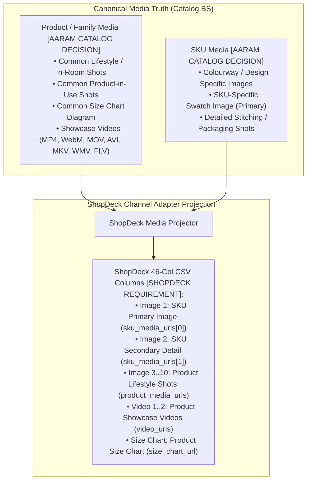
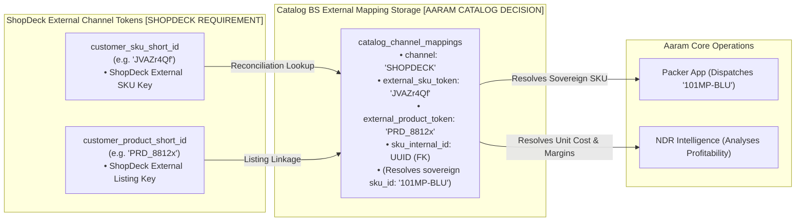
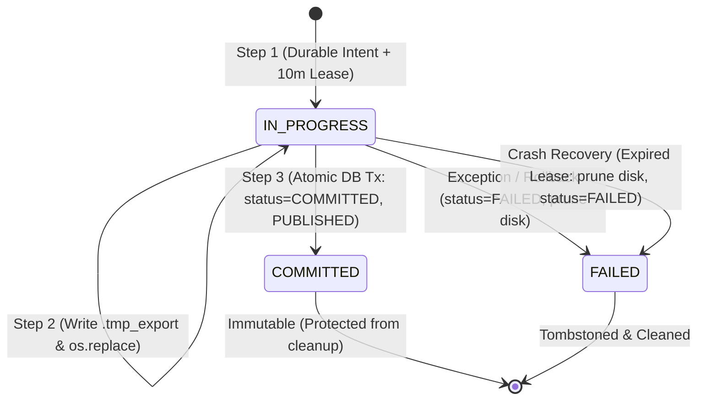

# ShopDeck Channel Publication & Adapter Specification

**Document Reference:** `business_systems/catalog/docs/05-shopdeck-channel.md`
**System Name:** Sovereign Catalog Business System (`Catalog BS`) — ShopDeck Channel Adapter
**Domain Layer:** Channel Publication Layer (Box 4 ➔ Box 5 in Aaram Ecosystem)
**Status:** Canonical Channel Specification
**Authoritative Version:** 2.2 (ShopDeck MCP Observability & Limitations Realignment)
**Last Updated:** September 1, 2026

---

## 1. Source Authority Hierarchy & Evidence Model

To ensure absolute architectural purity, this specification is strictly governed by the following **Source Authority Hierarchy**:

```text
┌────────────────────────────────────────────────────────────────────────┐
│                      SOURCE AUTHORITY HIERARCHY                        │
│                                                                        │
│  1. HIGHEST AUTHORITY: Official ShopDeck Guidelines PDF                │
│     (CatalogueUploadGudelinesV2.pdf)                                   │
│     • Authoritative source for ShopDeck platform rules, validation     │
│       constraints, field limits, required/optional status, allowed     │
│       values, and update/deletion mechanisms.                          │
│                                                                        │
│  2. HIGHEST AUTHORITY FOR FILE STRUCTURE: Official Sample CSV          │
│     (CatalogueBulkUploadSample.csv)                                    │
│     • Authoritative reference for the 46-column bulk-upload CSV header │
│       sequence, exact naming, and publication artifact structure.      │
│                                                                        │
│  3. LOWEST AUTHORITY / OBSERVATIONAL ONLY: shopdeck_catalogues.csv     │
│     • NON-AUTHORITATIVE / HISTORICAL OPERATIONAL EVIDENCE ONLY.         │
│     • Contains manual legacy attempts and potential historical errors. │
│     • Used ONLY for migration planning; NEVER constrains or shapes     │
│       the new Catalog BS architecture.                                 │
└────────────────────────────────────────────────────────────────────────┘
```

### 1.1 Rule Origin Classifications
Every requirement in this specification is explicitly tagged with its authoritative origin:
- **`[SHOPDECK REQUIREMENT]`**: Mandated by ShopDeck platform validators (PDF Guidelines / Sample CSV).
- **`[AARAM CATALOG DECISION]`**: Sovereign business truth invariant from Catalog BS (`01`–`04`).
- **`[AARAM CHANNEL ADAPTER DECISION]`**: Projection, default injection, or compilation rule handled by the adapter.
- **`[OBSERVATIONAL / HISTORICAL EVIDENCE]`**: Empirical observation from historical operations (non-binding).
- **`[OPEN / UNKNOWN]`**: Genuinely unresolved item requiring business or channel clarification.

---

## 2. Channel Role & System Boundaries

`Catalog BS` is the **sovereign owner of catalog truth**. ShopDeck is strictly an **external downstream commerce channel**.

```mermaid
graph TD
    subgraph "1. Cognitive Intelligence (Catalog ID)"
        CID["Catalog Intelligence (Catalog ID)
        • Proposes Descriptions, SEO, Taxonomy
        • Proposes SKU & Product Media Relationships"]
    end

    subgraph "2. Sovereign Truth Authority (Catalog BS)"
        CBS[("Catalog BS Database
        • Canonical Product & SKU Truth
        • Pricing, Physical Specs & Media URIs
        • Lifecycle: READY")]
    end

    subgraph "3. ShopDeck Channel Adapter (Catalog BS)"
        ADAPT["ShopDeck Publication Adapter
        • Validates ShopDeck Constraints (Selling Price < MRP, Bounds)
        • Injects ShopDeck Upload Quantity (default: 10)
        • Projects Product & SKU Media into 46 Columns
        • Compiles Versioned ShopDeck CSV Artifact"]
    end

    subgraph "4. Channel Operations & Runtime (ShopDeck)"
        OP["Human Operator
        (Manual CSV Upload via Seller Dashboard)"]
        SD["ShopDeck Runtime Storefront
        • Customer Detail Pages & Swatches
        • Live Operational State (ACTIVE / DE-LIVE)"]
    end

    CID -->|Proposes Structured Payloads| CBS
    CBS -->|Reads Validated READY Entities| ADAPT
    ADAPT -->|Emits 46-Column CSV File| OP
    OP -->|Uploads File| SD
    SD -.->|Order & Event Observability Only (Read-Only MCP)| CBS
```

### 2.1 Core Architectural Principles
1. **Single Sovereign Catalog `[AARAM CATALOG DECISION]`:** There is **NO second "ShopDeck Catalog"** inside Catalog BS. Catalog BS maintains singular, sovereign catalog truth. ShopDeck is strictly an external downstream sales channel.
2. **Channel Projection `[AARAM CHANNEL ADAPTER DECISION]`:** The 46-column CSV is a *projection* of canonical truth, compiled on demand for manual operator upload.
3. **Quantity Firewall `[AARAM CATALOG DECISION]`:** Physical inventory belongs 100% to `Inventory BS`. ShopDeck's `Quantity` column is strictly an operational upload placeholder (default: `10`) required by ShopDeck's validator. It is **NEVER** physical inventory truth and is never synchronized back into Inventory BS.
4. **Current Publication Reality `[AARAM CHANNEL ADAPTER DECISION]`:** ShopDeck is currently the **only active commerce channel** for Aaram. Publication is executed via manual CSV bulk upload because the ShopDeck MCP server provides read-only analytical access.

---

## 3. Media Ownership & Projection Architecture

Catalog BS cleanly separates **Product-level Media** from **SKU-level Media**:



### 3.1 Media Scopes Defined
- **Product / Family Media `[AARAM CATALOG DECISION]`:** Visual assets describing the entire commercial product family regardless of variant (lifestyle mood imagery, bedroom setups, size charts, assembly/showcase videos).
- **SKU Media `[AARAM CATALOG DECISION]`:** Visual assets describing the specific, individual sellable unit (colorway swatches, pattern close-ups, packaging box shots).
- **Catalog ID vs Catalog BS Authority `[AARAM CATALOG DECISION]`:** Catalog ID analyzes images and proposes entity relationships. Once validated and stored in Catalog BS, the references become **Canonical Catalog Truth**.
- **Adapter Projection Rule `[AARAM CHANNEL ADAPTER DECISION]`:** For each SKU row, the ShopDeck adapter projects the SKU's specific primary images into `Image 1` and `Image 2`, and fills subsequent columns (`Image 3` through `Image 10`) with shared Product family lifestyle imagery.

---

## 4. Complete 46-Column ShopDeck Schema & Mapping Specification

Reconstructed directly from [`CatalogueUploadGudelinesV2.pdf`](file:///Users/sumatidhingra/aarambooks/business_systems/catalog/docs/CatalogueUploadGudelinesV2.pdf) (Highest Authority) and [`CatalogueBulkUploadSample.csv`](file:///Users/sumatidhingra/aarambooks/business_systems/catalog/docs/CatalogueBulkUploadSample.csv) (Second Authority):

| # | ShopDeck Column Header | Req / Opt | Data Type / Format | Validation Constraints (from Guidelines V2 PDF) | Canonical Catalog Source | Entity Level | Generation / Derivation Logic | Origin Classification |
|---|---|---|---|---|---|---|---|---|
| **1** | `Product Code` | **Mandatory** | String | MinLength: 5, MaxLength < 25; Uppercase alphanumeric + hyphens | `product.product_code` | Product | Commercial grouping code; shared by sibling SKUs | **`[SHOPDECK REQUIREMENT]`** |
| **2** | `Amazon ASIN` | Optional | String | MinLength: 5 (Only for Amazon-Upload) | — | SKU | Omitted / Empty string (`""`) | **`[SHOPDECK REQUIREMENT]`** |
| **3** | `Name` | **Mandatory** | String | MinLength: 5 | `product.name` | Product | Commercial offering title | **`[SHOPDECK REQUIREMENT]`** |
| **4** | `Sku Id` | **Mandatory** | String | MinLength: 5, MaxLength: 10; Unique per size/product | `sku.sku_id` | SKU | Sovereign operational business key | **`[SHOPDECK REQUIREMENT]`** |
| **5** | `Selling Price` | **Mandatory** | Numeric | Range: `[1, 1000001]`; **Must be < MRP** | `sku.selling_price` | SKU | Canonical base selling price | **`[SHOPDECK REQUIREMENT]`** |
| **6** | `MRP` | **Mandatory** | Numeric | Range: `[1, 1000001]` | `sku.mrp` | SKU | Maximum Retail Price | **`[SHOPDECK REQUIREMENT]`** |
| **7** | `Cost Price` | Optional | Numeric | Range: `[20, 20000]` (ShopDeck upload bound) | `sku.cost_price` | SKU | Landed manufacturing cost | **`[SHOPDECK REQUIREMENT]`** |
| **8** | `Quantity` | **Mandatory** | Integer | $\ge 0$ | Config / Default | Channel | Injected **ShopDeck Upload Quantity** (default: `10`) | **`[AARAM CHANNEL ADAPTER DECISION]`** |
| **9** | `Packaging Length (in cm)` | **Mandatory** | Numeric | Range: `1 to 50` | `sku.packaging_length_cm` | SKU | Dead package dimensions | **`[SHOPDECK REQUIREMENT]`** |
| **10**| `Packaging Breadth (in cm)`| **Mandatory** | Numeric | Range: `1 to 50` | `sku.packaging_breadth_cm`| SKU | Dead package dimensions | **`[SHOPDECK REQUIREMENT]`** |
| **11**| `Packaging Height (in cm)` | **Mandatory** | Numeric | Range: `1 to 50` | `sku.packaging_height_cm` | SKU | Dead package dimensions | **`[SHOPDECK REQUIREMENT]`** |
| **12**| `Packaging Weight (in kg)` | **Mandatory** | Numeric | Range: `0.05 to 10.0` | `sku.packaging_weight_kg` | SKU | Dead package weight | **`[SHOPDECK REQUIREMENT]`** |
| **13**| `GST %` | Optional | Numeric | Range: `0 to 100` | `product.gst_percentage` | Product | GST tax rate (e.g. `5` or `12`) | **`[SHOPDECK REQUIREMENT]`** |
| **14**| `Image 1` | Optional | URI String | Public link; `< 8MB`; PNG/JPEG | `sku.sku_media_urls[0]` | SKU | Primary variant swatch image | **`[AARAM CHANNEL ADAPTER DECISION]`** |
| **15**| `Image 2` | Optional | URI String | Public link; `< 8MB`; PNG/JPEG | `sku.sku_media_urls[1]` | SKU | Secondary variant detail image | **`[AARAM CHANNEL ADAPTER DECISION]`** |
| **16**| `Image 3` | Optional | URI String | Public link; `< 8MB`; PNG/JPEG | `product.product_media_urls[0]`| Product | Shared lifestyle / room shot | **`[AARAM CHANNEL ADAPTER DECISION]`** |
| **17**| `Image 4` | Optional | URI String | Public link; `< 8MB`; PNG/JPEG | `product.product_media_urls[1]`| Product | Shared lifestyle / mood shot | **`[AARAM CHANNEL ADAPTER DECISION]`** |
| **18**| `Image 5` | Optional | URI String | Public link; `< 8MB`; PNG/JPEG | `product.product_media_urls[2]`| Product | Shared lifestyle / angle shot | **`[AARAM CHANNEL ADAPTER DECISION]`** |
| **19**| `Image 6` | Optional | URI String | Public link; `< 8MB`; PNG/JPEG | `product.product_media_urls[3]`| Product | Shared lifestyle / detail shot | **`[AARAM CHANNEL ADAPTER DECISION]`** |
| **20**| `Image 7` | Optional | URI String | Public link; `< 8MB`; PNG/JPEG | `product.product_media_urls[4]`| Product | Additional family asset | **`[AARAM CHANNEL ADAPTER DECISION]`** |
| **21**| `Image 8` | Optional | URI String | Public link; `< 8MB`; PNG/JPEG | `product.product_media_urls[5]`| Product | Additional family asset | **`[AARAM CHANNEL ADAPTER DECISION]`** |
| **22**| `Image 9` | Optional | URI String | Public link; `< 8MB`; PNG/JPEG | `product.product_media_urls[6]`| Product | Additional family asset | **`[AARAM CHANNEL ADAPTER DECISION]`** |
| **23**| `Image 10` | Optional | URI String | Public link; `< 8MB`; PNG/JPEG | `product.product_media_urls[7]`| Product | Additional family asset | **`[AARAM CHANNEL ADAPTER DECISION]`** |
| **24**| `Video 1` | Optional | URI String | Public link; `< 100MB`; MP4/WebM/MOV/AVI/MKV/WMV/FLV | `product.video_urls[0]` | Product | Showcase product video | **`[SHOPDECK REQUIREMENT]`** |
| **25**| `Video 2` | Optional | URI String | Public link; `< 100MB`; MP4/WebM/MOV/AVI/MKV/WMV/FLV | `product.video_urls[1]` | Product | Secondary video | **`[SHOPDECK REQUIREMENT]`** |
| **26**| `Product Type` | Optional | String | Exact taxonomy value from ShopDeck list | `product.product_type` | Product | Taxonomy (e.g. `home__home_furnishing__bed_linen`) | **`[SHOPDECK REQUIREMENT]`** |
| **27**| `Size Type` | Optional | String | Allowed: `'size'` or `'variant'` | `sku.size_type` | SKU | Classification of option selector | **`[SHOPDECK REQUIREMENT]`** |
| **28**| `Size` | **Mandatory** | String | MaxLength: 40; Unique per `(Product Code, Sku Id)` | `sku.size` | SKU | Option label (e.g. `'King'`, `'Standard'`) | **`[SHOPDECK REQUIREMENT]`** |
| **29**| `Colour` | Optional | String | MaxLength: 100 | `sku.colour` | SKU | Variant color / design name | **`[SHOPDECK REQUIREMENT]`** |
| **30**| `Description` | Optional | String / HTML | Storefront marketing copy | `product.description` | Product | Enriched HTML copy stored in Catalog BS | **`[SHOPDECK REQUIREMENT]`** |
| **31**| `Return/Exchange Condition`| Optional | Numeric | Format: Number; $\ge 0$ | Config / Default | Channel | Default: `7` (7 days return window) | **`[AARAM CHANNEL ADAPTER DECISION]`** |
| **32**| `Visibility` | **Mandatory** | String | Allowed: `'true'`, `'false'` | Config / Derived | Channel | Default injected: `'true'` | **`[SHOPDECK REQUIREMENT]`** |
| **33**| `Size Chart` | Optional | URI String | Public link; `< 8MB`; PNG/JPEG | `product.size_chart_url` | Product | Shared sizing diagram | **`[SHOPDECK REQUIREMENT]`** |
| **34**| `Pickup Address Code` | **Mandatory** | Numeric String | Sequence number from Seller Dashboard | Config / Warehouse | Channel | Injected: `'1'` (Panipat Central Hub) | **`[SHOPDECK REQUIREMENT]`** |
| **35**| `HSN Code` | Optional | String | MinLength: 4, MaxLength: 10, no spaces | `product.hsn_code` | Product | e.g. `6304` or `6302` | **`[SHOPDECK REQUIREMENT]`** |
| **36**| `Customisation Id` | Optional | String | Valid customization page ID | — | Product | Omitted / Empty string (`""`) | **`[SHOPDECK REQUIREMENT]`** |
| **37**| `Associated Pixel` | Optional | String | e.g. `'1'`, `'2'`, `'1,2'` | Config / Marketing | Channel | Omitted or injected marketing pixel | **`[SHOPDECK REQUIREMENT]`** |
| **38**| `attr1_Attribute Name` | Optional | String | Custom attribute key/value | `product.fabric_type` | Product | Header: `attr1_Fabric`, Value: e.g. `'Cotton Blend'` | **`[AARAM CHANNEL ADAPTER DECISION]`** |
| **39**| `attr2_Attribute Name` | Optional | String | Custom attribute key/value | `product.care_instructions`| Product | Header: `attr2_Care`, Value: e.g. `'Machine Wash'` | **`[AARAM CHANNEL ADAPTER DECISION]`** |
| **40**| `attr3_Attribute Name` | Optional | String | Custom attribute key/value | `product.set_composition` | Product | Header: `attr3_Set`, Value: e.g. `'1 Sheet + 2 Covers'` | **`[AARAM CHANNEL ADAPTER DECISION]`** |
| **41**| `attr4_Attribute Name` | Optional | String | Custom attribute key/value | `sku.pack_configuration` | SKU | Header: `attr4_Pack`, Value: e.g. `'Pack of 1'` | **`[AARAM CHANNEL ADAPTER DECISION]`** |
| **42**| `attr5_Attribute Name` | Optional | String | Custom attribute key/value | — | Product | Omitted / Empty string (`""`) | **`[AARAM CHANNEL ADAPTER DECISION]`** |
| **43**| `collection_1` | Optional | String | Storefront collection slug | `product.collection_tags[0]`| Product | e.g. `'bedsheets'` | **`[SHOPDECK REQUIREMENT]`** |
| **44**| `collection_2` | Optional | String | Storefront collection slug | `product.collection_tags[1]`| Product | e.g. `'premium-bedding'` | **`[SHOPDECK REQUIREMENT]`** |
| **45**| `collection_3` | Optional | String | Storefront collection slug | `product.collection_tags[2]`| Product | e.g. `'bestsellers'` | **`[SHOPDECK REQUIREMENT]`** |
| **46**| `Action` (for Del/Updates)| Optional | String | Keyword: `'del'` (for deletion) | — | Channel | Used strictly during bulk deletion/update | **`[SHOPDECK REQUIREMENT]`** |

---

## 5. Quantity Semantics: ShopDeck Upload Quantity vs Inventory Truth

```text
┌────────────────────────────────────────────────────────────────────────┐
│                      QUANTITY SEMANTICS FIREWALL                       │
│                                                                        │
│  1. PHYSICAL MANUFACTURED INVENTORY (Inventory BS)                     │
│     • Real-world physical stock in Panipat warehouse.                  │
│     • Completely decoupled from Catalog BS and ShopDeck upload CSVs.   │
│                                                                        │
│  2. SHOPDECK UPLOAD QUANTITY (CSV Column 8)                            │
│     • Configured placeholder figure (e.g. 10) injected into the CSV.   │
│     • Exists purely to satisfy ShopDeck's CSV ingestion validator.     │
│     • NEVER stored as a canonical catalog attribute.                   │
│                                                                        │
│  3. SHOPDECK LIVE OPERATIONAL QUANTITY (ShopDeck Runtime)              │
│     • Maintained operationally by store operators inside ShopDeck.     │
│     • Changing quantity on ShopDeck does NOT update Catalog or Stock.  │
└────────────────────────────────────────────────────────────────────────┘
```

---

## 6. External ShopDeck Identifiers & Reverse Reconciliation

When orders and post-order event telemetry are read through ShopDeck MCP tables, ShopDeck identifies entities using generated short tokens:



- **`customer_sku_short_id`:** External SKU-level identifier generated by ShopDeck upon import. Mapped in Catalog BS to resolve the sovereign `sku_id` (`101MP-BLU`) for physical dispatch and order tracking.
- **`customer_product_short_id`:** External Product-level identifier generated by ShopDeck. Used for channel listing reconciliation; **never** replaces `internal_id` or `product_code`.

---

## 7. ShopDeck MCP Capabilities, Limitations & Observability Boundaries

An exhaustive architectural and empirical inspection of the live ShopDeck MCP Server (`https://mcp.shopdeck.com/mcp`) establishes its exact capabilities and definitive boundaries:

```text
┌────────────────────────────────────────────────────────────────────────┐
│                   SHOPDECK MCP ARCHITECTURAL SCOPE                     │
│                                                                        │
│  1. NATURE OF MCP: Read-Only Observability & Analytics Pipeline        │
│     • Exposes 97 analytical tables (Orders, NDR, Clickstream Events).  │
│     • Built for post-order tracking, reporting, and marketing funnel.  │
│                                                                        │
│  2. NO MASTER CATALOG EXPOSED:                                         │
│     • MCP does NOT expose an authoritative ShopDeck catalog master.    │
│     • MCP does NOT expose SKU/variant masters, media URLs, inventory   │
│       stock masters, visibility flags, or publication states.          │
│     • MCP does NOT expose DB metadata (PKs, FKs, indexes, DDL).        │
│                                                                        │
│  3. ORDER & EVENT TABLES ARE NOT CATALOG TRUTH:                        │
│     • `order_line_items` is a point-in-time order snapshot.            │
│     • `product_*` event tables are clickstream telemetry projections.  │
│     • `product_id` in `order_line_items` is legacy and null in data.   │
│                                                                        │
│  4. PUBLISHED ➔ ACTIVE IS NOT VERIFIABLE VIA MCP:                      │
│     • Transition from PUBLISHED to ACTIVE occurs when ShopDeck ingests │
│       the CSV and makes listings live on the storefront.               │
│     • Current MCP access CANNOT verify listing status or live state.   │
│     • Future read-back verification remains a CONDITIONAL capability   │
│       requiring an authoritative ShopDeck catalog/listing API.         │
└────────────────────────────────────────────────────────────────────────┘
```

> [!IMPORTANT]
> **Boundary Clarification:** Lack of exposure via the MCP Reader does **NOT** prove that ShopDeck internally lacks master catalog tables. It proves strictly that such tables are **not accessible via the current MCP interface**. Therefore, Catalog BS must remain completely sovereign and self-contained, and cannot rely on MCP for catalog state verification.

---

---

## 8. Pre-Publication Validation Gate & Transaction Boundary

Before generating the 46-column CSV file, the ShopDeck adapter executes an automated pre-flight audit:
1. **Price Strictness `[SHOPDECK REQUIREMENT]`:** Asserts that $\text{Selling Price} < \text{MRP}$. If $\text{Selling Price} = \text{MRP}$, the export compiler halts and flags the record for operator resolution.
2. **Packaging Limits `[SHOPDECK REQUIREMENT]`:** Asserts $1 \le L, B, H \le 50\text{ cm}$ and $0.05 \le W \le 10.0\text{ kg}$.
3. **Identifier Constraints `[AARAM CATALOG DECISION]`:** Asserts $5 \le \text{length(sku\_id)} \le 10$ and $5 \le \text{length(product\_code)} < 25$.
4. **Composite Uniqueness `[SHOPDECK REQUIREMENT]`:** Asserts that `[Product Code, Sku Id, Size]` is unique across all rows in the publication batch per Guidelines V2 Rule 1.
5. **Media Availability `[AARAM CHANNEL ADAPTER DECISION]`:** Asserts that `Image 1` (`sku_media_urls[0]`) is present and is a well-formed HTTP/HTTPS URL.

### 8.1 Publication Transaction Boundary, Lease Protocol & Crash Recovery

The publication export process coordinates two separate resources: the local POSIX filesystem (CSV artifact file) and PostgreSQL (`catalog_publication_artifacts` and `catalog_products.lifecycle_state`). Because distributed two-phase commits across PostgreSQL and local POSIX disk do not exist, Catalog BS employs an explicit, durable lease-based state machine.



#### Exact Publication State Machine Definitions
- **`IN_PROGRESS` (Active Lease):** Intent registered in `catalog_publication_artifacts` with `expires_at = CURRENT_TIMESTAMP + INTERVAL '10 minutes'`. In-flight temp file (`.tmp_export_{artifact_id}.csv`) and finalized target file (`shopdeck_catalog_export_{artifact_id}.csv`) are protected from recovery cleanup while `expires_at > CURRENT_TIMESTAMP`.
- **`COMMITTED`:** Database transaction has atomically committed `status = 'COMMITTED'`, `finalized_at = CURRENT_TIMESTAMP`, and transitioned eligible products to `PUBLISHED`. Artifact is permanently preserved and NEVER touched by cleanup.
- **`FAILED`:** Explicitly aborted or crashed run. On in-process exception, the handler updates `status = 'FAILED'`, records `error_message`, and deletes disk files. On unhandled process death, `cleanup_uncommitted_publication_artifacts()` detects `expires_at <= CURRENT_TIMESTAMP`, prunes abandoned disk files, and marks DB status `FAILED`.
- **`ORPHANED` (Untracked Files):** Files in the output directory with no matching active or committed DB record. Safely deleted by `cleanup_uncommitted_publication_artifacts()`.

#### Crash-Point Invariants (Points a through e)
1. **Crash Point a (Before file creation):** Intent row exists in DB (`IN_PROGRESS`), 0 files on disk. Product remains `READY` (no false `PUBLISHED` state). Once lease expires, cleanup transitions DB row to `FAILED`.
2. **Crash Point b (After temporary file creation, before `os.replace`):** `.tmp_export_{id}.csv` on disk. Active lease preserves file from eager deletion. After lease expiry, cleanup deletes temporary file and marks DB row `FAILED`.
3. **Crash Point c (After `os.replace`, before DB commit):** Finalized file on disk, DB row still `IN_PROGRESS`. Product remains `READY`. Active lease prevents concurrent deletion. After lease expiry, cleanup purges orphaned target file and marks DB row `FAILED`.
4. **Crash Point d (During DB commit transaction):** DB transaction aborts. In-process rollback handler marks DB `FAILED` and deletes disk files immediately. Product remains `READY`.
5. **Crash Point e (After DB commit):** State is `COMMITTED`, products are `PUBLISHED`, artifact file is finalized. Recovery cleanup preserves committed artifact indefinitely.

---

## 9. ShopDeck Channel Runtime Peculiarities (Guidelines V2 Rules)

> [!WARNING]
> **Authoritative ShopDeck Channel Quirks (Guidelines V2):**
> 1. **Image Immutability (Rule 2a) `[SHOPDECK REQUIREMENT]`:** Uploading a standard Create/Update CSV does **NOT** update existing product images if the `Product Code` already exists on ShopDeck. Modifying images on existing listings requires generating and uploading a dedicated **"Bulk Update Image"** CSV artifact.
> 2. **Product Code Overwrite Matching (Rule 3) `[SHOPDECK REQUIREMENT]`:** During bulk upload, if a product with an existing `Product Code` is uploaded, ShopDeck updates all matching SKU sizes in place.
> 3. **Bulk Deletion Keyword (Rule 4) `[SHOPDECK REQUIREMENT]`:** To delete entire listings or specific column data in bulk, the operator utilizes a deletion CSV where the target rows contain the keyword `'del'` in the `Action` column.

---

## 10. Historical Operational Evidence / Migration Notes

> [!NOTE]
> **Status:** `NON-AUTHORITATIVE / HISTORICAL OPERATIONAL DATA`
> The existing `shopdeck_catalogues.csv` (1,084 historical lines) reflects past operational attempts. It contains non-canonical patterns (e.g. inconsistent SKU naming lengths, missing size charts, flat attribute names like `attr_Pattern` or `attr_Fabric Type`).
> **Rule:** Historical data will be normalized and migrated into the clean `Product ➔ SKU` schema during the migration phase. Historical imperfections **never** constrain or dictate the sovereign Catalog BS architecture.

---

## 11. Concrete Example: 46-Column CSV Export Row

For the *100% Waterproof Quilted Mattress Protector* (`AH-MP-WATERPROOF-DBF`), sibling SKUs export as follows:

```csv
Product Code,Amazon ASIN,Name,Sku Id,Selling Price,MRP,Cost Price,Quantity,Packaging Length (in cm),Packaging Breadth (in cm),Packaging Height (in cm),Packaging Weight (in kg),GST %,Image 1,Image 2,Image 3,Image 4,Image 5,Image 6,Image 7,Image 8,Image 9,Image 10,Video 1,Video 2,Product Type,Size Type,Size,Colour,Description,Return/Exchange Condition,Visibility,Size Chart,Pickup Address Code,HSN Code,Customisation Id,Associated Pixel,attr1_Fabric,attr2_Care,attr3_Set,attr4_Pack,attr5_Attribute Name,collection_1,collection_2,collection_3
AH-MP-WATERPROOF-DBF,,100% Waterproof Quilted Mattress Protector,101MP-BLU,1499,2999,760,10,33,27,11,1.3,5,https://media.aaramhomes.com/products/101mp-blue-pack.jpg,,https://media.aaramhomes.com/lifestyle/mp-room.jpg,,,,,,,,home__home_furnishing__bed_linen,size,72x78 + 12 Inches,Royal Blue,<p>Premium breathable waterproof protector.</p>,7,true,,1,6304,,,Cotton Blend,Machine Wash,1 Piece,Pack of 1,,bed-linen,protectors,bestsellers
AH-MP-WATERPROOF-DBF,,100% Waterproof Quilted Mattress Protector,102MP-RED,1499,2999,760,10,33,27,11,1.3,5,https://media.aaramhomes.com/products/102mp-red-pack.jpg,,https://media.aaramhomes.com/lifestyle/mp-room.jpg,,,,,,,,home__home_furnishing__bed_linen,size,72x78 + 12 Inches,Dark Red,<p>Premium breathable waterproof protector.</p>,7,true,,1,6304,,,Cotton Blend,Machine Wash,1 Piece,Pack of 1,,bed-linen,protectors,bestsellers
```

---

## 12. Architectural Decision Records (ADRs)

| ADR Reference | Decision Topic | Status | Architectural Determination |
|---|---|---|---|
| **`ADR-SD-001`** | ShopDeck Upload Quantity | `DECIDED` | Injected placeholder value (`10`) strictly for CSV upload; permanently decoupled from physical inventory. |
| **`ADR-SD-002`** | Price Strictness Pre-Flight Gate | `DECIDED` | Channel export stops with validation error if $\text{Selling Price} = \text{MRP}$ to preserve canonical truth. |
| **`ADR-SD-003`** | Default Pickup Point Code | `DECIDED` | Injected configured sequence `'1'` (Panipat Central Hub) for ShopDeck pickup address. |
| **`ADR-SD-004`** | Product vs SKU Media Projection | `DECIDED` | Image 1/2 project SKU-specific assets; Image 3-10 project shared family lifestyle assets. |
| **`ADR-SD-005`** | Custom Attributes Mapping | `DECIDED` | `attr1` through `attr4` dynamically project Fabric, Care, Set, and Pack configurations into CSV headers. |
| **`ADR-SD-006`** | External Identifiers Scope | `DECIDED` | `customer_sku_short_id` and `customer_product_short_id` are external alias mappings, never sovereign identities. |
| **`ADR-SD-007`** | ShopDeck MCP Scope & Read Verification | `DECIDED` | ShopDeck MCP is classified as read-only observability/analytics infrastructure (orders, clickstream). It does NOT expose catalog master data. `PUBLISHED ➔ ACTIVE` verification is deferred until an authoritative catalog API is available. |

---

## 13. Review Status

- **Architectural Status:** **`ARCHITECTURALLY READY & FROZEN`**
- **Decisions Consolidated:**
  - Source authority hierarchy formalized (Guidelines PDF > Sample CSV > Historical Catalog).
  - ShopDeck MCP explicitly classified as read-only observability infrastructure (not a catalog master).
  - `PUBLISHED ➔ ACTIVE` confirmed as non-verifiable via current MCP Reader.
  - Media ownership strictly partitioned (Product lifestyle vs SKU swatches).
  - Quantity semantics anchored on "ShopDeck Upload Quantity".
  - External tokens mapped cleanly in `catalog_channel_mappings`.
  - Historical operational data isolated from architectural constraints.
