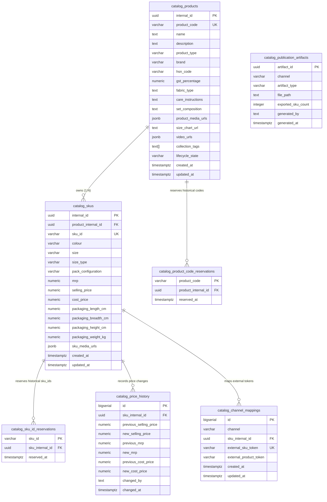

# Catalog Physical Data Schema & PostgreSQL DDL Specification

**Document Reference:** `business_systems/catalog/docs/06-catalog-data-schema.md`
**System Name:** Sovereign Catalog Business System (`Catalog BS`)
**Domain Layer:** Physical Persistence & Data Schema Layer (Box 4 in Aaram Ecosystem)
**Status:** Canonical Schema Specification
**Authoritative Version:** 1.2 (Permanent Key Reservation & Immutability Integration)
**Last Updated:** September 1, 2026

---

## 1. Executive Summary & Schema Governance

This document establishes the **authoritative PostgreSQL physical data schema** for the Sovereign Catalog Business System (`Catalog BS`). It derives directly from approved documents `01` through `05` and provides the exact relational schema, constraints, indexes, views, and migration baseline.

### 1.1 Invariant Principles Enforced by Schema
1. **Commercial Model:** Strict 2-tier hierarchy (`catalog_products` $\rightarrow$ `catalog_skus`). There is **NO separate Variant entity**.
2. **Identity Decoupling:** `internal_id` (`UUID PK`) is the immutable technical primary key. `sku_id` is an editable, unique business key ($5 \le \text{length} \le 10$). `product_code` is an editable commercial grouping code ($5 \le \text{length} < 25$).
3. **Permanent Historical Reservation (Rules RET-02 & PRD-05):** `catalog_sku_id_reservations` and `catalog_product_code_reservations` lock every assigned business key permanently to its entity `internal_id`. Re-assigning or recycling historical strings to any other entity is physically rejected by PostgreSQL triggers.
4. **Normalized Relationship Tree:** `catalog_channel_mappings` links strictly to `sku_internal_id`. The Product relationship is derived naturally through the SKU's foreign key.
5. **Quantity Firewall:** Zero physical inventory or stock quantity columns exist in this schema. Physical stock is 100% owned by `Inventory BS`.
6. **No Competing Lifecycle Flags:** Removed generic `is_active` flags. Commercial status is governed strictly by `catalog_products.lifecycle_state` (`DRAFT`, `READY`, `PUBLISHED`).

---

## 2. Table Responsibilities & Physical Specifications

### 2.1 Table: `catalog_products`
Represents the commercial product offering family.

| Column Name | Data Type | Nullable | Constraints & Defaults | Description |
|---|---|---|---|---|
| **`internal_id`** | `UUID` | **NO** | `PRIMARY KEY DEFAULT gen_random_uuid()` | Immutable technical anchor. |
| **`product_code`** | `VARCHAR(24)` | **NO** | `UNIQUE`, regex `^[A-Z0-9]+(-[A-Z0-9]+)*$` | Commercial grouping code ($5 \le \text{len} < 25$). |
| **`name`** | `TEXT` | **NO** | `CHECK (char_length(name) >= 5)` | Commercial offering title. |
| **`description`** | `TEXT` | YES | None | Storefront narrative / marketing HTML copy. |
| **`product_type`** | `VARCHAR(128)` | YES | None | Category taxonomy slug (e.g. `home__bed_linen`). |
| **`brand`** | `VARCHAR(64)` | **NO** | `DEFAULT 'Aaram Homes'` | Brand name. |
| **`hsn_code`** | `VARCHAR(10)` | YES | `CHECK (char_length(hsn_code) >= 4)` | Harmonized System tax code. |
| **`gst_percentage`**| `NUMERIC(4,2)`| **NO** | `DEFAULT 5.00 CHECK (gst_percentage >= 0 AND gst_percentage <= 100)` | GST tax rate. |
| **`fabric_type`** | `TEXT` | YES | None | Shared fabric description (e.g. `'Cotton Blend'`). |
| **`care_instructions`**| `TEXT` | YES | None | Shared wash care instructions. |
| **`set_composition`** | `TEXT` | YES | None | Shared package component list. |
| **`product_media_urls`**| `JSONB` | **NO** | `DEFAULT '[]'::jsonb` | Shared lifestyle / room visual asset URLs. |
| **`size_chart_url`**| `TEXT` | YES | None | Shared size chart image URL. |
| **`video_urls`** | `JSONB` | **NO** | `DEFAULT '[]'::jsonb` | Shared product video showcase URLs. |
| **`collection_tags`**| `TEXT[]` | **NO** | `DEFAULT '{}'::text[]` | Storefront collection slugs. |
| **`lifecycle_state`**| `VARCHAR(32)`| **NO** | `DEFAULT 'DRAFT' CHECK (lifecycle_state IN ('DRAFT', 'READY', 'PUBLISHED'))` | Sovereign lifecycle state. |
| **`created_at`** | `TIMESTAMPTZ` | **NO** | `DEFAULT CURRENT_TIMESTAMP` | Record creation timestamp. |
| **`updated_at`** | `TIMESTAMPTZ` | **NO** | `DEFAULT CURRENT_TIMESTAMP` | Record mutation timestamp. |

---

### 2.2 Table: `catalog_skus`
Represents the atomic sellable commercial unit.

| Column Name | Data Type | Nullable | Constraints & Defaults | Description |
|---|---|---|---|---|
| **`internal_id`** | `UUID` | **NO** | `PRIMARY KEY DEFAULT gen_random_uuid()` | Immutable technical anchor for SKU. |
| **`product_internal_id`**| `UUID` | **NO** | `REFERENCES catalog_products(internal_id) ON DELETE RESTRICT` | Foreign Key linking to Product family. |
| **`sku_id`** | `VARCHAR(10)` | **NO** | `UNIQUE`, regex `^[A-Z0-9]+(-[A-Z0-9]+)*$` | Sovereign operational key ($5 \le \text{len} \le 10$). |
| **`colour`** | `VARCHAR(64)` | YES | None | Variant colorway / design name. |
| **`size`** | `VARCHAR(64)` | YES | None | Variant size specification (nullable for size-less items). |
| **`size_type`** | `VARCHAR(32)` | YES | `CHECK (size_type IS NULL OR size_type IN ('size', 'variant'))` | Dimension classification for channels. |
| **`pack_configuration`**| `VARCHAR(64)`| YES | None | Pack configuration (e.g. `'Pack of 1'`). |
| **`mrp`** | `NUMERIC(10,2)`| **NO** | `CHECK (mrp > 0)` | Maximum Retail Price in INR. |
| **`selling_price`** | `NUMERIC(10,2)`| **NO** | `CHECK (selling_price > 0 AND selling_price <= mrp)` | Canonical selling price in INR. |
| **`cost_price`** | `NUMERIC(10,2)`| **NO** | `CHECK (cost_price > 0)` | Landed manufacturing cost in INR. |
| **`packaging_length_cm`**| `NUMERIC(6,2)`| **NO** | `CHECK (packaging_length_cm >= 1.0 AND packaging_length_cm <= 50.0)` | Dead package length in cm. |
| **`packaging_breadth_cm`**| `NUMERIC(6,2)`| **NO** | `CHECK (packaging_breadth_cm >= 1.0 AND packaging_breadth_cm <= 50.0)`| Dead package breadth in cm. |
| **`packaging_height_cm`**| `NUMERIC(6,2)`| **NO** | `CHECK (packaging_height_cm >= 1.0 AND packaging_height_cm <= 50.0)` | Dead package height in cm. |
| **`packaging_weight_kg`**| `NUMERIC(6,3)`| **NO** | `CHECK (packaging_weight_kg >= 0.050 AND packaging_weight_kg <= 10.000)`| Dead package weight in kg. |
| **`sku_media_urls`** | `JSONB` | **NO** | `DEFAULT '[]'::jsonb` | Variant-specific images (primary swatch at `[0]`). |
| **`created_at`** | `TIMESTAMPTZ` | **NO** | `DEFAULT CURRENT_TIMESTAMP` | Record creation timestamp. |
| **`updated_at`** | `TIMESTAMPTZ` | **NO** | `DEFAULT CURRENT_TIMESTAMP` | Record mutation timestamp. |

---

### 2.3 Table: `catalog_sku_id_reservations`
Permanent immutable registry of all SKU IDs ever assigned. Enforces **Rule RET-02 / ADR-RUL-002** (Permanent SKU Immutability / No Recycling).

| Column Name | Data Type | Nullable | Constraints & Defaults | Description |
|---|---|---|---|---|
| **`sku_id`** | `VARCHAR(10)` | **NO** | `PRIMARY KEY` | Globally reserved business key. |
| **`sku_internal_id`**| `UUID` | **NO** | `REFERENCES catalog_skus(internal_id) ON DELETE RESTRICT` | Permanently associated SKU technical entity. |
| **`reserved_at`** | `TIMESTAMPTZ` | **NO** | `DEFAULT CURRENT_TIMESTAMP` | Initial reservation timestamp. |

---

### 2.4 Table: `catalog_product_code_reservations`
Permanent immutable registry of all Product Codes ever assigned. Enforces **Rule PRD-05 / ADR-RUL-008** (Product Code Historical Non-Reuse).

| Column Name | Data Type | Nullable | Constraints & Defaults | Description |
|---|---|---|---|---|
| **`product_code`** | `VARCHAR(24)` | **NO** | `PRIMARY KEY` | Globally reserved commercial grouping code. |
| **`product_internal_id`**| `UUID` | **NO** | `REFERENCES catalog_products(internal_id) ON DELETE RESTRICT` | Permanently associated Product entity. |
| **`reserved_at`** | `TIMESTAMPTZ` | **NO** | `DEFAULT CURRENT_TIMESTAMP` | Initial reservation timestamp. |

---

### 2.5 Table: `catalog_price_history`
Immutable ledger recording all pricing adjustments for unit-economics auditability. Protected from mutation by database trigger `trg_catalog_price_history_immutable`.

| Column Name | Data Type | Nullable | Constraints & Defaults | Description |
|---|---|---|---|---|
| **`id`** | `BIGSERIAL` | **NO** | `PRIMARY KEY` | Sequence ID. |
| **`sku_internal_id`**| `UUID` | **NO** | `REFERENCES catalog_skus(internal_id) ON DELETE RESTRICT` | Target SKU anchor. |
| **`previous_selling_price`**| `NUMERIC(10,2)`| YES | None | Prior selling price. |
| **`new_selling_price`**| `NUMERIC(10,2)`| **NO** | None | Updated selling price. |
| **`previous_mrp`** | `NUMERIC(10,2)`| YES | None | Prior MRP. |
| **`new_mrp`** | `NUMERIC(10,2)`| **NO** | None | Updated MRP. |
| **`previous_cost_price`**| `NUMERIC(10,2)`| YES | None | Prior Cost Price. |
| **`new_cost_price`**| `NUMERIC(10,2)`| **NO** | None | Updated Cost Price. |
| **`changed_by`** | `TEXT` | **NO** | `DEFAULT 'SYSTEM'` | Operator / Command identifier. |
| **`changed_at`** | `TIMESTAMPTZ` | **NO** | `DEFAULT CURRENT_TIMESTAMP` | Audit timestamp. |

---

### 2.6 Table: `catalog_channel_mappings`
Isolates external sales channel identifiers (ShopDeck random tokens) from sovereign Catalog truth.

| Column Name | Data Type | Nullable | Constraints & Defaults | Description |
|---|---|---|---|---|
| **`id`** | `BIGSERIAL` | **NO** | `PRIMARY KEY` | Sequence ID. |
| **`channel`** | `VARCHAR(32)` | **NO** | `DEFAULT 'SHOPDECK'` | External sales channel name. |
| **`sku_internal_id`**| `UUID` | **NO** | `REFERENCES catalog_skus(internal_id) ON DELETE RESTRICT` | Sovereign SKU anchor. |
| **`external_sku_token`**| `VARCHAR(64)`| **NO** | `UNIQUE` per channel | ShopDeck `customer_sku_short_id`. |
| **`external_product_token`**| `VARCHAR(64)`| YES | None | ShopDeck `customer_product_short_id`. |
| **`created_at`** | `TIMESTAMPTZ` | **NO** | `DEFAULT CURRENT_TIMESTAMP` | Mapping creation timestamp. |
| **`updated_at`** | `TIMESTAMPTZ` | **NO** | `DEFAULT CURRENT_TIMESTAMP` | Mapping mutation timestamp. |

---

### 2.7 Table: `catalog_publication_artifacts`
Tracks versioned publication payloads and dual-resource leases compiled for external channels.

| Column Name | Data Type | Nullable | Constraints & Defaults | Description |
|---|---|---|---|---|
| **`artifact_id`** | `UUID` | **NO** | `PRIMARY KEY DEFAULT gen_random_uuid()` | Immutable artifact ID. |
| **`channel`** | `VARCHAR(32)` | **NO** | `DEFAULT 'SHOPDECK'` | Target channel name. |
| **`artifact_type`** | `VARCHAR(32)` | **NO** | `DEFAULT 'CSV_46_COLUMN'` | Export format specification. |
| **`file_path`** | `TEXT` | **NO** | None | Physical filesystem path to generated CSV. |
| **`content_hash`** | `VARCHAR(64)` | YES | None | Cryptographic SHA-256 hash. |
| **`exported_sku_count`**| `INTEGER`| **NO** | `CHECK (exported_sku_count >= 0)` | Count of SKUs in export batch. |
| **`status`** | `VARCHAR(32)` | **NO** | `DEFAULT 'IN_PROGRESS' CHECK (status IN ('IN_PROGRESS', 'COMMITTED', 'FAILED'))` | Dual-resource lifecycle state. |
| **`expires_at`** | `TIMESTAMPTZ` | YES | None | In-flight lease expiration cutoff. |
| **`finalized_at`** | `TIMESTAMPTZ` | YES | None | Timestamp when DB transaction committed. |
| **`error_message`** | `TEXT` | YES | None | Error log on publication failure. |
| **`generated_by`** | `TEXT` | **NO** | `DEFAULT 'SYSTEM'` | Operator / Process triggering export. |
| **`generated_at`** | `TIMESTAMPTZ` | **NO** | `DEFAULT CURRENT_TIMESTAMP` | Artifact intent registration timestamp. |

---

### 2.8 Table: `catalog_idempotency_records`
Persists mutation idempotency records for 24 hours.

| Column Name | Data Type | Nullable | Constraints & Defaults | Description |
|---|---|---|---|---|
| **`idempotency_key`**| `VARCHAR(128)`| **NO** | `PRIMARY KEY` | Client-supplied unique mutation token. |
| **`operation`** | `VARCHAR(64)` | **NO** | None | Executed operation name. |
| **`request_hash`** | `VARCHAR(64)` | **NO** | None | SHA-256 hash of inbound payload. |
| **`response_payload`**| `JSONB` | **NO** | None | Cached structured response payload. |
| **`created_at`** | `TIMESTAMPTZ` | **NO** | `DEFAULT CURRENT_TIMESTAMP` | Record creation timestamp. |
| **`expires_at`** | `TIMESTAMPTZ` | **NO** | None | TTL cutoff timestamp. |

---

## 3. Canonical PostgreSQL DDL Specification

The exact, authoritative DDL is maintained in [`business_systems/catalog/schema.sql`](file:///Users/sumatidhingra/aarambooks/business_systems/catalog/schema.sql) and [`business_systems/catalog/public_views.sql`](file:///Users/sumatidhingra/aarambooks/business_systems/catalog/public_views.sql).
