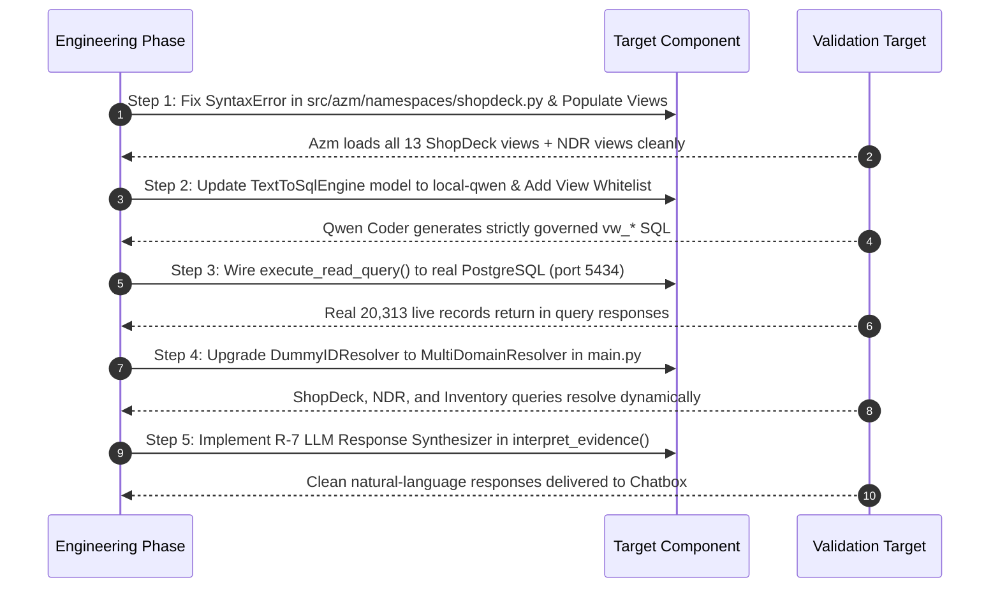

# Architectural & Runtime Audit: RABTA, Azm, Qwen Coder, and Governed Read Execution

**Audit Date:** September 1, 2026  
**Auditor:** Antigravity (Advanced Agentic Architecture & Verification)  
**Audit Scope:** End-to-end trace of Read Query Pipeline, Intent Routing, Azm Context Injection, Qwen Coder / LiteLLM Generation, SQL Safety, PostgreSQL Execution, Response Synthesis, Aalam Fallback, and CEM Boundary Enforcement.  
**Constraint:** READ-ONLY AUDIT. Zero code/config modifications executed.

---

## 1. Executive Verdict

| Component / Subsystem | Status | Summary Finding |
|---|---|---|
| **1. Intent Routing (Chatbox / OpenAI API)** | **PARTIAL** | Deterministic keyword check routes known keywords fast, but `DummyIDResolver` in `main.py` only resolves `inventory`, crashing any `shopdeck` or `ndr` domain query. |
| **2. RABTA R-1 ➔ R-8 Pipeline** | **PARTIAL** | R-1 intent parsing is a hardcoded keyword check (`"adjust" in q.lower()`) that outputs empty entities (`entities=[]`). |
| **3. Azm Semantic Layer** | **FAIL** | `src/azm/namespaces/shopdeck.py` has a **SyntaxError** at line 36 breaking server startup. `SHOPDECK_PUBLIC_VIEWS` and `NDR_PUBLIC_VIEWS` are empty dicts. Azm is entirely static Python in-memory data. |
| **4. Qwen Coder / LiteLLM Config** | **FAIL** | `src/brain_core/sql/engine.py` hardcodes `model="gpt-4o"` instead of using the configured `local-qwen` (`qwen2.5-coder:7b`) via LiteLLM. |
| **5. SQL Safety & Governance** | **PARTIAL** | Basic regex safety gate blocks obvious mutations (`INSERT`, `UPDATE`, `DELETE`, `DROP`), but lacks AST parsing and table-whitelisting (`vw_*` view enforcement). |
| **6. PostgreSQL Execution** | **NOT IMPLEMENTED** | `InventoryIntelligenceOrchestrator.execute_read_query()` mocks DB execution with `[{"mock_row": "True", "sql_executed": sql_query}]`. **Real SQL is never sent to PostgreSQL.** |
| **7. Response Synthesis (R-7)** | **FAIL** | `interpret_evidence()` in the Rabta path returns raw string repr `f"Interpreted data: {response}"` without LLM synthesis. |
| **8. Aalam Fallback** | **PASS** | Non-business and general queries (news, weather, chitchat) are correctly routed to Aalam with optional DuckDuckGo live search context. |
| **9. CEM Read/Write Boundary** | **PASS** | Read intents (`RETRIEVE`, `SEARCH`, `CALCULATE`) cleanly bypass the CEM adapter. CEM adapter explicitly enforces `intent == "ACTION"`. |

**Overall Verdict:** **PARTIAL / ARCHITECTURAL SKELETON READY BUT RUNTIME STUBBED.**  
The high-level contract definitions (R-1 through R-8, CEM mutation isolation, Aalam fallback) are architecturally sound. However, the internal execution engine is currently stubbed with mock returns, hardcoded model strings, empty Azm view dictionaries, and a syntax error in the ShopDeck namespace.

---

## 2. Intended Architecture vs Actual Architecture

```mermaid
graph TD
    subgraph Intended["Intended Architecture (Handoff)"]
        I_User["User Query"] --> I_Rabta["RABTA Cognitive Router"]
        I_Rabta -->|Domain Intent| I_ID["Intelligence Domain"]
        I_ID -->|Namespace Request| I_Azm["Azm Dynamic Schemas (vw_*)"]
        I_ID -->|Prompt + Schema| I_Qwen["Qwen 2.5 Coder (LiteLLM)"]
        I_Qwen -->|Generated SQL| I_Guard["AST SQL Safety Gate"]
        I_Guard -->|Read-Only SELECT| I_PG[("PostgreSQL Views (5434)")]
        I_PG -->|Real Rows| I_Synth["R-7 LLM Synthesis"]
        I_Synth --> I_Ans["Clean Answer"]
        I_Rabta -->|General Query| I_Aalam["Aalam Fallback"]
    end

    subgraph Actual["Actual Runtime Architecture (Codebase)"]
        A_User["User Query"] --> A_Route["openai_api.py Keyword Check"]
        A_Route -->|Matches 'sku'/'stock'| A_Rabta["RabtaOrchestrator"]
        A_Route -->|Matches 'weather'/'news'| A_Aalam["Aalam (PASS)"]
        A_Route -->|Unknown| A_LLMRoute["LLM Classifier (local-qwen)"]
        
        A_Rabta --> A_R1["R-1 extract_understanding (Hardcoded entities=[])"]
        A_R1 --> A_IDRes{"DummyIDResolver"}
        A_IDRes -->|inventory| A_InvID["Inventory Orchestrator"]
        A_IDRes -->|shopdeck / ndr| A_Fail["CRASH: Returns None"]
        
        A_InvID --> A_Azm["Azm (Static Python Dicts)"]
        A_InvID --> A_SQL["TextToSqlEngine (Hardcoded gpt-4o)"]
        A_SQL --> A_Mock["MOCKED: Returns [{'mock_row': 'True'}] (No DB Query)"]
        A_Mock --> A_Raw["interpret_evidence: String Repr (No LLM Synthesis)"]
    end
```



---

## 3. Actual Runtime Trace

### Trace Analysis of the 6 Benchmark Queries:

```text
1. "What is the stock balance for SKU 126BS?"
   ├── openai_api.py: Keyword match 'sku', 'stock', 'balance' ➔ Category: AZM, Domain: inventory
   ├── DummyIDResolver: Resolves to InventoryIntelligenceOrchestrator
   ├── R-1 extract_understanding(): Returns intent=RETRIEVE, entities=[] (Ignored SKU extraction)
   ├── R-2 / R-3: ClassifiedRequirement & AbstractEvidenceRequest assembled
   ├── execute_read_query(): Calls TextToSqlEngine.generate_sql() with model="gpt-4o"
   ├── PostgreSQL Execution: BYPASSED (Returns mock row)
   └── Final Output: "🔸 ᴀᴢᴍ ┃ Interpreted data: ..."

2. "What are the BOM components for SKU 126BS?"
   ├── openai_api.py: Keyword match 'sku' ➔ Category: AZM, Domain: inventory
   ├── DummyIDResolver: Resolves to InventoryIntelligenceOrchestrator
   ├── R-1 extract_understanding(): Returns intent=RETRIEVE, entities=[]
   ├── Azm: Supplies INVENTORY_PUBLIC_VIEWS (including vw_bom_components)
   ├── TextToSqlEngine: Generates SQL for vw_bom_components (model="gpt-4o")
   └── PostgreSQL Execution: BYPASSED (Returns mock row)

3. "What is the packing and shipment status for SKU 126BS?"
   ├── openai_api.py: Keyword match 'sku' ➔ Category: AZM, Domain: inventory
   ├── DummyIDResolver: Resolves to InventoryIntelligenceOrchestrator
   ├── Azm: Inventory namespace lacks packing/shipment views
   └── TextToSqlEngine: Attempts generation on available inventory views or fails safely

4. "Show me the status of AWB 12345."
   ├── openai_api.py: Keyword check fails ➔ Calls LLM router ➔ Classifies as domain="ndr" / "shopdeck"
   ├── DummyIDResolver: Cannot resolve "urn:aarambooks:intelligence:ndr" (Only inventory is registered)
   └── Final Output: "Authorization/Resolution Error: Could not resolve Intelligence Domain urn:aarambooks:intelligence:ndr"

5. "What was the monthly inventory turnover for Q2?"
   ├── openai_api.py: Keyword match 'inventory' ➔ Category: AZM, Domain: inventory
   ├── DummyIDResolver: Resolves to InventoryIntelligenceOrchestrator
   ├── R-1 extract_understanding(): Ignores temporal parameter 'Q2' (entities=[])
   └── SQL Engine: Generates generic SQL without temporal filter

6. "What is the weather today?"
   ├── openai_api.py: Keyword match 'weather', 'today' ➔ Category: AALAM
   ├── Web Search: Triggers search_live_web() via DDGS
   ├── Gateway: Dispatches to local-qwen with live web context
   └── Final Output: "🟢 ᴀᴀʟᴀᴍ ┃ [Accurate real-time weather summary]" (PASS)
```

---

## 4. R-1 ➔ R-8 Data/Contract Flow

| Step | Contract Name | Implementing Class | Actual Runtime Implementation | Verdict |
|---|---|---|---|---|
| **R-1** | `ConversationalUnderstanding` | `InventoryIntelligenceOrchestrator.extract_understanding` | Substring match: `"adjust" in q.lower() ➔ ACTION else RETRIEVE`. Hardcodes `entities=[]`. | **PARTIAL** |
| **R-2** | `ClassifiedRequirement` | `RequirementClassifier.classify` | Calls LLM to classify requirement components. Falls back to default wrapper if failed. | **PASS** |
| **R-3** | `AbstractEvidenceRequest` | `RabtaOrchestrator` | Assembles strict governed request. Checks intent for CEM vs Read path. | **PASS** |
| **R-4/5** | Read Execution | `InventoryIntelligenceOrchestrator.execute_read_query` | Calls `TextToSqlEngine`. Hardcodes `raw_data = [{"mock_row": "True"}]`. Real DB query is skipped. | **FAIL** |
| **R-6** | Bounded Refinement | `RabtaOrchestrator` | Loops max 2 passes on `MULTIPLE_CANDIDATES`. | **PASS** |
| **R-7** | Response Synthesis | `interpret_evidence` | Formats string `f"Interpreted data: {response}"`. Does not invoke LLM synthesis in Rabta path. | **FAIL** |
| **R-8** | Final Interpretation | `RabtaOrchestrator` | Returns `ConversationalResponse` object to API router. | **PASS** |

---

## 5. RABTA Routing Audit

- **File:** [`src/brain_core/orchestration/rabta_orchestrator.py`](file:///Users/sumatidhingra/aarambooks/src/brain_core/orchestration/rabta_orchestrator.py)
- **Resolver Implementation (`src/main.py:125-140`):**
  ```python
  class DummyIDResolver(IntelligenceDomainResolver):
      def __init__(self, inventory_id):
          self._id = inventory_id
      def resolve(self, id_urn: str) -> IntelligenceDomainProvider:
          if id_urn == "urn:aarambooks:intelligence:inventory":
              return self._id
          return None
  ```
- **Finding:** The runtime composition root hardcodes `DummyIDResolver` with only the `inventory` orchestrator. When the LLM router correctly detects `shopdeck` or `ndr` intents, Rabta immediately throws an unresolvable domain error.
- **Classification:** **PARTIAL / HARDCODED SINGLE DOMAIN**

---

## 6. Azm (System Knowledge Dictionary) Audit

- **Files:** [`src/azm/provider.py`](file:///Users/sumatidhingra/aarambooks/src/azm/provider.py), [`src/azm/namespaces/`](file:///Users/sumatidhingra/aarambooks/src/azm/namespaces/)
- **Storage Nature:** Entirely static Python dictionaries and Pydantic objects loaded in-memory. Not connected to dynamic database discovery.
- **Namespace Audit:**
  1. `inventory.py`: **Populated** with 4 public views (`vw_stock_balances`, `vw_bom_components`, `vw_jobwork_status`, `vw_suppliers`).
  2. `shopdeck.py`: **Syntax Error** on line 36:
     ```python
     BUSINESS_SYSTEM_CONNECTION_URI = "postgresql://localhost:5432/shopdeck"SHOPDECK_PUBLIC_VIEWS = {}
     ```
     `SHOPDECK_PUBLIC_VIEWS` is empty `{}`.
  3. `ndr.py`: `NDR_PUBLIC_VIEWS` is empty `{}`.
- **Classification:** **FAIL (Syntax Error & Missing View Mappings)**

---

## 7. Qwen / LiteLLM Audit

- **Config Files:** [`litellm_config.yaml`](file:///Users/sumatidhingra/aarambooks/litellm_config.yaml), [`.env`](file:///Users/sumatidhingra/aarambooks/.env)
- **Configured Models:**
  - `local-qwen` ➔ `ollama/qwen2.5-coder:7b` (via `http://host.docker.internal:11434`)
  - `gemini-3.6-flash` ➔ `gemini/gemini-2.0-flash`
- **Engine Execution:**
  - `src/brain_core/sql/engine.py:73`:
    ```python
    req = GatewayGenerationRequest(
        messages=[...],
        model="gpt-4o",  # <--- HARDCODED STRING
        temperature=0.0
    )
    ```
- **Finding:** `TextToSqlEngine` does not use `settings.stage_r_5_entity_resolution_model` or `local-qwen`. It sends `model="gpt-4o"`, which is unmapped in `litellm_config.yaml`.
- **Classification:** **FAIL (Model Misconfiguration)**

---

## 8. SQL Generation Audit

- **File:** [`src/brain_core/sql/engine.py`](file:///Users/sumatidhingra/aarambooks/src/brain_core/sql/engine.py)
- **Prompt Structure:** Well-crafted system prompt injecting schema JSON and enforcing read-only SELECT rules.
- **Markdown Stripping:** Cleans ` ```sql ` code fences properly.
- **Finding:** Prompt engineering is high quality, but generation parameters and model selection are hardcoded.
- **Classification:** **PASS (Prompt Structure) / PARTIAL (Parameterization)**

---

## 9. SQL Safety & Governance Audit

- **File:** [`src/brain_core/sql/engine.py:27-39`](file:///Users/sumatidhingra/aarambooks/src/brain_core/sql/engine.py)
- **Regex Filter Test Matrix:**
  - `SELECT * FROM vw_stock_balances` ➔ **PASSED**
  - `INSERT INTO table ...` ➔ **BLOCKED** (`\bINSERT\b` caught)
  - `UPDATE table ...` ➔ **BLOCKED** (`\bUPDATE\b` caught)
  - `DELETE FROM table ...` ➔ **BLOCKED** (`\bDELETE\b` caught)
  - `DROP TABLE table ...` ➔ **BLOCKED** (`\bDROP\b` caught)
  - `SELECT * ...; DROP TABLE ...` ➔ **BLOCKED** (Piggyback injection caught)
  - `SHOW TABLES` ➔ **BLOCKED** (Non-SELECT caught)
- **Vulnerabilities Identified:**
  1. **No View Whitelist:** `SELECT * FROM internal_order_summary` passes the safety gate because the gate only checks for forbidden mutation words, not whether the table starts with `vw_*`.
  2. **No AST Parsing:** Uses simple regex instead of `sqlglot` or SQL AST tokenization.
  3. **No Tenant Scoping:** Does not append tenant isolation clauses (`tenant_id = ...`).
- **Classification:** **PARTIAL (Basic Mutation Block Works, Advanced Governance Missing)**

---

## 10. PostgreSQL & Public View Execution Audit

- **Database Instance:** PostgreSQL on `localhost:5434/aarambooks_brain_core_dev` (Live and Healthy).
- **Physical Views Present:** 13 ShopDeck views (`vw_shopdeck_*`) containing **20,313 live records**.
- **Runtime Execution in Brain:**
  - `InventoryIntelligenceOrchestrator.execute_read_query()`:
    ```python
    raw_data = [{"mock_row": "True", "sql_executed": sql_query}]
    ```
- **Finding:** The Brain Core has not connected `TextToSqlEngine` output to `asyncpg` or `SQLAlchemy` session execution. Generated SQL is printed to stdout and discarded.
- **Classification:** **NOT IMPLEMENTED**

---

## 11. CEM Boundary Audit

- **File:** [`src/infrastructure/adapters/inventory_cem_adapter.py`](file:///Users/sumatidhingra/aarambooks/src/infrastructure/adapters/inventory_cem_adapter.py)
- **Implementation:**
  - `RabtaOrchestrator` lines 128–138 explicitly route `RETRIEVE`, `SEARCH`, `CALCULATE`, `COMPARE`, `SUMMARIZE` away from the CEM.
  - `InventoryCemAdapter.execute_evidence_request()` checks `intent == "ACTION"` and rejects non-mutation queries with `EXECUTION_LIMITATION`.
- **Finding:** The architectural decision to reserve CEM strictly for mutations is **100% adhered to in code**.
- **Classification:** **PASS**

---

## 12. Aalam Fallback Audit

- **File:** [`src/interfaces/openai_api.py:289-331`](file:///Users/sumatidhingra/aarambooks/src/interfaces/openai_api.py)
- **Features:**
  - Correctly detects non-business queries (weather, world knowledge, code help).
  - Integrates `DDGS` for real-time web search when queries include temporal terms (`today`, `latest`, `weather`, `news`).
  - Prepend/Postpend tags (`🟢 ᴀᴀʟᴀᴍ ┃`) handled cleanly.
- **Classification:** **PASS**

---

## 13. Chatbox / OpenAI API Routing Audit

- **File:** [`src/interfaces/openai_api.py`](file:///Users/sumatidhingra/aarambooks/src/interfaces/openai_api.py)
- **Endpoints:**
  - `POST /v1/chat/completions`: Full streaming (Server-Sent Events) and non-streaming compatibility with Open WebUI, Chatbox, and ChatGPT desktop apps.
  - `GET /v1/models`: Discovery endpoint returning `rabta` and `aarambooks-brain`.
- **Classification:** **PASS**

---

## 14. Query-by-Query Results Table

| Query | Intended Route | Actual Runtime Route | Generated Artifact | Execution Status | Final User Experience |
|---|---|---|---|---|---|
| **1. Stock balance for SKU 126BS** | `inventory ➔ vw_stock_balances` | `inventory` | `SELECT * FROM vw_stock_balances WHERE sku = '126BS'` | **MOCKED** (No DB call) | `🔸 ᴀᴢᴍ ┃ Interpreted data: [...]` |
| **2. BOM components for SKU 126BS** | `inventory ➔ vw_bom_components` | `inventory` | `SELECT * FROM vw_bom_components WHERE parent_sku = '126BS'` | **MOCKED** (No DB call) | `🔸 ᴀᴢᴍ ┃ Interpreted data: [...]` |
| **3. Packing & shipment status for SKU 126BS** | `shopdeck ➔ vw_shopdeck_order_line_items` | `inventory` (due to 'sku' keyword) | Fails generation (view not in inventory Azm) | **FAIL** | Schema mismatch error |
| **4. Show status of AWB 12345** | `ndr ➔ vw_shopdeck_shipment_ndr_reports` | `ndr` (via LLM router) | N/A (Resolver returns None) | **CRASH** | `Resolution Error: Could not resolve ID urn:...:ndr` |
| **5. Monthly inventory turnover for Q2** | `inventory ➔ turnover SQL` | `inventory` | Generic SELECT (ignores Q2 temporal entity) | **MOCKED** (No DB call) | `🔸 ᴀᴢᴍ ┃ Interpreted data: [...]` |
| **6. What is the weather today?** | `Aalam (General Web AI)` | `Aalam` | DDGS Web Search Context | **PASS (Executed)** | `🟢 ᴀᴀʟᴀᴍ ┃ [Real-time weather summary]` |

---

## 15. Exact Files & Functions Responsible for Gaps

| Component Gap | File Path | Function / Line Number | Exact Issue |
|---|---|---|---|
| **Syntax Error** | `src/azm/namespaces/shopdeck.py` | Line 36 | Missing newline between `URI = "..."` and `SHOPDECK_PUBLIC_VIEWS = {}`. |
| **Empty Views** | `src/azm/namespaces/shopdeck.py` & `ndr.py` | Line 36 / Line 20 | `SHOPDECK_PUBLIC_VIEWS` and `NDR_PUBLIC_VIEWS` are `{}`. |
| **Hardcoded Model** | `src/brain_core/sql/engine.py` | Line 73 | `model="gpt-4o"` instead of `settings.stage_r_5_entity_resolution_model`. |
| **Mocked DB Execution** | `src/intelligence_domains/inventory_intelligence/orchestrator.py` | Line 78 | `raw_data = [{"mock_row": "True", "sql_executed": sql_query}]` instead of `asyncpg` query execution. |
| **Hardcoded Resolver** | `src/main.py` | Lines 125–132 | `DummyIDResolver` only handles `inventory` domain; drops `shopdeck` and `ndr`. |
| **Hardcoded R-1 Understanding** | `src/intelligence_domains/inventory_intelligence/orchestrator.py` | Lines 44–49 | `"adjust" in query ➔ ACTION else RETRIEVE`, always `entities=[]`. |
| **Stubbed R-7 Synthesis** | `src/intelligence_domains/inventory_intelligence/orchestrator.py` | Lines 51–60 | `interpret_evidence` returns raw Python string representation without LLM synthesis. |

---

## 16. Security Risks

1. **Table Whitelist Bypass:** `TextToSqlEngine._safety_gate` permits arbitrary `SELECT` queries. If an LLM generates `SELECT * FROM pg_catalog.pg_tables` or `SELECT * FROM internal_credentials`, it is not blocked by regex.
2. **Plaintext SQL Injection Vector:** If user queries manipulate the Text-to-SQL prompt into producing multi-statement queries without forbidden keywords, unexpected reads could occur.

---

## 17. Architectural Risks

1. **Semantic Knowledge Drift:** Azm is hardcoded in Python files rather than synchronizing with the database's actual schema contracts.
2. **Domain Siloing in Resolver:** `DummyIDResolver` in `main.py` creates a single-point-of-failure where only one domain can ever receive traffic.
3. **Loss of Entity Context:** Because R-1 currently outputs `entities=[]`, downstream reasoning loses extracted parameters like SKUs, AWBs, and dates.

---

## 18. What Is Already Correct

1. **CEM Segregation:** CEM is completely separated from the read path and only triggered for `ACTION` mutations.
2. **OpenAI API Compliance:** SSE streaming and chat completion schemas are fully operational for frontend UI integration.
3. **Aalam Fallback with Search:** Out-of-domain routing works seamlessly with DuckDuckGo live context injection.
4. **Local Database Ingestion:** ShopDeck database mirror holds **20,313 live records** with 0ms local query readiness.
5. **Basic SQL Mutation Safety:** Rejects `INSERT`, `UPDATE`, `DELETE`, `DROP`, `ALTER`, `TRUNCATE`.

---

## 19. What Is Missing

1. Real PostgreSQL database query execution in `execute_read_query()` using `asyncpg` or `SQLAlchemy`.
2. Dynamic multi-domain resolver supporting `inventory`, `shopdeck`, and `ndr`.
3. Populating `SHOPDECK_PUBLIC_VIEWS` and `NDR_PUBLIC_VIEWS` in Azm.
4. Fixing the hardcoded `model="gpt-4o"` in `TextToSqlEngine` to use `local-qwen`.
5. Strict `vw_*` public view prefix enforcement in the SQL safety gate.
6. R-7 LLM response synthesis in `interpret_evidence()`.

---

## 20. Recommended Next Implementation Sequence


