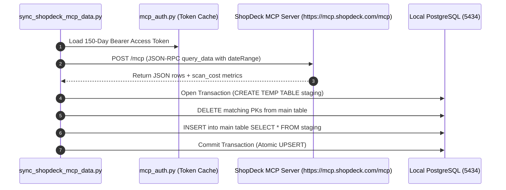

# ShopDeck Business System — Master Architecture

## 1. Executive Summary
ShopDeck serves as the authoritative Business Truth for orders, customers, and shipments in the Aaram ecosystem. In adherence to the 4-Box Architecture, the Brain Core never mutates ShopDeck directly; instead, it relies on strict Read Capabilities to fetch structured context for Intelligence Domains (such as NDR and Customer Query).

---

## 2. Bounded Context Architecture

```mermaid
graph TD
    subgraph External["ShopDeck Cloud (External Business System)"]
        MCP["ShopDeck MCP Server (https://mcp.shopdeck.com/mcp)"]
    end

    subgraph SyncLayer["business_systems/shopdeck/ (Synchronization Engine)"]
        Sync["sync_shopdeck_mcp_data.py (OAuth Bearer Token / JSON-RPC)"]
        MCP -->|Incremental Sync (Hourly / Rolling 3-Day)| Sync
    end

    subgraph LocalStorage["Local Postgres Storage (aarambooks_brain_core_dev)"]
        Tables[("13 Private Internal Tables (internal_tables.sql)")]
        Views[("13 Public Read Views (public_read_views.sql)")]
        Sync -->|Atomic Transaction UPSERT| Tables
        Tables -->|Governed Read Interface| Views
    end

    subgraph AaramBrain["Aaram Brain & Intelligence Domains"]
        Azm["Azm (Semantic Dictionary)"]
        NDR["NDR Intelligence Domain"]
        Support["Customer Query Intelligence Domain"]
        Views -->|Read Only (0ms Latency)| Azm
        Azm --> NDR
        Azm --> Support
    end
```

---

## 3. Public Read Contracts (The 13 Core Tables)

While the ShopDeck MCP Server exposes over 90 tables, the Aaram ecosystem restricts its intelligence gathering to a governed set of **13 core tables**, categorized by business capability:

### Summary of Core Tables & Local Mirror Baseline

| Category | Table Name | Public Read View | Key Identifier | Live Local Records | Context & Strategic Purpose |
|---|---|---|---|---|---|
| **A. Core Transactions** | `order_summary` | `vw_shopdeck_order_summary` | `order_id` | **5,300** | High-level financial totals, payment status, discounts |
| **A. Core Transactions** | `order_line_items` | `vw_shopdeck_order_line_items` | `order_id`, `sku_id` | **6,536** | Product specifics, unit pricing, item-level lifecycle |
| **A. Core Transactions** | `customer_info` | `vw_shopdeck_customer_info` | `awb_no` | **6,177** | Decrypted customer phone, shipping addresses, cities |
| **B. NDR & Logistics** | `shipment_ndr_reports` | `vw_shopdeck_shipment_ndr_reports` | `awb_no` | **1,189** | Current failed attempt status, latest reason, attempt count |
| **B. NDR & Logistics** | `ndr_action_log` | `vw_shopdeck_ndr_action_log` | `_id` | **241** | Complete chronological log of outreach (IVR/SMS) & responses |
| **C. Post-Purchase** | `cancel_reason_events` | `vw_shopdeck_cancel_reason_events` | `order_id` | **273** | Exact customer-submitted reasons for post-purchase cancel |
| **C. Post-Purchase** | `return_exchange_events` | `vw_shopdeck_return_exchange_events` | `session_id` | **25** | Return and exchange click triggers from order details |
| **C. Post-Purchase** | `rating_review_feedback_submit_events` | `vw_shopdeck_rating_review_feedback_submit_events` | `feedback_id` | **59** | Customer star ratings, text reviews, media attachments |
| **C. Post-Purchase** | `order_cancellation_events` | `vw_shopdeck_order_cancellation_events` | `order_id` | 0 | Storefront cancellation flow events |
| **C. Post-Purchase** | `post_order_survey_submit_events` | `vw_shopdeck_post_order_survey_submit_events` | `session_id` | 0 | Post-purchase survey responses |
| **D. Checkout Friction**| `payment_gateway_events` | `vw_shopdeck_payment_gateway_events` | `order_id` | **64** | Payment gateway attempts, drop-offs, and error codes |
| **D. Checkout Friction**| `checkout_input_error_events` | `vw_shopdeck_checkout_input_error_events` | `checkout_session_id` | **449** | Form validation errors (phone, address, pincode friction) |
| **D. Checkout Friction**| `checkout_external_events` | `vw_shopdeck_checkout_external_events` | `checkout_session_id` | 0 | Third-party checkout flow events |

**TOTAL VERIFIED RECORDS IN LOCAL DATABASE:** **20,313**

---

## 4. Semantic Integration (Azm)
These 13 core tables form the absolute foundation of `SHOPDECK_CONCEPTS` in Azm, allowing the Brain to resolve abstract capabilities into concrete ShopDeck queries.

---

## 5. Physical Integration Boundary (Native MCP)



### 5.1 Authentication & Session State
- **Token Validity:** 150-day persistent OAuth 2.0 Bearer access token (cached locally in `business_systems/shopdeck/.token.json`).
- **Endpoint:** `POST https://mcp.shopdeck.com/mcp` (Accept: `application/json, text/event-stream`).
- **Stateless:** No interactive login or session management needed during operational runs.

### 5.2 MCP Query Engine Specifications & Constraints
- **`list_tables`**: Returns 97 live tables and complete column metadata.
- **`query_data`**: Executes standard SQL over BigQuery/backend storage.
  - **Mandatory Constraint:** Every query **must** specify a `dateRange` (`startDate` and `endDate` in `YYYY-MM-DD`) inside `tables_included[i]`.
  - **Scan Budget Monitoring:** Each query response returns `scan_cost` (bytes scanned and remaining daily scan budget out of ~50 GiB).
