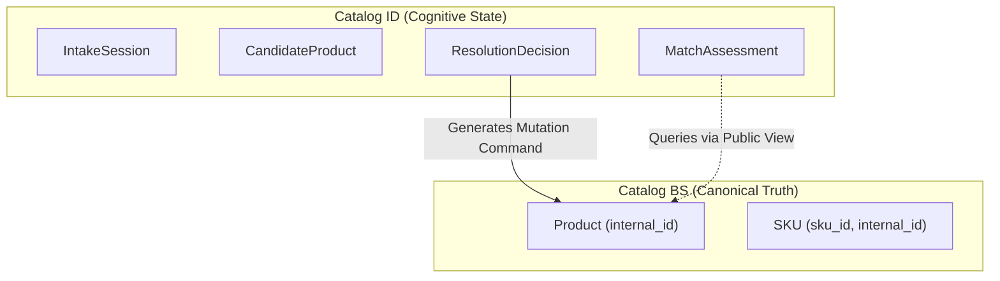

# Catalog ID Domain Model

**Document Reference:** `docs/03-intelligence-domains/catalog-intelligence/02-catalog-id-domain-model.md`
**System Name:** Catalog Intelligence Domain (`Catalog ID`)
**Domain Layer:** Cognitive Intelligence Layer
**Status:** Canonical Intelligence Specification
**Authoritative Version:** 1.0
**Last Updated:** September 1, 2026

---

## 1. Executive Summary & Purpose

This document establishes the **Cognitive Domain Model** for Catalog ID. It defines the conceptual entities used during the intelligence process (intake, reasoning, evaluation, human review). 

**CRITICAL INVARIANT:** These cognitive entities represent *working state*. They are **never** canonical catalog truth and must never become a shadow Product/SKU master.

---

## 2. Cognitive Working State Entities

To process unstructured input into deterministic commands, Catalog ID utilizes the following logical entities:

### 2.1 `IntakeSession`
- **Definition:** The context of a single cognitive workflow initiated by a human operator or automated trigger.
- **Role:** Tracks the progression of the interaction, the raw unstructured inputs (chat history, images), and the current resolution status.
- **Lifecycle:** Ephemeral or archived for auditability; it terminates once a command is successfully accepted by Catalog BS.

### 2.2 `CandidateProduct` / `CandidateSKU`
- **Definition:** The proposed, unvalidated structure of a product or SKU generated by the cognitive engine.
- **Role:** Holds extracted attributes (e.g., proposed `sku_id`, proposed `product_code`, extracted `selling_price`) before they are submitted.
- **Constraints:** This is a hypothesis, not a fact. It lacks canonical `internal_id` anchors until matched or created.

### 2.3 `MatchAssessment`
- **Definition:** An evaluation of how well a candidate aligns with an existing Catalog BS entity.
- **Role:** Stores the comparison signals (e.g., name similarity, visual similarity) and the resulting `SimilarityScore`.
- **Outcome:** Drives the resolution decision (Deterministic Match, Strong Candidate, Ambiguous, No Match).

### 2.4 `ResolutionDecision`
- **Definition:** The final cognitive conclusion reached by Catalog ID.
- **Role:** Dictates the next action (e.g., "Propose new Product", "Propose attachment to existing Product `internal_id`", "Request Human Clarification").

---

## 3. Boundary Enforcement: Cognitive State vs Canonical Truth

- **No Duplication:** Catalog ID does not maintain synchronized copies of `Product` or `SKU` tables.
- **No Shadow Identities:** `CandidateProduct` does not generate its own UUIDs to act as primary keys; it only proposes human business keys (like `sku_id`) or references existing `internal_id`s discovered from Catalog BS.
- **Auditability:** `IntakeSession` data may be persisted for reasoning audits or human-in-the-loop resumption, but it is strictly categorized as "process log" data, not catalog master data.
