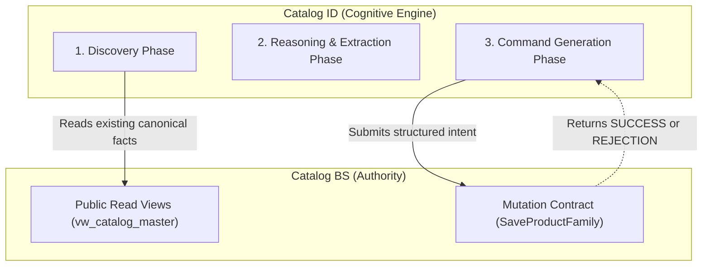

# Catalog ID Contracts & Boundaries

**Document Reference:** `docs/03-intelligence-domains/catalog-intelligence/04-catalog-id-contracts.md`
**System Name:** Catalog Intelligence Domain (`Catalog ID`)
**Domain Layer:** Cognitive Intelligence Layer
**Status:** Canonical Intelligence Specification
**Authoritative Version:** 1.0
**Last Updated:** September 1, 2026

---

## 1. The Interaction Boundary

Catalog ID functions as a cognitive client to the authoritative Catalog Business System (`Catalog BS`). To guarantee zero direct database coupling, Catalog ID strictly uses approved contracts.

---

## 2. Read / Discovery Semantics

To perform deduplication, similarity reasoning, and collision avoidance, Catalog ID requires access to the current catalog state.

- **Contract Used:** Catalog BS Public Read Projections (e.g., `vw_catalog_master`, `vw_catalog_products`, `vw_catalog_skus`).
- **Semantic Rule:** Catalog ID queries these views to build its in-memory context or vector embeddings. It uses these facts to resolve human intent to an existing `internal_id`.
- **Historical Semantics:** Because Catalog BS tombstone records (retired SKUs) remain in the database (or reservation ledgers) to prevent non-reuse, Catalog ID must query broadly to avoid proposing historically reserved `sku_id`s or `product_code`s.

---

## 3. Mutation / Command Semantics

Once Catalog ID reaches a `ResolutionDecision` (e.g., Strong Candidate or No Viable Candidate), it formulates a mutation.

- **Contract Used:** Catalog BS Inbound Mutation Contract (specifically `SaveProductFamily`).
- **Attachment Rule:** To attach a new SKU to an existing Product family, Catalog ID **must** supply the target `product_internal_id` (UUID). It cannot simply pass a matching `product_code` and expect auto-attachment.
- **Idempotency:** Catalog ID must generate and supply a unique `idempotency_key` for every proposed command to prevent duplicate creation on network retries.

---

## 4. Rejection Handling & Retry Behavior

Catalog ID's proposals are subject to deterministic rejection by Catalog BS. Catalog ID must implement failure semantics for standard Catalog BS error codes:

| Catalog BS Rejection Error | Catalog ID Handling Semantic |
|---|---|
| `SKU_COLLISION` | The proposed `sku_id` is in use (or historically reserved). Catalog ID must execute its disambiguation heuristic to generate a new candidate and retry, or escalate to human review. |
| `PRODUCT_CODE_COLLISION` | The proposed `product_code` conflicts with a different `internal_id`. Catalog ID must re-evaluate its product-family reasoning: was this meant to be an attachment? If yes, it must resolve the correct `internal_id`. If no, it must generate a distinct `product_code`. |
| `SYNTAX_VALIDATION_ERROR` | The proposed string violated bounds (e.g. `sku_id` > 10 chars). Catalog ID must trim/adjust the proposal heuristically and retry. |
| `PRICING_INVARIANT_VIOLATION`| (e.g. Selling Price > MRP). Catalog ID cannot logically resolve pricing strategy. It must immediately escalate to **Human Approval Required**. |

## 5. Human Escalation Contract

When Catalog ID reaches an `Ambiguous Candidate` state or encounters an unresolvable rejection, it triggers human escalation.
- **Mechanism:** The `IntakeSession` is paused. A structured choice is presented to the operator (e.g., "Does this belong to Family A, Family B, or is it New?").
- **Resumption:** Upon human selection, Catalog ID resumes the pipeline and generates the definitive command.
