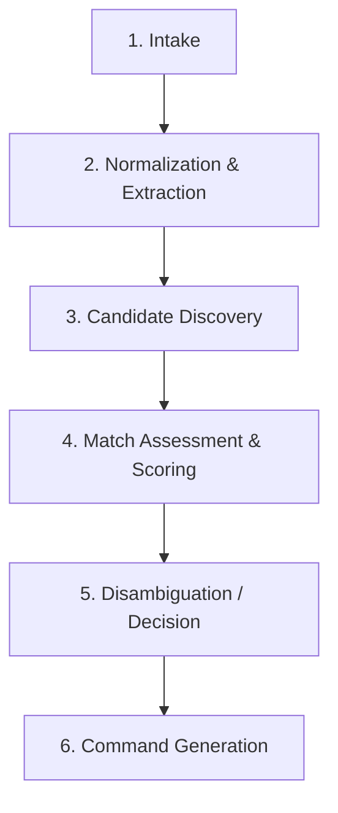

# Catalog ID Resolution & Semantics

**Document Reference:** `docs/03-intelligence-domains/catalog-intelligence/05-catalog-id-resolution.md`
**System Name:** Catalog Intelligence Domain (`Catalog ID`)
**Domain Layer:** Cognitive Intelligence Layer
**Status:** Canonical Intelligence Specification
**Authoritative Version:** 2.1
**Last Updated:** September 1, 2026

---

## 1. The Resolution Pipeline

Catalog ID processes unstructured human intent or imagery into deterministic proposals through a strict sequential pipeline:

### 1.1 Intake
- Establishes an `IntakeSession`. 

### 1.2 Normalization & Extraction
- Extracts attributes with explicit `EXTRACTED` and `INFERRED` provenance tags. Formats raw text into a `Candidate`.

### 1.3 Candidate Discovery
- Queries Catalog BS public read contracts (`vw_catalog_master`, `vw_catalog_products`) to discover existing canonical facts (`DISCOVERED_CANONICAL`).

### 1.4 Match Assessment & Scoring
- Compares the `Candidate` against `DISCOVERED_CANONICAL` facts. Produces a `MatchAssessment`.

### 1.5 Disambiguation / Decision
- Assigns a Semantic Decision Class (e.g., Deterministic Match, Ambiguous Candidate).

### 1.6 Command Generation
- Revalidates discovery state to avoid staleness. Constructs the `SaveProductFamily` mutation.

---

## 2. Human-in-the-Loop Semantics

When Catalog ID reaches an `Ambiguous Candidate` or `Human Approval Required` state, the `IntakeSession` pauses.

### 2.1 What the Human is Approving
The human operator is resolving cognitive uncertainty. They are choosing or modifying:
- The **interpretation** of the input (e.g., "This image is a bedsheet, not a curtain").
- The **family decision** (e.g., "Yes, this attaches to Family A" mapping to the explicit `internal_id`).
- The **proposed attributes** (e.g., fixing an `INFERRED` size).

### 2.2 Authority Limits
**CRITICAL INVARIANT:** Human approval within Catalog ID **MUST NOT** bypass Catalog BS validation. 
- A human cannot directly create canonical truth through Catalog ID. 
- If a human overrides the AI and forces a proposal that violates pricing rules, uniqueness constraints, or historical reservations, the final generated command still goes through Catalog BS, which will definitively reject it.
