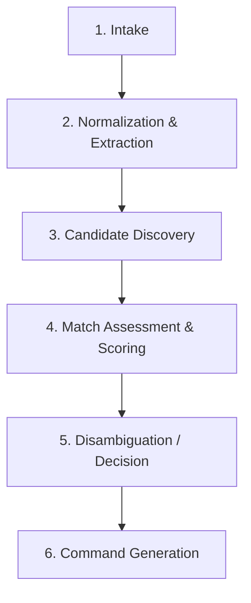

# Catalog ID Resolution & Semantics

**Document Reference:** `docs/03-intelligence-domains/catalog-intelligence/05-catalog-id-resolution.md`
**System Name:** Catalog Intelligence Domain (`Catalog ID`)
**Domain Layer:** Cognitive Intelligence Layer
**Status:** Canonical Intelligence Specification
**Authoritative Version:** 2.0
**Last Updated:** September 1, 2026

---

## 1. The Resolution Pipeline

Catalog ID processes unstructured human intent or imagery into deterministic Catalog BS commands through a strict sequential pipeline:

---

## 2. Human-in-the-Loop Semantics

When Catalog ID cannot safely automate a resolution decision, it suspends the `IntakeSession` and routes to a human operator. The operator is not merely clicking "Approve"; they are making a specific cognitive choice that the AI could not.

### 2.1 Trigger Conditions for Escalation
- **Ambiguous:** Semantic score is borderline. The operator must choose: "Is this identical to `Product X`, or is it a new product?"
- **Conflicting Evidence:** The image implies one product family, but the user's text implies another. The operator must declare which signal is correct.
- **Catalog BS Rejection:** Automated bounded retries for a `SKU_COLLISION` have exhausted. The operator must manually supply a unique `sku_id`.
- **Policy-Blocked Action:** E.g., attempting to update a price in a way that violates a business invariant (which Catalog BS would reject anyway).

### 2.2 Human Authority Limits
**CRITICAL INVARIANT:** Human approval within Catalog ID does **NOT** bypass Catalog BS deterministic validation. 
- If a human overrides the AI and forces the generation of a command proposing a duplicated `sku_id`, Catalog BS will still physically reject it. 
- The human is merely taking over the *cognitive command generation* process; the physical database remains fully sovereign.
