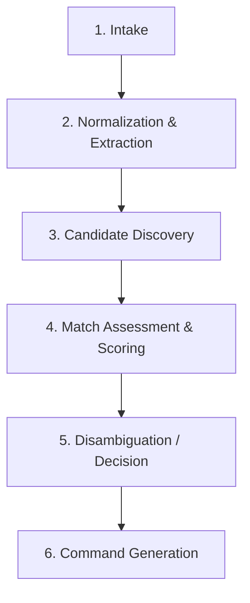

# Catalog ID Resolution & Semantics

**Document Reference:** `docs/03-intelligence-domains/catalog-intelligence/05-catalog-id-resolution.md`
**System Name:** Catalog Intelligence Domain (`Catalog ID`)
**Domain Layer:** Cognitive Intelligence Layer
**Status:** Canonical Intelligence Specification
**Authoritative Version:** 1.0
**Last Updated:** September 1, 2026

---

## 1. The Resolution Pipeline

Catalog ID processes unstructured human intent or imagery into deterministic Catalog BS commands through a strict sequential pipeline:

### 1.1 Intake
- **Input:** Unstructured conversational text, uploaded images (e.g., product photos, vendor catalogs), or raw CSV dumps.
- **Process:** Establishes an `IntakeSession` to track the cognitive working state.

### 1.2 Normalization & Extraction
- **Input:** Raw data from Intake.
- **Process:** Extracts discrete attributes (color, size, fabric, style). Formats unstructured text into a canonical internal schema (e.g., correcting "Ryl Blue" to "Royal Blue").
- **Output:** A `CandidateProduct` / `CandidateSKU` with proposed attributes.

### 1.3 Candidate Discovery
- **Process:** Catalog ID queries Catalog BS public read contracts (`vw_catalog_master`, `vw_catalog_products`) to discover existing catalog entities that may relate to the candidate.
- **Goal:** Identify potential parent Product families or detect duplicate SKUs.

### 1.4 Match Assessment & Scoring
- **Process:** Compares the extracted candidate against the discovered existing entities using deterministic rules (e.g., exact barcode match) and probabilistic reasoning (e.g., semantic textual similarity of descriptions, visual similarity of images).
- **Output:** A `MatchAssessment` containing a `SimilarityScore`.

### 1.5 Disambiguation / Decision
- **Process:** Evaluates the `SimilarityScore` against the defined **Decision Classes** (see `03-catalog-id-business-rules.md`).
- **Outcomes:**
  - **Deterministic Match:** Target `internal_id` identified.
  - **Strong Candidate:** High-confidence target `internal_id` identified.
  - **No Viable Candidate:** Distinct new entity.
  - **Ambiguous Candidate:** Halts pipeline for **Human Approval Required**.

### 1.6 Command Generation
- **Process:** Constructs the final JSON payload (`SaveProductFamily`) adhering strictly to `04-catalog-contracts.md`. Includes idempotency keys and proposed `sku_id` / `product_code` strings.

---

## 2. Respecting Historical Invariants

Catalog BS enforces permanent historical non-reuse (Rules RET-02 and PRD-05). 

- **Discovery Requirement:** During Candidate Discovery, Catalog ID must account for *all* historically reserved identifiers, not just actively `PUBLISHED` ones.
- **Collision Avoidance:** If Catalog ID proposes a `sku_id` (e.g., `126BS-RED`) that matches a tombstoned historical record, Catalog BS will deterministically reject it. Catalog ID must proactively attempt to discover these conflicts before command generation to minimize rejection loops.
