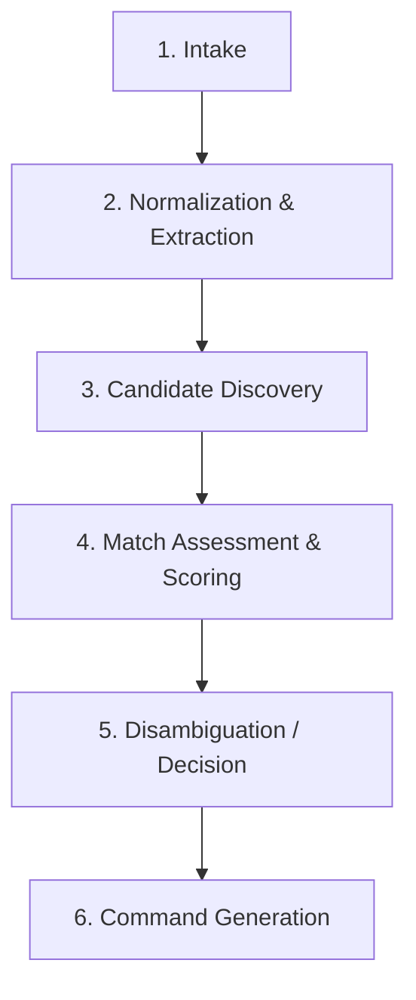

# Catalog ID Resolution & Semantics

**Document Reference:** `docs/03-intelligence-domains/catalog-intelligence/05-catalog-id-resolution.md`
**System Name:** Catalog Intelligence Domain (`Catalog ID`)
**Domain Layer:** Cognitive Intelligence Layer
**Status:** Canonical Intelligence Specification
**Authoritative Version:** 2.2
**Last Updated:** September 1, 2026

---

## 1. The Resolution Pipeline

Catalog ID processes unstructured human intent or imagery into deterministic proposals through a strict sequential pipeline:

### 1.1 Intake
- Establishes an `IntakeSession`. 

### 1.2 Normalization & Extraction
- Extracts attributes with explicit `EXTRACTED` and `INFERRED` provenance tags. Formats raw text into a `Candidate`.

### 1.3 Candidate Discovery
- Queries Catalog BS public read contracts (`vw_catalog_master`) for advisory cognitive context (`DISCOVERED_CANONICAL`).

### 1.4 Match Assessment & Scoring
- Compares the `Candidate` against `DISCOVERED_CANONICAL` facts. Produces a `MatchAssessment`.

### 1.5 Disambiguation / Decision
- Assigns a Semantic Decision Class (e.g., Deterministic Match, Ambiguous Candidate).

### 1.6 Command Generation
- Revalidates discovery state to avoid staleness. Constructs the `SaveProductFamily` mutation.

---

## 2. Human Approval Semantics

When Catalog ID reaches an `Ambiguous Candidate` or `Human Approval Required` state, the `IntakeSession` pauses for operator review.

### 2.1 What a Human May Override
The human operator resolves cognitive uncertainty. They are authorized to change:
- The **interpretation** of the input.
- The **candidate selection**.
- The **proposed attribute values**.
- The **family decision**.
- The **proposed SKU ID / product code**.

### 2.2 What a Human May NOT Override
Human approval within Catalog ID is strictly limited to cognitive command generation. A human operator **MAY NOT**:
- Create an authoritative `internal_id`.
- Bypass Catalog BS validation constraints.
- Bypass Catalog BS historical identifier reservations.
- Declare uniqueness authoritative.
- Directly mutate the Catalog BS database.

The final generated command, even if fully manually authored within Catalog ID, must still go through the standard Catalog BS mutation contract, which holds absolute authority to reject it.
