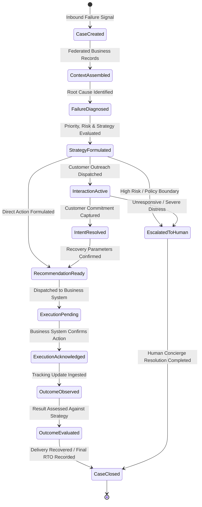

# NDR Intelligence Workflows & Lifecycle Architecture

## 1. Purpose & Workflow Principles

This document defines the intelligence lifecycles, operational interaction flows, and closed feedback loops of the **NDR Resolution Intelligence Domain (NDR-ID)**.

### Architectural Principles:
1. **Intelligence Precedes Action:** Every intervention must be grounded in multi-factor context, failure diagnosis, and risk evaluation rather than immediate unreasoned triggering.
2. **Decoupled Execution Authority:** NDR-ID produces structured intervention recommendations; authoritative business systems execute the physical, carrier, or customer communication workflows.
3. **Multi-Tier Outcome Accountability:** An intervention is never assumed to be successful until the downstream physical operational outcome is observed, verified, and evaluated.
4. **Governed Continuous Learning:** Every resolved or failed case feeds structured outcome evidence back into domain memory to refine future strategy selection without mutating operational records.

---

## 2. The NDR Intelligence Lifecycle

The complete cognitive and operational journey of an NDR case flows through structured conceptual stages:

```
[ NDR Signal Ingested ]
           │ (Delivery failure exception published by logistics source)
           ▼
[ Understand Situation & Build Context ]
           │ (Federate order financials, customer history, delivery attempts, & carrier data)
           ▼
[ Diagnose Failure ]
           │ (Identify root cause: unreachable, address gap, fake attempt, buyer remorse)
           ▼
[ Assess Customer Intent / State ]
           │ (Evaluate customer responsiveness, past interactions, & current sentiment)
           ▼
[ Assess Priority & Risk ]
           │ (Synthesize operational risk, commercial priority, and customer experience risk)
           ▼
[ Determine Recovery Strategy ]
           │ (Select optimal candidate strategy pattern based on context, policy, & confidence)
           ▼
[ Generate Action Recommendation ]
           │ (Formulate governed, typed action proposal with confidence & justification)
           ▼
[ Customer / Human Interaction (Where Required) ]
           │ (Interactive multi-channel outreach or human concierge escalation handoff)
           ▼
[ Business-System Execution ]
           │ (Authoritative business system commits reattempt, updates address, or files claim)
           ▼
[ Observe Downstream Outcome ]
           │ (Monitor downstream tracking events: Delivered, Reattempted, RTO, Cancelled)
           ▼
[ Evaluate Result & Generate Learning Evidence ]
           │ (Compare actual operational outcome against strategy prediction; update domain priors)
           ▼
[ Case Closure ]
```

---

## 3. The NDR Case State Model

An NDR Case is a domain-owned intelligence container tracking the resolution journey of a delivery exception:



### Key Conceptual States:
- **`CaseCreated`:** Initial delivery exception captured and case initialized.
- **`ContextAssembled`:** Shipment facts, customer profile, order value, and prior attempt histories retrieved from business systems.
- **`FailureDiagnosed`:** Courier exception codes translated into semantic business failure modes.
- **`StrategyFormulated`:** Operational risk, commercial priority, and candidate recovery strategies synthesized.
- **`InteractionActive`:** Interactive multi-channel communication initiated with the recipient.
- **`IntentResolved`:** Customer response parsed into verified commitments (e.g. agreed date, corrected landmark, prepayment intent).
- **`RecommendationReady`:** Structured action proposal emitted by NDR-ID.
- **`ExecutionPending` / `ExecutionAcknowledged`:** Action received and confirmed by the operational business system.
- **`OutcomeObserved` / `OutcomeEvaluated`:** Physical delivery outcome verified and evaluated against the strategy.
- **`EscalatedToHuman`:** Case transferred to human support with a structured briefing dossier.
- **`CaseClosed`:** Case archived with complete outcome and learning evidence recorded.

---

## 4. Customer Interaction Lifecycle

When customer engagement is required to clarify intent, confirm availability, or enrich delivery details, NDR-ID coordinates the interaction intelligence:

```
[ NDR Exception Diagnosed ]
             │
             ▼
[ Channel & Timing Strategy ] ──► Selects optimal channel (WhatsApp, IVR, SMS) & timing window
             │
             ▼
[ Proactive Outreach ] ─────────► Dispatches structured options (Date selection, Landmark input)
             │
             ▼
[ Customer Inbound Response ] ──► Ingests text, button clicks, DTMF digits, or location pins
             │
             ▼
[ Intent & Sentiment Parser ] ──► Evaluates customer commitment and emotional tone
             │
             ├──► Clear Commitment (e.g. "Deliver on Thursday") ➔ Formulate Action Recommendation
             ├──► Hesitation / Cancellation Intent ─────────────► Evaluate Retention Strategy
             └──► Frustration / High Ambiguity ─────────────────► Escalate to Human Support
```

### Interaction Principles:
- **Unified Context Thread:** Conversations across multiple touchpoints or fallback channels maintain unified case history.
- **Low-Friction Responses:** Prioritize structured, single-tap responses over open-ended text entry.
- **Immediate Human Safety Bridge:** If the customer expresses severe distress or requests human assistance, automated messaging pauses and context transfers cleanly to human agents.

---

## 5. The Multi-Tier Outcome Chain

A foundational architectural rule of NDR-ID is that **intermediate events are not equivalent to final business recovery**:

$$\text{Recommendation Accepted} \neq \text{Action Executed} \neq \text{Customer Engaged} \neq \text{Delivery Recovered} \neq \text{RTO Avoided}$$

```
┌────────────────────────────────────────────────────────────────────────────────────────┐
│                         THE MULTI-TIER OUTCOME CHAIN                                   │
│                                                                                        │
│  1. Recommendation Accepted ──► Did the operational team/system accept the proposal?  │
│  2. Action Executed ──────────► Did the logistics carrier apply the reattempt/update?  │
│  3. Customer Engaged ─────────► Did the customer interact and provide verified intent? │
│  4. Delivery Recovered ───────► Was the parcel successfully handed over and paid for?  │
│  5. RTO Avoided ──────────────► Was an avoidable return journey completely prevented?  │
└────────────────────────────────────────────────────────────────────────────────────────┘
```

Only verified **Delivery Recovery** and **RTO Avoidance** represent ultimate business success.

---

## 6. The Learning Loop & Memory Boundary

NDR-ID continuously improves its decision intelligence by comparing strategy predictions against actual physical delivery outcomes:

```
┌─────────────────────────────┐        ┌──────────────────────────────┐
│  Observed Delivery Outcome  │ ──►──► │  Outcome Evaluation Engine   │
│  (Delivered vs RTO)         │        │  (Calculates Strategy ROI)   │
└─────────────────────────────┘        └──────────────┬───────────────┘
                                                      │
                                                      ▼
┌─────────────────────────────┐        ┌──────────────────────────────┐
│  Refined Decision Models    │ ◄──◄── │  Knowledge & Memory Feed     │
│  - Updated recovery priors  │        │  - Carrier reliability index │
│  - Improved risk thresholds │        │  - Pincode failure patterns  │
│  - Optimized channel rules  │        │  - Strategy success rates    │
└─────────────────────────────┘        └──────────────────────────────┘
```

### Learning Separation of Concerns:
- **NDR-ID:** Interprets domain outcomes, calculates strategy efficacy, and generates structured learning evidence.
- **Brain Core:** Provides the underlying memory framework and semantic persistence mechanisms.
- **Business Systems:** Remain authoritative systems of record; learning evidence **never** mutates business records, customer master data, or financial transactions directly.
