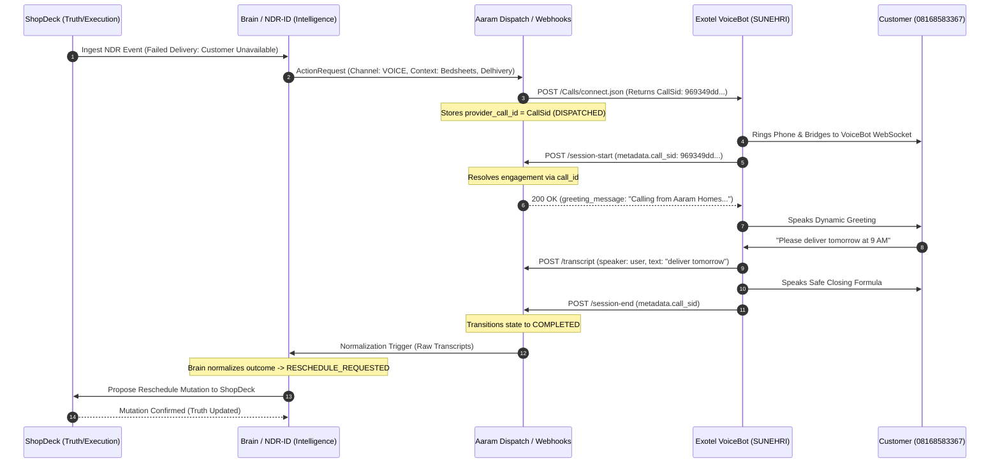

# Exotel VoiceBot v2 (`SUNEHRI`) Contract Verification & Architectural Boundary

**Document Status**: CERTIFIED / FROZEN READ-ONLY CONTRACT  
**Document Type**: Public Integration & Architectural Contract  
**Date**: September 6, 2026  
**Telephony Provider**: Exotel VoiceBot v2 (Applet ID: `1334860`, Flow: `voicebot-mum-prod-default-flow`, Bot: `SUNEHRI` / `bd56f182-1eb0-4801-8966-31d1a5cfd7f7`)  
**Physical Baseline Trace**: Exotel CallSid `969349dd78460ec32ecaa98aa2731a96` (Duration: 156s, Connected to Bot: 145s)

---

## 1. Executive Summary & Core Invariant Enforcement

This document establishes the verified runtime contract between the **Exotel SUNEHRI v2 VoiceBot platform** and the **Aaram Brain Customer Engagement Gateway**.

Every interface and data flow defined herein strictly conforms to our foundational architectural invariants:

1. **Business System (ShopDeck) owns truth and execution.** No external system or bot may execute business state mutations directly.
2. **AZM owns semantic and schematic knowledge.** Product definitions, bedsheet specifications, and catalog truth originate exclusively from Aaram AZM.
3. **Brain / NDR-ID owns intelligence.** Evaluation, intent classification, policy rules, and next-action determination belong solely to the Brain.
4. **VoiceBot is sensory interaction only.** The bot is an auditory transducer; it perceives speech and delivers sound. It possesses zero operational authority.
5. **Customer statements are evidence, not truth.** An utterance like *"Please deliver tomorrow"* is recorded evidence of intent, not an executed delivery reschedule.
6. **No mutation may be claimed until the Business System confirms it.** The VoiceBot is strictly forbidden from claiming an order has been rescheduled, canceled, or modified.

---

## 2. Point-by-Point Contract Verification (15 Points)

### Point 1: Exact HTTP Response Schema for Session Start
The Session Start webhook is triggered when Exotel initiates the VoiceBot WebSocket stream. The Aaram webhook handler must respond with HTTP `200 OK` containing top-level `http_code: 200` and the following payload:

```json
{
  "http_code": 200,
  "response": {
    "data": {
      "greeting_message": {
        "text": "Hello, I am Sunehri calling from Aaram Homes regarding your recent bedsheet order. Our delivery partner Delhivery reported that they could not reach you today. Would you like us to reschedule the delivery for tomorrow?"
      },
      "session_constants": {
        "engagement_id": "eng_1570b847-...",
        "action_request_id": "act_1570b847",
        "brand_name": "Aaram Homes"
      },
      "conversation_assistant_id": "",
      "webhook_config": {
        "session_end": {
          "url": "https://<tunnel_domain>/api/v1/webhooks/exotel/session-end"
        },
        "transcript_events": {
          "url": "https://<tunnel_domain>/api/v1/webhooks/exotel/transcript"
        },
        "insights_events": {
          "url": "https://<tunnel_domain>/api/v1/webhooks/exotel/insights",
          "trigger_type": "timer",
          "trigger_interval_sec": 30
        },
        "pre_agent_transfer": {
          "url": "https://<tunnel_domain>/api/v1/webhooks/exotel/pre-agent-transfer"
        }
      }
    }
  }
}
```

### Point 2: Runtime Availability of Session Start Data to the Agent
* **First Spoken Utterance**: **Fully Supported**. `response.data.greeting_message.text` dynamically overrides the bot's static prompt greeting and is spoken immediately upon call connection.
* **LLM System Prompt Text**: **Unsupported**. Exotel does not provide runtime macro-substitution (e.g. `{{var}}`) inside the static System Prompt / Behavior editor.
* **Tool Parameter Mapping**: **Supported**. In Exotel Tool Integration, parameters can be mapped to `"Dynamic Variable"`, pulling values from `session_constants`.

### Point 3: Variable Reference Syntax in Agent Prompt
* **In Agent Prompt**: None. Prompt templating is undocumented and unsupported by the Exotel platform.
* **In Conversational Practice**: Dynamic customer and order context must be baked directly into `greeting_message.text` at Session Start.

### Point 4: Dynamic Greeting as First Spoken Utterance
* **Verified**: **YES**. When `response.data.greeting_message.text` is returned within the HTTP timeout, the VoiceBot synthesizes and delivers this text as the opening line of the conversation.

### Point 5: Consumption of Arbitrary Order Fields
* Fields such as `customer_name`, `brand_name`, `item_description`, `courier_partner`, `delivery_issue`, `engagement_id`, and `action_request_id`:
  - Are stored in `session_constants` for lifecycle tracking and tool parameters.
  - Must be formatted into `greeting_message.text` if the VoiceBot is to articulate them to the customer during conversation.

### Point 6: Field Names and Data Types for Dynamic Variables
* The container must strictly be `"session_constants"` as a flat JSON dictionary of string key-value pairs (`{"key": "value"}`).

### Point 7 & 8: Validity of Proposed Schema
* **Previous Aaram Implementation**: **INVALID**. In `src/api/webhooks/exotel_webhooks.py`, keys with spaces (`"greeting message"` and `"session constants"`) and missing `http_code: 200` were used.
* **Verified Supported Schema**: Snake_case (`"greeting_message"`, `"session_constants"`) with `http_code: 200` and `webhook_config`.

### Point 9: Session-Start Correlation Identity
* **Verified**: Session-start **must** correlate via `metadata.call_sid` (or root `external_id`), matching Aaram's `customer_engagements.provider_call_id`.
* The incoming VoiceBot callback provides `custom_parameters: {}` and does not carry a piped `CustomField`. Demanding `CustomField` causes an immediate HTTP 400 rejection.

### Point 10: Production SUNEHRI v2 Webhook Payload Fields
Every callback (`session_start`, `transcript_events`, `session_end`) provides:
* Telephony & Bot Identity: `session_id`, `conversation_id`, `bot_id`, `bot_name`, `metadata.call_sid`, `metadata.stream_sid`, `external_id`, `landing_number`, `contact_uri`, `network_type`, `account_id`.
* Timing & State: `start_time`, `end_time`, `session_state`, `trigger_reason`.
* Event Container: `events[]` containing `event_type`, `event_id`, and `event_data`.

### Point 11: Transcript Payload Information Preservation
Exotel transcript payloads provide complete preservation of:
* **CallSid**: Available in `metadata.call_sid` and `external_id`.
* **Session & Conversation ID**: Available in `session_id` and `conversation_id`.
* **Speaker**: Available in `transcript_segments[].speaker` (`"assistant"` or `"user"`).
* **Utterance**: Available in `transcript_segments[].text`.
* **Event Ordering**: Explicitly preserved via monotonic `sequence` integer, `start_timestamp`, and `end_timestamp`.

### Point 12: Current Aaram Handler Capability
* **Status**: **Defective prior to patch**.
* `resolve_correlation` queried `session_id=call_sid`. Because Aaram stores the dispatch `CallSid` in `provider_call_id`, MongoDB returned `None`. Correlation must query `call_id=call_sid`.

### Point 13: Session-Start CallSid Fallback
* **Status**: **Mandatory**. `handle_session_start` must use the same `resolve_correlation(call_sid, ...)` logic rather than failing on missing `CustomField`.

### Point 14: Minimum Code Changes Required
Isolated exclusively to `src/api/webhooks/exotel_webhooks.py`:
1. Use `resolve_correlation` in `handle_session_start`.
2. Query `call_id=call_sid, session_id=call_sid` in `resolve_correlation`.
3. Return valid snake_case schema (`greeting_message`, `session_constants`, `http_code: 200`, `webhook_config`).
4. Generate dynamic greeting from engagement context.

### Point 15: Physical Capability vs UI Configuration
* Webhook configurations in the Exotel console only fire if:
  1. The bot version is active and rolled out to 100%.
  2. The webhook endpoints are reachable via public HTTPS with valid TLS.
  3. The endpoint responds within the timeout with HTTP 200 and a valid schema.

---

## 3. The Strict SUNEHRI Prompt & Persona Boundary

### Role Definition
SUNEHRI is a sensory outreach interface representing **Aaram Homes**. She speaks with warmth, empathy, and absolute clarity. She is an attentive listener, not an operational decision-maker.

### Prohibited Behaviors
1. **Never claim operational execution**: SUNEHRI must never say *"I have rescheduled your delivery"* or *"Your order is canceled"*.
2. **Never hallucinate catalog items**: SUNEHRI must only reference the product communicated in her dynamic greeting (e.g., Luxury Bedsheet Sets), never mobile phones or electronics.
3. **Never negotiate policy**: SUNEHRI records requests as preferences, not approved exceptions.

### Mandatory Closing Formula
*"Thank you. I have recorded your preference for delivery on [Day/Time]. Our support team will coordinate with Delhivery and confirm via SMS. Have a wonderful day!"*

---

## 4. End-to-End Sequence Diagram



---

## 5. Certification Gates Before Physical Execution

* **Gate 1 (Unit Contract Test)**: Validate `handle_session_start` with an authentic Exotel VoiceBot v2 JSON fixture, ensuring snake_case keys, `http_code: 200`, and `call_id` correlation.
* **Gate 2 (Cloudflare Tunnel Health)**: Verify active bidirectional reachability of `/session-start`, `/transcript`, and `/session-end`.
* **Gate 3 (User Authorization)**: Controlled single-call physical trace run only upon explicit user directive.
